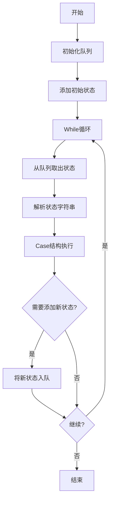

# JKI State Machine(JKISM)简介

## 概述

JKI State Machine（JKISM）是由JKI公司开发的一个轻量级LabVIEW应用框架，基于字符串队列的状态机模式。它是LabVIEW社区中最流行的设计模式之一，广泛应用于各种规模的项目中。

### 什么是JKISM

JKISM是一个基于**字符串状态队列**的有限状态机框架，其核心思想是：
1. 使用字符串来表示状态
2. 使用队列来管理状态序列
3. 在循环中依次执行状态
4. 每个状态可以动态添加新的状态到队列中

### 设计理念

JKISM的设计理念体现在以下几个方面：
1. **简单直观**：使用字符串表示状态，易于理解和调试
2. **灵活动态**：状态可以动态生成和添加
3. **轻量级**：框架本身非常简单，易于学习和使用
4. **可扩展**：可以根据项目需求进行扩展

## JKISM的基本结构

### 核心组件

JKISM的核心包含以下几个部分：

#### 1. 状态队列（State Queue）

```
┌─────────────┐
│  State 1    │
├─────────────┤
│  State 2    │
├─────────────┤
│  State 3    │
├─────────────┤
│     ...     │
└─────────────┘
```

- 使用LabVIEW队列存储待执行的状态
- FIFO（先进先出）执行模式
- 状态以字符串形式存储

#### 2. While循环

主循环不断从队列中取出状态并执行：
```
Loop {
    Dequeue -> Get State String
    Parse State
    Execute State in Case Structure
    State can Enqueue new states
}
```

#### 3. Case结构

根据状态字符串选择执行的代码：
```
Case: "Initialize"
    -> Initialize Code
    
Case: "Read Data"
    -> Read Data Code
    
Case: "Process"
    -> Process Code
    
...
```

### 基本工作流程



### 状态字符串格式

JKISM使用特殊格式的字符串来表示状态：

#### 单一状态
```
"Initialize"
```

#### 状态序列
使用换行符分隔多个状态：
```
"Initialize
Read Configuration
Start Acquisition"
```

#### 参数传递
使用特定分隔符传递参数：
```
"Set Value: 100"
"Write File: C:\data\test.txt"
```

## JKISM的优势

### 1. 易于学习和使用

**优势说明**：
- 概念简单，只需要理解队列和状态机
- 代码结构清晰，易于阅读
- 新手友好，学习曲线平缓

**典型应用**：
- 简单的数据采集程序
- 仪器控制程序
- 测试序列执行

### 2. 灵活的状态转换

**优势说明**：
- 状态可以动态生成
- 支持条件状态转换
- 可以实现复杂的状态流程

**示例**：
```labview
Case: "Check Condition"
    If (Condition Met) {
        Enqueue("Success Path")
    } else {
        Enqueue("Error Path")
    }
```

### 3. 可读性强

**优势说明**：
- 状态名称直接可见
- 代码流程清晰
- 便于调试和维护

**调试支持**：
- 可以在前面板显示当前状态
- 可以记录状态执行历史
- 可以手动添加状态进行测试

### 4. 轻量级框架

**优势说明**：
- 没有复杂的框架开销
- 启动快速
- 内存占用小

**适用场景**：
- 小型应用
- 简单控制逻辑
- 原型开发

### 5. 易于集成

**优势说明**：
- 可以与其他代码轻松集成
- 可以嵌入到现有项目中
- 可以与SubVI配合使用

## JKISM的局限性

### 1. 缺乏模块间通讯机制

**问题描述**：
- 只有一个状态队列
- 难以实现模块间的消息传递
- 多个状态机之间通讯困难

**影响**：
- 不适合复杂的多模块系统
- 扩展性受限
- 代码复用困难

**CSM的改进**：
- 提供完整的模块间通讯API
- 支持同步/异步消息
- 支持消息广播和订阅

### 2. 参数传递方式原始

**问题描述**：
- 参数通过字符串编码
- 需要手动解析参数
- 没有类型安全检查

**示例问题**：
```labview
// JKISM
State: "Set Value: 100"
// 需要手动解析"100"

// 容易出错
State: "Set Value: abc"  // 解析失败
```

**CSM的改进**：
- 提供多种参数类型支持
- HEXSTR、MassData等高级参数
- API String支持

### 3. 错误处理不完善

**问题描述**：
- 没有内置错误处理机制
- 错误处理需要手动实现
- 难以统一错误处理策略

**典型问题**：
- 某个状态出错后如何恢复？
- 如何记录错误信息？
- 如何通知用户错误？

**CSM的改进**：
- 内置错误处理机制
- ERRSTR参数类型
- 统一的错误处理流程

### 4. 缺乏高级特性

**缺失功能**：
- 无工作者模式
- 无责任链模式
- 无状态广播机制
- 无模块生命周期管理
- 无全局日志系统

**CSM的改进**：
- 提供完整的高级特性
- 工作者模式和责任链模式
- 状态广播和订阅
- 插件机制

### 5. 调试工具有限

**问题描述**：
- 主要依赖前面板显示
- 缺少专门的调试工具
- 难以追踪复杂的状态流

**CSM的改进**：
- 全局日志窗口
- 状态仪表板
- 状态表格窗口
- JKISM State Editor集成

### 6. 扩展性受限

**问题描述**：
- 难以添加新功能
- 没有插件机制
- 框架修改影响所有代码

**CSM的改进**：
- 完整的插件系统
- Addon/Template/Tools接口
- 不修改核心代码即可扩展

## JKISM的应用场景

### 适合使用JKISM的场景

#### 1. 简单的顺序控制

**描述**：
- 明确的步骤序列
- 状态转换简单
- 单一执行流程

**示例**：
- 仪器初始化序列
- 简单测试流程
- 数据处理步骤

#### 2. 小型应用程序

**描述**：
- 代码量小（<1000行）
- 功能单一
- 不需要复杂架构

**示例**：
- 简单数据采集
- 仪器控制面板
- 工具型程序

#### 3. 原型开发

**描述**：
- 快速验证想法
- 不需要长期维护
- 时间优先于架构

**优势**：
- 快速搭建
- 灵活调整
- 易于演示

#### 4. 学习和教学

**描述**：
- 理解状态机概念
- LabVIEW编程入门
- 设计模式学习

**优势**：
- 概念清晰
- 代码简单
- 易于理解

### 不适合使用JKISM的场景

#### 1. 大型复杂系统

**原因**：
- 缺乏模块化支持
- 难以管理复杂状态
- 维护困难

**建议**：
- 使用CSM框架
- 使用DQMH框架
- 使用Actor Framework

#### 2. 多模块协同

**原因**：
- 缺乏通讯机制
- 模块间耦合高
- 难以独立开发

**建议**：
- 使用CSM的模块通讯
- 使用消息队列框架

#### 3. 需要高性能

**原因**：
- 字符串解析开销
- 队列操作开销
- 不适合高频操作

**建议**：
- 优化关键路径
- 使用CSM的高级特性
- 考虑其他架构

#### 4. 长期维护项目

**原因**：
- 扩展性差
- 重构困难
- 技术债务累积

**建议**：
- 从一开始使用CSM
- 采用模块化设计
- 考虑未来扩展

## JKISM与CSM的对比

### 架构对比

| 特性 | JKISM | CSM |
|------|-------|-----|
| 基础架构 | 单队列状态机 | 多模块通讯状态机 |
| 模块化 | 不支持 | 完整支持 |
| 模块通讯 | 无 | 同步/异步/广播 |
| 参数传递 | 字符串解析 | 多种类型支持 |
| 错误处理 | 手动实现 | 内置机制 |
| 插件系统 | 无 | Addon/Template/Tools |
| 调试工具 | 基本 | 丰富工具集 |

### 复杂度对比

| 方面 | JKISM | CSM |
|------|-------|-----|
| 学习曲线 | 平缓 | 中等 |
| 初始开发 | 快速 | 较快 |
| 扩展开发 | 困难 | 容易 |
| 维护成本 | 随项目增大 | 相对稳定 |
| 代码复用 | 低 | 高 |

### 性能对比

| 指标 | JKISM | CSM |
|------|-------|-----|
| 启动时间 | 快 | 快 |
| 状态执行 | 中 | 中 |
| 通讯开销 | N/A | 低 |
| 内存占用 | 低 | 中 |
| 参数传递 | 中 | 高（多种优化） |

### 适用项目规模对比

| 项目规模 | JKISM | CSM |
|----------|-------|-----|
| 小型（<1K行） | ⭐⭐⭐⭐⭐ | ⭐⭐⭐⭐ |
| 中型（1-5K行） | ⭐⭐⭐ | ⭐⭐⭐⭐⭐ |
| 大型（5-20K行） | ⭐⭐ | ⭐⭐⭐⭐⭐ |
| 超大型（>20K行） | ⭐ | ⭐⭐⭐⭐⭐ |

## JKISM工作流程详解

### 初始化阶段

```labview
1. 创建状态队列
   Queue = Create Queue

2. 添加初始状态
   Enqueue(Queue, "Initialize")

3. 初始化其他资源
   Initialize UI
   Initialize Data Structures
```

### 执行阶段

```labview
While Loop {
    // 1. 从队列取出状态
    State = Dequeue(Queue)
    
    // 2. 可选：记录状态
    Log(State)
    Display Current State(State)
    
    // 3. 解析状态（如果有参数）
    State Name = Parse State Name(State)
    Parameters = Parse Parameters(State)
    
    // 4. 执行状态
    Case(State Name) {
        "Initialize": {
            // 初始化代码
            Enqueue(Queue, "Idle")
        }
        
        "Idle": {
            // 等待用户输入或事件
            Wait for Event
        }
        
        "Process Data": {
            // 处理数据
            Process(Data, Parameters)
            Enqueue(Queue, "Update Display")
        }
        
        "Error": {
            // 错误处理
            Handle Error
            Enqueue(Queue, "Idle")
        }
        
        "Exit": {
            // 退出准备
            Cleanup
            Stop Loop
        }
    }
}
```

### 清理阶段

```labview
1. 释放队列
   Release Queue(Queue)

2. 清理资源
   Close Files
   Stop Tasks
   Cleanup UI
```

## 从JKISM迁移到CSM

### 为什么要迁移

如果你的项目遇到以下问题，考虑迁移到CSM：
1. 项目规模增长，难以管理
2. 需要多个模块协同工作
3. 需要更好的错误处理
4. 需要代码复用和模块化
5. 需要更强的调试支持

### 迁移策略

#### 策略1：渐进式迁移

**适用场景**：大型现有项目

**步骤**：
1. 新模块使用CSM框架
2. 旧模块通过CSM API调用
3. 逐步重构关键模块
4. 保持系统可用

#### 策略2：完全重写

**适用场景**：小型项目或原型

**步骤**：
1. 使用CSM Template创建新项目
2. 将JKISM状态转换为CSM API
3. 利用CSM的高级特性
4. 一次性切换

#### 策略3：并行开发

**适用场景**：中型项目

**步骤**：
1. 保留JKISM核心
2. CSM模块作为补充
3. 两者通过接口协同
4. 最终完全迁移

### 迁移对照表

| JKISM概念 | CSM对应概念 | 说明 |
|-----------|-------------|------|
| 状态 | API/状态 | CSM使用API和状态两个概念 |
| 队列入队 | 发送消息 | 使用CSM消息API |
| 状态字符串 | 消息字符串 | 支持多种参数类型 |
| Case结构 | Case结构 | 相同，但有更多标准分支 |
| - | 模块通讯 | JKISM无，CSM新增 |
| - | 广播订阅 | JKISM无，CSM新增 |

### 迁移示例

#### JKISM代码
```labview
// 入队状态
Enqueue(Queue, "Read Data")

// 执行状态
Case: "Read Data"
    Data = Read from File
    Enqueue(Queue, "Process Data: " + Data)
```

#### 对应的CSM代码
```labview
// 发送消息给自己
API: Read Data >> "" -> This Module

// 处理API
API: Read Data >> {
    Data = Read from File
    
    // 调用处理API
    API: Process Data >> Data -> This Module
}

// 处理数据
API: Process Data >> {
    Process Arguments
}
```

### 迁移注意事项

1. **理解概念差异**：
   - CSM有模块、API、状态等概念
   - 需要重新思考架构

2. **利用CSM特性**：
   - 使用模块化设计
   - 使用内置参数类型
   - 使用错误处理机制

3. **渐进式改进**：
   - 不需要一次性完美
   - 先迁移功能，再优化
   - 持续重构

4. **测试覆盖**：
   - 确保功能一致性
   - 增加单元测试
   - 进行集成测试

---------------------------------------

# JKISM编程最佳实践

## 状态命名规范

### 使用有意义的状态名

**推荐**：
```
"Initialize"
"Read Configuration"
"Start Acquisition"
"Process Data"
"Update Display"
"Stop and Cleanup"
"Exit"
```

**避免**：
```
"State1"
"DoIt"
"Step3"
"A"
```

### 命名约定

#### 1. 使用动词开头

**示例**：
```
"Initialize Hardware"
"Read Sensor Data"
"Calculate Results"
"Write to File"
"Display Results"
```

#### 2. 使用清晰的层次

**示例**：
```
"Init: Hardware"
"Init: UI"
"Init: Data Structures"
"Cleanup: Hardware"
"Cleanup: UI"
```

#### 3. 错误状态标识

**示例**：
```
"Error: File Not Found"
"Error: Communication Timeout"
"Error: Invalid Parameter"
```

#### 4. 状态前缀分类

**示例**：
```
// 初始化类
"Init: ..."

// 处理类
"Process: ..."

// 显示类
"Display: ..."

// 错误类
"Error: ..."

// 清理类
"Cleanup: ..."
```

## 状态转换设计原则

### 1. 保持状态单一职责

**原则**：每个状态只做一件事

**好的示例**：
```labview
Case: "Read File" {
    Data = Read File
    Enqueue("Parse Data")
}

Case: "Parse Data" {
    Parsed = Parse(Data)
    Enqueue("Validate Data")
}

Case: "Validate Data" {
    Valid = Validate(Parsed)
    If (Valid) {
        Enqueue("Process Data")
    } else {
        Enqueue("Error: Invalid Data")
    }
}
```

**避免的示例**：
```labview
Case: "Do Everything" {
    Data = Read File
    Parsed = Parse(Data)
    Valid = Validate(Parsed)
    Processed = Process(Parsed)
    Display(Processed)
    Save(Processed)
    // 太多职责！
}
```

### 2. 明确的状态转换路径

**原则**：每个状态的下一步应该清晰

**示例**：
```labview
Case: "Initialize" {
    Success = Init()
    If (Success) {
        Enqueue("Idle")
    } else {
        Enqueue("Error: Init Failed")
    }
}
```

### 3. 使用状态序列简化流程

**示例**：
```labview
// 启动序列
Enqueue("Initialize
Check Configuration
Connect to Hardware
Start Acquisition
Enter Idle State")
```

### 4. 避免状态循环陷阱

**问题示例**：
```labview
Case: "A" {
    Enqueue("B")
}

Case: "B" {
    Enqueue("A")  // 无限循环！
}
```

**解决方案**：
```labview
Case: "A" {
    Counter++
    If (Counter < Max) {
        Enqueue("B")
    } else {
        Enqueue("Done")
    }
}
```

## 数据管理建议

### 1. 使用Shift Register存储状态数据

**示例**：
```labview
Shift Register: {
    Config: Configuration Cluster
    Data: Current Data
    Status: Status Information
    Error: Error Cluster
}
```

### 2. 初始化所有数据

**原则**：在"Initialize"状态中初始化所有数据结构

**示例**：
```labview
Case: "Initialize" {
    Config = Default Config
    Data = Empty Array
    Status = "Ready"
    Error = No Error
}
```

### 3. 使用Functional Global Variables谨慎

**建议**：
- 只用于真正的全局数据
- 优先使用Shift Register
- 考虑竞态条件

### 4. 参数传递模式

**方法1：字符串编码**
```labview
State: "Set Value: 100"

Case: "Set Value" {
    Value = Parse Value from State String
}
```

**方法2：使用Variant**
```labview
// 更复杂但类型安全
State with Variant Attribute
```

**方法3：使用HEXSTR（如果集成了CSM工具）**
```labview
State: "Set Config: <HEXSTR>..."
```

## 错误处理模式

### 1. 统一错误处理状态

**模式**：
```labview
Case: "Error" {
    Log Error
    Display Error to User
    Cleanup Resources
    
    If (Can Recover) {
        Enqueue("Reset and Retry")
    } else {
        Enqueue("Fatal Error")
    }
}
```

### 2. 每个状态检查错误

**模式**：
```labview
Case: "Read Data" {
    Data, Error = Read File
    
    If (Error?) {
        Enqueue("Error: File Read Failed")
    } else {
        Enqueue("Process Data")
    }
}
```

### 3. 错误传播

**模式**：
```labview
// 使用Shift Register传递错误
If (Error in Shift Register) {
    // 跳过正常处理
    Continue
} else {
    // 正常处理
}
```

### 4. 错误恢复策略

**示例**：
```labview
Case: "Retry Operation" {
    Retry Count++
    
    If (Retry Count < Max Retries) {
        Wait(Delay)
        Enqueue("Try Operation")
    } else {
        Enqueue("Error: Max Retries Exceeded")
    }
}
```

## 性能优化技巧

### 1. 避免不必要的状态转换

**问题**：
```labview
// 太多小状态
Enqueue("Read1
Read2
Read3
...")
```

**优化**：
```labview
// 合并相关操作
Case: "Read All" {
    Read1
    Read2
    Read3
}
```

### 2. 使用Timeout实现周期性操作

**模式**：
```labview
Dequeue with Timeout = 100ms

If (Timeout) {
    // 周期性任务
    Enqueue("Periodic Check")
} else {
    // 处理状态
}
```

### 3. 批量处理而非逐个处理

**优化前**：
```labview
For Each Item {
    Enqueue("Process Item: " + Item)
}
```

**优化后**：
```labview
Enqueue("Process All Items")

Case: "Process All Items" {
    For Each Item {
        Process(Item)
    }
}
```

### 4. 避免状态字符串构建开销

**优化技巧**：
- 预定义状态字符串常量
- 避免频繁的字符串拼接
- 考虑使用枚举（如果可能）

## 调试和维护技巧

### 1. 状态历史记录

**实现**：
```labview
// Shift Register: State History Array
Append Current State to History

// 可选：限制历史大小
If (History Size > Max) {
    Remove Oldest State
}
```

### 2. 状态执行时间监控

**实现**：
```labview
Case: Each State {
    Start Time = Get Time
    
    // 执行状态代码
    ...
    
    End Time = Get Time
    Duration = End Time - Start Time
    
    Log("State: " + State Name + " Duration: " + Duration)
}
```

### 3. 前面板状态显示

**实现**：
- 显示当前状态
- 显示状态历史
- 显示队列中待执行状态数量

### 4. 日志记录

**建议**：
```labview
// 记录关键状态
Case: Important States {
    Log to File(State + Timestamp + Data)
}
```

### 5. 断点状态

**技巧**：
```labview
Case: "Debug Breakpoint" {
    // 可以在这里设置断点
    // 或弹出对话框
    Pause = One Button Dialog("Continue?")
}
```

## 常见陷阱和避免方法

### 陷阱1：状态字符串拼写错误

**问题**：
```labview
Enqueue("Initialize")  // 正确
...
Case: "Initalize"  // 拼写错误！
```

**解决方案**：
- 使用常量或枚举定义状态名
- 使用JKISM State Editor
- 代码审查

### 陷阱2：忘记入队下一个状态

**问题**：
```labview
Case: "Some State" {
    Do Something
    // 忘记Enqueue下一个状态！
    // 程序将在这里停止
}
```

**解决方案**：
- 每个状态都明确下一步
- 使用Default Case处理
- 添加"Idle"状态作为默认

### 陷阱3：队列阻塞

**问题**：
```labview
// Dequeue without timeout
State = Dequeue(Queue)  // 如果队列空，永远等待
```

**解决方案**：
```labview
State = Dequeue(Queue, Timeout = 100ms)

If (Timeout) {
    // 处理超时
    Enqueue("Idle")  // 或其他默认状态
}
```

### 陷阱4：状态名称冲突

**问题**：
```labview
Case: "Process" {
    // 模块A的处理
}

Case: "Process" {
    // 模块B的处理 - 冲突！
}
```

**解决方案**：
- 使用前缀区分
- "ModuleA: Process"
- "ModuleB: Process"

### 陷阱5：过度复杂的状态逻辑

**问题**：
```labview
Case: "Complex State" {
    // 100行代码
    // 多层If-else
    // 复杂逻辑
}
```

**解决方案**：
- 拆分成多个状态
- 使用SubVI封装逻辑
- 保持Case简洁

## 实际项目应用经验

### 经验1：从简单开始

**建议**：
- 初始设计保持简单
- 只在需要时添加复杂性
- 渐进式改进

### 经验2：文档化状态流程

**建议**：
- 绘制状态转换图
- 注释关键状态
- 维护设计文档

### 经验3：定期重构

**建议**：
- 识别重复代码
- 提取公共逻辑
- 优化状态设计

### 经验4：适时升级到CSM

**时机**：
- 项目规模超过3000行
- 需要多模块协作
- 需要更强的可维护性

### 经验5：团队开发规范

**建议**：
- 统一状态命名规范
- 定义项目特定的状态分类
- 代码审查机制

## 总结

### JKISM的价值

JKISM是一个优秀的入门框架：
- ✓ 概念简单，易于学习
- ✓ 代码清晰，易于理解
- ✓ 灵活动态，适应变化
- ✓ 轻量级，快速开发

### JKISM的局限

对于大型项目存在挑战：
- ✗ 缺乏模块化支持
- ✗ 通讯机制简单
- ✗ 扩展性受限
- ✗ 高级特性缺失

### 选择建议

| 项目特点 | 推荐 |
|----------|------|
| 小型、简单、短期 | JKISM |
| 中大型、复杂、长期 | CSM |
| 学习、原型 | JKISM |
| 生产、维护 | CSM |

### 最佳实践总结

1. **命名规范**：使用清晰、一致的状态命名
2. **单一职责**：每个状态只做一件事
3. **错误处理**：统一的错误处理机制
4. **性能优化**：避免不必要的状态转换
5. **调试支持**：记录状态历史和执行时间
6. **文档维护**：绘制状态图，注释关键逻辑
7. **团队协作**：统一规范，代码审查
8. **适时升级**：当项目规模增长时考虑CSM

### 更多资源

- **JKI官方网站**: http://www.jki.net/
- **CSM框架**: https://github.com/NEVSTOP-LAB/Communicable-State-Machine
- **CSM Wiki**: https://nevstop-lab.github.io/CSM-Wiki/
- **社区支持**: LabVIEW论坛、JKI社区

通过遵循这些最佳实践，可以充分发挥JKISM的优势，同时避免常见陷阱，开发出高质量的LabVIEW应用程序。当项目复杂度增长时，考虑迁移到CSM以获得更强大的功能和更好的可维护性。
