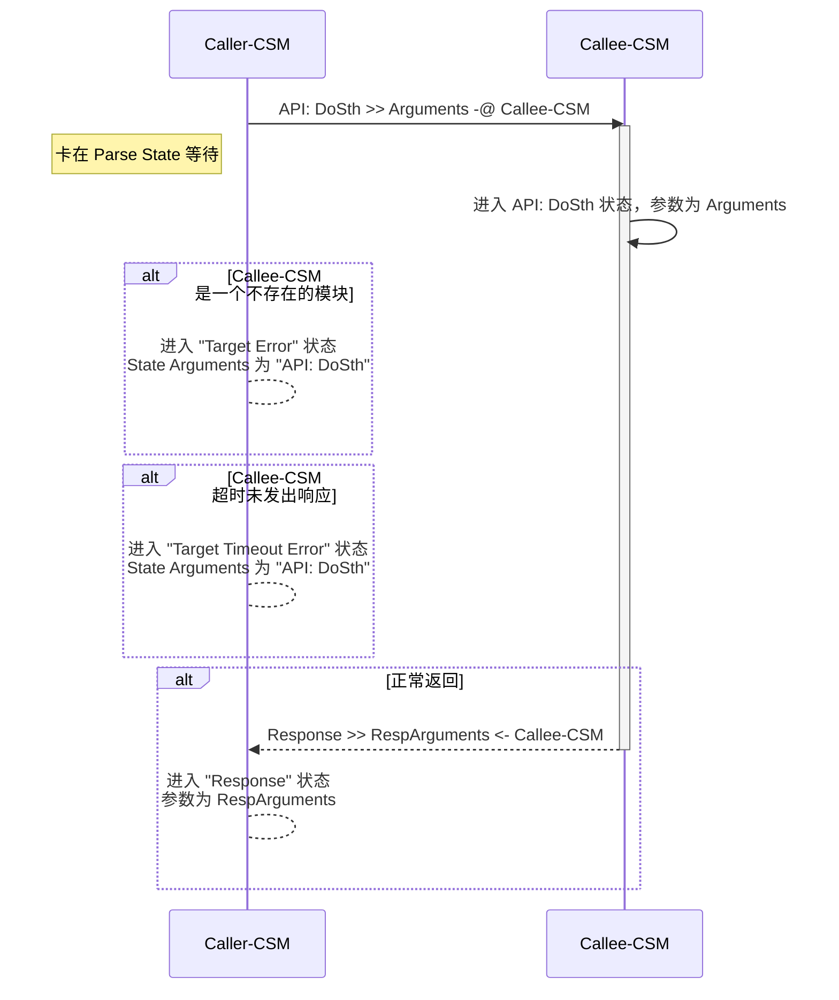
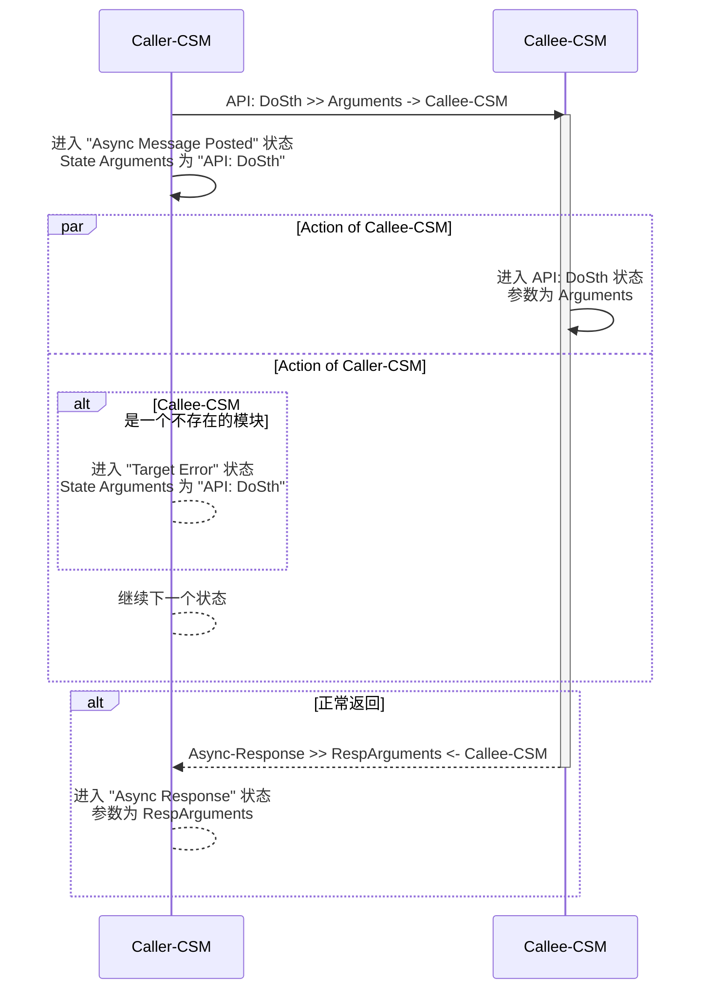
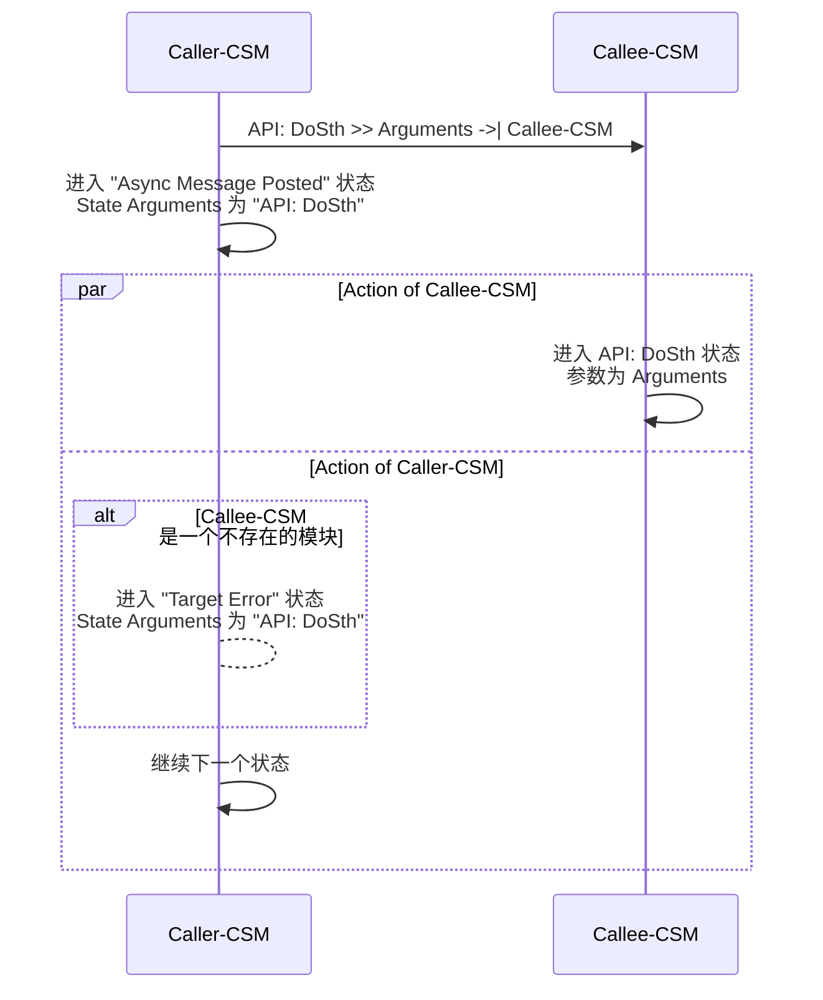

# 模块间通讯概述

CSM框架提供了灵活强大的模块间通讯机制，支持同步调用、异步调用和状态订阅三种主要通讯方式。通过这些机制，可以实现模块间的解耦和灵活的消息传递。

## 通讯方式对比

| 通讯方式 | 符号 | 等待返回 | 优先级 | 适用场景 |
|---------|------|---------|--------|----------|
| 同步调用 | `-@` | 是 | 高 | 需要立即获取结果的操作 |
| 异步调用（有返回） | `->` | 否，后续处理 | 普通 | 耗时操作但需要结果 |
| 异步调用（无返回） | `->\|` | 否 | 普通 | 通知型操作 |
| 状态订阅 | `<register>` | 事件驱动 | 可配置 | 模块状态变化通知 |

# 同步调用 (`-@`)

`同步消息`是`消息`的一种。CSM 发出`同步消息`后，将暂停`状态`变化，等待被调用方完成`消息`处理。`同步消息`通过 -@ 描述。
一个 CSM模块通过`同步消息`对另一个模块的调用，叫做`同步调用`。

## CSM 同步消息全局超时

CSM提供了灵活的超时配置机制，以适应不同场景的需求。

### 超时时间配置

- **默认超时**: CSM模块间通信，或使用同步消息发送VI时，默认的超时时间为-2，此时将使用全局设置的超时时间
- **全局设置**: 全局超时时间可以通过`CSM - Set TMO of Sync-Reply VI`设置为其他正值，以覆盖全局设置的超时时间
- **作用范围**: 全局超时时间仅对同步调用生效，异步调用不受影响
- **特殊值说明**:
  - `-2`: 使用全局超时设置（默认值）
  - `-1`: 永久等待，直到收到响应
  - `> 0`: 指定的超时时间（毫秒）

### 超时处理最佳实践

1. **合理设置超时时间**: 根据被调用模块的实际处理时间设置
2. **避免永久等待**: 除非确定被调用模块一定会响应，否则不要使用-1
3. **处理超时错误**: 在"Target Timeout Error"状态中实现合适的错误处理逻辑
4. **考虑网络延迟**: 如果涉及网络通讯，适当增加超时时间

### 错误类型详解

同步调用可能遇到以下错误：

#### No Target Error
- **触发条件**: 目标模块名称为空字符串("")
- **错误代码**: 特定的错误码
- **处理建议**: 检查消息构建逻辑，确保目标模块名称正确

#### Target Error
- **触发条件**: 目标模块不存在
- **错误代码**: 特定的错误码
- **处理建议**: 
  - 在发送消息前使用`CSM - Check If Module Exists.vi`检查模块是否存在
  - 使用`CSM - Wait for Module to Be Alive.vi`等待模块上线

#### Target Timeout Error
- **触发条件**: 目标模块在指定时间内未完成处理
- **错误代码**: 特定的错误码
- **处理建议**:
  - 增加超时时间
  - 优化被调用模块的处理速度
  - 改用异步调用
  - 实现超时重试机制

## CSM `同步消息` 执行过程



### 示例

#### 底层模块

**"SubModule" 模块实现 "API: EchoArguments" 状态**

``` text
    功能：将参数作为响应返回。
```


#### CSM 模块间的同步调用

**"MainModule" 模块通过 "API: EchoArguments >> xyz -@ SubModule"同步调用SubModule执行"API: EchoArguments" 状态**

按键中添加同步消息 "API: EchoArguments >> xyz -@ SubModule"


在"Response"状态中处理同步消息的响应


**运行状态**

先运行 SubModule，再运行主模块，点击按钮。


#### 非 CSM 的调用

可以使用 `AdvanceAPI\CSM Send Message and Wait for Reply.vi` 在非CSM的代码中调用 SubModule 的"API: EchoArguments" 状态


# 异步调用(`->` 或 `->|`)

`异步消息`是消息的一种。CSM发出`异步消息`后，不等待被调用方完成消息处理，继续进行`状态`变化。
`异步消息`也分为两种:

- `有返回的异步消息`：通过 `->` 描述。被调用方完成`消息`处理后，将通知调用方
- `无返回的异步消息`：通过 `->|` 描述，被调用方不会通知调用方

一个 CSM模块通过`异步消息`对另一个模块的调用，叫做异步调用。

## CSM `异步消息` 执行过程

### 有返回的异步消息 (->)



### 无返回的异步消息 (->|)



### 示例

#### 底层模块

**"SubModule" 模块实现 "API: EchoArguments" 状态**

``` text
    功能：将参数作为响应返回。
```


### CSM 模块间的异步调用

#### 有返回的异步消息 (->)

- **"MainModule" 模块通过 "API: EchoArguments >> xyz -> SubModule" 异步调用 SubModule 执行"API: EchoArguments" 状态。**
- **发送后立刻进入"Async Message Posted"。**
- **因为使用的 -> 为带返回的异步消息符号, 会在执行完毕后进入 "Async Response"状态处理返回参数**

按键中添加同步消息 "API: EchoArguments >> xyz -> SubModule"


在"Async Response"状态中处理同步消息的响应


#### 无返回的异步消息 (->\|)

- **"MainModule" 模块通过 "API: EchoArguments >> xyz ->\| SubModule" 也可以异步调用 SubModule 执行"API: EchoArguments" 状态。**
- **发送后立刻进入"Async Message Posted"。**
- **因为使用的 ->\| 为不带返回的异步消息符号，将不收到任何响应**

按键中添加同步消息 "API: EchoArguments >> xyz ->\| SubModule"


**运行状态**

在带返回消息的情况下，先运行 SubModule，再运行主模块，点击按钮, 将弹出下图对话框。在没有返回消息的情况下，虽然 SubModule 执行了状态，MainModule 不发生弹框。


### 非 CSM 的调用

可以使用 `AdvanceAPI\CSM Post Message.vi` 在非CSM的代码中调用 SubModule 的"API: EchoArguments" 状态, 消息会被发送执行，但是没有任何返回。


# 状态订阅

`状态(Status)`是 CSM 通知外部自身状态变化的特殊消息。外部的模块需要注册状态后，才会处理对应的状态变化。

`状态(Status)` 的设计加入，能够更好的实现不同功能模块的解耦，提高复用性。它能保证具有关联性的模块在设计时，不去关心与其他模块的交互，而是转换为自身状态变化的设计，从而实现更好的独立性。整体业务逻辑实现时，注册模块的状态，与具有交互关系的模块消息接口绑定，实现相关间的交换逻辑。

状态的订阅、取消订阅能够动态完成，程序的灵活性更高。

**举例：实现音乐下载完毕后自动播放功能**

根据场景，实现 `下载模块` `音乐播放模块` 两个模块，能够更好的复用，且逻辑划分清楚。

如果没有 `状态(Status)`，可能有以下实现方法：

1. `下载模块` 内部完成下载后，需要通知 `音乐播放模块` 开始播放，内部需要了解 `音乐播放模块` 及其接口，彼此将包含依赖关系
2. 外围业务逻辑 **阻塞式调用** `下载模块` 的下载接口，完毕后由外围业务逻辑调用 `音乐播放模块`播放接口，灵活度受限

在添加了`状态(Status)`后，实现变为：

1. 状态订阅
　－　`下载模块` 实现时，在下载完成后，发出下载完成状态，并携带下载文件路径的参数。无需考虑与外部模块的交互。
　－　`音乐播放模块`照旧，实现播放接口，参数为文件路径
　－　业务逻辑将`下载模块`的下载完成状态注册到`音乐播放模块`的播放接口，下载完成后自动会触发播放。
　－　可以动态取消。如果下载的是视频文件，与`视频播放模块`的交互方法类似，模块间交互优雅简单。

## CSM 状态设计

### CSM 状态发布

1. 通过 `CSM Broadcast Status Change.vi` 发布状态，可携带`参数`


2. 直接通过字符串描述, 以下描述完成和上截图相同的状态发布

``` c
I'm timeout >> statusArguments -> <all>
```

### CSM 状态订阅

通过 `AdvanceAPI\CSM Register Status Change.vi` 和 `AdvanceAPI\CSM Unregister Status Change.vi` 订阅和取消订阅。"*" 可以代表所有模块，例如 CSM Template 都将发布 "Error Occurred" 状态，如果订阅 "\*" 的"Error Occurred" 状态，能够收到除自己外所有模块的错误发生。


#### 举例

**`SubModule` 每 2000ms 发布 "I'm timeout" 状态**


**`MainModule`可以通过按钮动态订阅/取消订阅 "I'm timeout" 状态**


**订阅后的结果**


## 消息构建API

CSM提供了一系列API用于构建消息字符串，虽然熟悉规则后可以直接书写字符串，但使用API可以减少错误并提高开发效率。

### Build Message with Arguments++.vi

这是推荐使用的消息构建API，提供了多态VI支持多种消息类型。

**多态VI选项**：

1. **Build Message with Arguments(Auto Check).vi** - 自动检测消息类型
   - 根据输入的消息符号自动识别消息类型
   - 适合快速开发和原型验证
   - 使用示例：
     ```
     State with Arguments: "API: DoSth -@ Target"
     自动识别为同步消息
     ```

2. **Build Asynchronous Message with Arguments.vi** - 异步消息（有返回）
   - 消息类型符号：`->`
   - 适合需要异步执行但需要结果的场景

3. **Build No-Reply Asynchronous Message with Arguments.vi** - 异步消息（无返回）
   - 消息类型符号：`->|`
   - 适合单向通知场景

4. **Build Synchronous Message with Arguments.vi** - 同步消息
   - 消息类型符号：`-@`
   - 适合需要立即获取结果的场景

5. **Build Interrupt Broadcast Message.vi** - 中断广播
   - 高优先级广播
   - 适合紧急通知场景

6. **Build Normal Broadcast Message.vi** - 信号广播
   - 普通优先级广播
   - 适合常规状态通知

7. **Build Register Message.vi** - 注册订阅
   - 用于创建订阅关系

8. **Build Unregister Message.vi** - 取消订阅
   - 用于移除订阅关系

### 消息构建最佳实践

1. **使用API构建复杂消息**: 减少语法错误
2. **简单消息可直接书写**: 提高代码可读性
3. **统一消息格式**: 在团队中统一消息命名规范
4. **参数安全处理**: 对特殊字符进行转义或使用HEXSTR格式
5. **添加注释**: 在消息中使用`//`添加注释，提高可维护性

### Parse State Queue++.vi

这是CSM的核心VI，负责解析状态队列并返回下一个要执行的状态。

**关键输入参数**：

- **State Queue**: 整个状态队列，来自移位寄存器
- **Response Arguments**: 上一个状态的响应参数
- **Name**: CSM模块名称
- **Previous Error**: 错误簇输入
- **Dequeue (1 ms)**: 检查消息队列的超时，默认1ms
- **Response Timeout (-2)**: 同步调用超时时间，-2表示使用全局设置
- **Allowed Messages**: 允许的消息列表，为空表示允许所有消息

**关键输出参数**：

- **Name Used**: 实际分配的模块名称
- **Remaining States**: 拼接后的所有待执行状态
- **Current State**: 下一个要执行的状态
- **Arguments**: 当前状态的参数（在`>>`之后）
- **Additional Information**: 额外信息，如广播触发时的广播名称和参数
- **Source CSM**: 如果是外部发送的消息，这是源模块名称

### 消息过滤机制

通过`Allowed Messages`参数，可以实现消息过滤，这在责任链模式中特别有用：

```labview
// 只允许处理特定的API
Allowed Messages: ["API: ProcessTypeA", "API: ProcessTypeB"]

// 当收到"API: ProcessTypeC"时，将自动传递给责任链中的下一个节点
```

## 通讯性能优化

### 消息队列优化

1. **合理使用优先级**: 紧急消息使用同步调用或中断广播
2. **批量处理**: 相似的操作可以批量发送
3. **避免消息积压**: 监控队列长度，避免消息堆积
4. **异步优先**: 非必要不使用同步调用

### 参数传递优化

1. **小数据直接传递**: 简单参数直接使用字符串
2. **大数据使用MassData**: 大数组、波形等使用MassData Addon
3. **结构化数据使用HEXSTR**: 复杂数据结构转换为HEXSTR
4. **避免重复传递**: 使用CSM Attribute存储共享数据

## 通讯模式总结

### 选择指南

根据不同场景选择合适的通讯方式：

| 场景 | 推荐方式 | 理由 |
|------|---------|------|
| 获取配置信息 | 同步调用 | 需要立即获取结果 |
| 启动耗时任务 | 异步调用（有返回） | 不阻塞，但需要结果 |
| 发送通知 | 异步调用（无返回） | 单向通知，无需等待 |
| 状态变化通知 | 状态订阅 | 解耦模块，灵活配置 |
| 紧急通知 | 中断广播 | 高优先级，立即处理 |
| 常规通知 | 信号广播 | 普通优先级，按序处理 |

### 常见组合模式

1. **请求-响应模式**: 同步调用
   ```
   Request -@ ServiceModule
   处理Response状态
   ```

2. **任务-通知模式**: 异步调用 + 状态订阅
   ```
   Task -> WorkerModule
   订阅TaskComplete状态
   ```

3. **发布-订阅模式**: 广播 + 订阅
   ```
   发送方：定期发送广播
   接收方：订阅感兴趣的广播
   ```

4. **命令链模式**: 责任链 + 消息过滤
   ```
   Command -> ChainModule
   责任链节点按顺序处理
   ```

## 调试技巧

### 消息追踪

1. **使用全局日志**: 查看消息的完整流动路径
2. **使用State Dashboard**: 实时查看各模块状态
3. **使用State Table**: 分析并发消息的时序关系

### 常见问题排查

1. **消息未送达**: 
   - 检查目标模块是否存在
   - 检查模块名称是否正确
   - 查看全局日志确认消息是否发送

2. **同步调用超时**:
   - 检查被调用模块是否正常运行
   - 检查超时时间设置是否合理
   - 查看被调用模块的处理时间

3. **异步响应未收到**:
   - 确认使用的是`->`而不是`->|`
   - 检查Response状态或Async Response状态是否正确实现

4. **订阅未触发**:
   - 确认订阅关系已建立
   - 检查广播是否正确发送
   - 验证订阅的API是否正确

更多调试工具和方法，请参考[CSM调试与开发工具](./2024-01-03-csm-Tools.html)和[CSM全局日志系统](./2024-01-04-csm-global-log.html)。

## 总结

CSM的模块间通讯机制提供了灵活、强大且易用的消息传递能力：

- **同步调用**：适合需要立即响应的场景
- **异步调用**：适合耗时操作和非阻塞场景
- **状态订阅**：适合事件驱动和模块解耦场景

合理使用这些通讯机制，配合超时管理、错误处理和性能优化，可以构建出高效、可靠、易维护的模块化应用系统。
