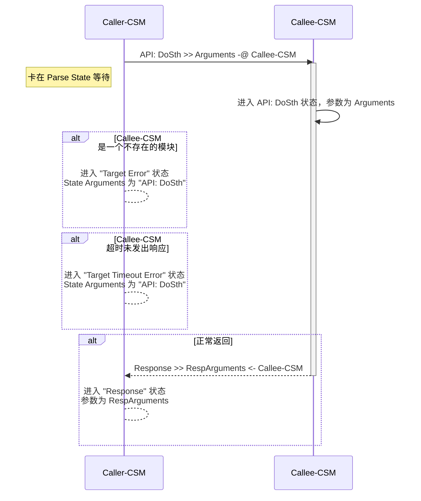
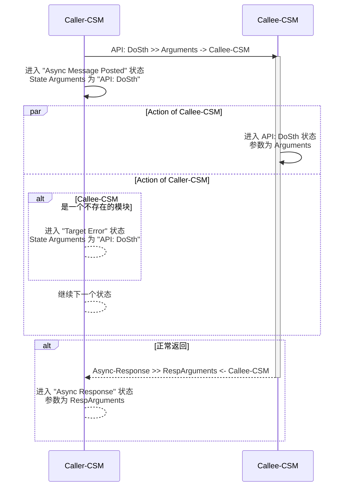
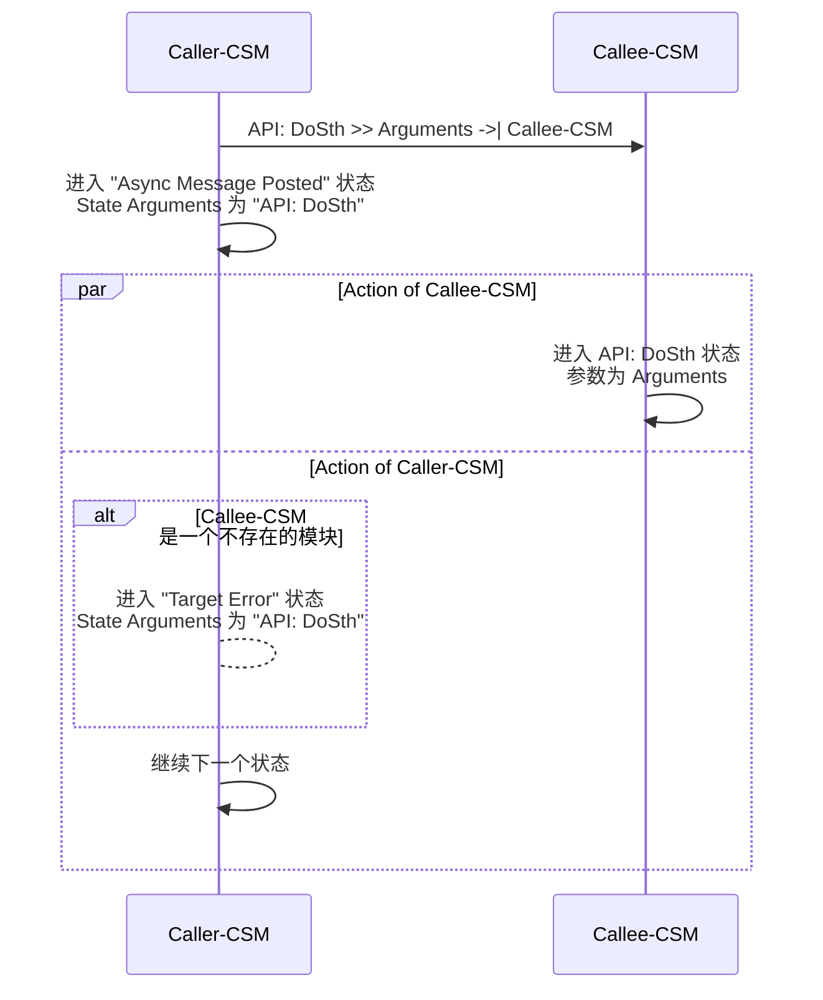

# 同步调用 (`-@`)

`同步消息`是`消息`的一种。CSM 发出`同步消息`后，将暂停`状态`变化，等待被调用方完成`消息`处理。`同步消息`通过 -@ 描述。
一个 CSM模块通过`同步消息`对另一个模块的调用，叫做`同步调用`。

## CSM `同步消息` 执行过程



### 示例

#### 底层模块

**"SubModule" 模块实现 "API: EchoArguments" 状态**

``` text
    功能：将参数作为响应返回。
```


#### CSM 模块间的同步调用

**"MainModule" 模块通过 "API: EchoArguments >> xyz -@ SubModule"同步调用SubModule执行"API: EchoArguments" 状态**

按键中添加同步消息 "API: EchoArguments >> xyz -@ SubModule"


在"Response"状态中处理同步消息的响应


**运行状态**

先运行 SubModule，再运行主模块，点击按钮。


#### 非 CSM 的调用

可以使用 `AdvanceAPI\CSM Send Message and Wait for Reply.vi` 在非CSM的代码中调用 SubModule 的"API: EchoArguments" 状态


# 异步调用(`->` 或 `->|`)

`异步消息`是消息的一种。CSM发出`异步消息`后，不等待被调用方完成消息处理，继续进行`状态`变化。
`异步消息`也分为两种:

- `有返回的异步消息`：通过 `->` 描述。被调用方完成`消息`处理后，将通知调用方
- `无返回的异步消息`：通过 `->|` 描述，被调用方不会通知调用方

一个 CSM模块通过`异步消息`对另一个模块的调用，叫做异步调用。

## CSM `异步消息` 执行过程

### 有返回的异步消息 (->)



### 无返回的异步消息 (->|)



### 示例

#### 底层模块

**"SubModule" 模块实现 "API: EchoArguments" 状态**

``` text
    功能：将参数作为响应返回。
```


### CSM 模块间的异步调用

#### 有返回的异步消息 (->)

- **"MainModule" 模块通过 "API: EchoArguments >> xyz -> SubModule" 异步调用 SubModule 执行"API: EchoArguments" 状态。**
- **发送后立刻进入"Async Message Posted"。**
- **因为使用的 -> 为带返回的异步消息符号, 会在执行完毕后进入 "Async Response"状态处理返回参数**

按键中添加同步消息 "API: EchoArguments >> xyz -> SubModule"


在"Async Response"状态中处理同步消息的响应


#### 无返回的异步消息 (->\|)

- **"MainModule" 模块通过 "API: EchoArguments >> xyz ->\| SubModule" 也可以异步调用 SubModule 执行"API: EchoArguments" 状态。**
- **发送后立刻进入"Async Message Posted"。**
- **因为使用的 ->\| 为不带返回的异步消息符号，将不收到任何响应**

按键中添加同步消息 "API: EchoArguments >> xyz ->\| SubModule"


**运行状态**

在带返回消息的情况下，先运行 SubModule，再运行主模块，点击按钮, 将弹出下图对话框。在没有返回消息的情况下，虽然 SubModule 执行了状态，MainModule 不发生弹框。


### 非 CSM 的调用

可以使用 `AdvanceAPI\CSM Post Message.vi` 在非CSM的代码中调用 SubModule 的"API: EchoArguments" 状态, 消息会被发送执行，但是没有任何返回。


# 状态订阅

`状态(Status)`是 CSM 通知外部自身状态变化的特殊消息。外部的模块需要注册状态后，才会处理对应的状态变化。

`状态(Status)` 的设计加入，能够更好的实现不同功能模块的解耦，提高复用性。它能保证具有关联性的模块在设计时，不去关心与其他模块的交互，而是转换为自身状态变化的设计，从而实现更好的独立性。整体业务逻辑实现时，注册模块的状态，与具有交互关系的模块消息接口绑定，实现相关间的交换逻辑。

状态的订阅、取消订阅能够动态完成，程序的灵活性更高。

**举例：实现音乐下载完毕后自动播放功能**

根据场景，实现 `下载模块` `音乐播放模块` 两个模块，能够更好的复用，且逻辑划分清楚。

如果没有 `状态(Status)`，可能有以下实现方法：

1. `下载模块` 内部完成下载后，需要通知 `音乐播放模块` 开始播放，内部需要了解 `音乐播放模块` 及其接口，彼此将包含依赖关系
2. 外围业务逻辑 **阻塞式调用** `下载模块` 的下载接口，完毕后由外围业务逻辑调用 `音乐播放模块`播放接口，灵活度受限

在添加了`状态(Status)`后，实现变为：

1. 状态订阅
　－　`下载模块` 实现时，在下载完成后，发出下载完成状态，并携带下载文件路径的参数。无需考虑与外部模块的交互。
　－　`音乐播放模块`照旧，实现播放接口，参数为文件路径
　－　业务逻辑将`下载模块`的下载完成状态注册到`音乐播放模块`的播放接口，下载完成后自动会触发播放。
　－　可以动态取消。如果下载的是视频文件，与`视频播放模块`的交互方法类似，模块间交互优雅简单。

## CSM 状态设计

### CSM 状态发布

1. 通过 `CSM Broadcast Status Change.vi` 发布状态，可携带`参数`


2. 直接通过字符串描述, 以下描述完成和上截图相同的状态发布

``` c
I'm timeout >> statusArguments -> <all>
```

### CSM 状态订阅

通过 `AdvanceAPI\CSM Register Status Change.vi` 和 `AdvanceAPI\CSM Unregister Status Change.vi` 订阅和取消订阅。"*" 可以代表所有模块，例如 CSM Template 都将发布 "Error Occurred" 状态，如果订阅 "\*" 的"Error Occurred" 状态，能够收到除自己外所有模块的错误发生。


#### 举例

**`SubModule` 每 2000ms 发布 "I'm timeout" 状态**


**`MainModule`可以通过按钮动态订阅/取消订阅 "I'm timeout" 状态**


**订阅后的结果**


