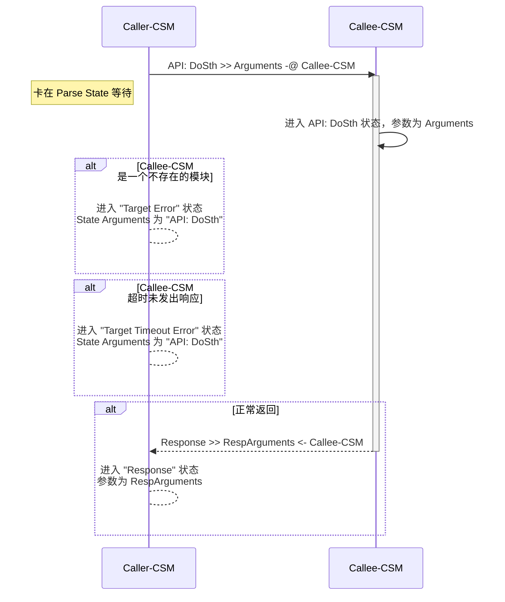
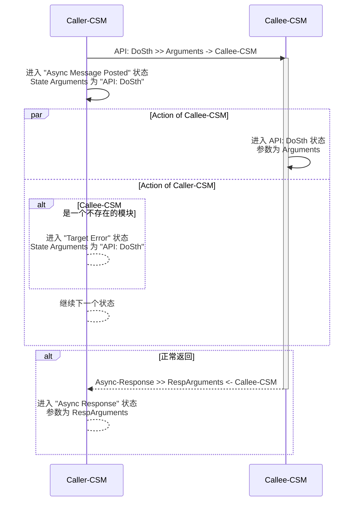
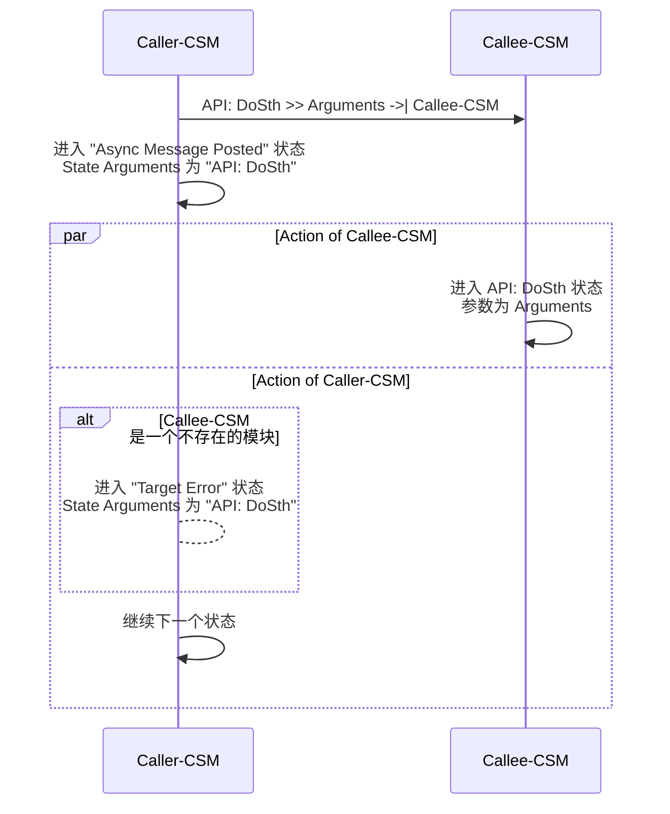

# 模块间通讯
{: .no_toc }

## 目录
{: .no_toc .text-delta }

1. TOC
{:toc}

---

## 模块间通讯概述

CSM 支持三种通讯方式：同步调用、异步调用和状态订阅。选择哪种方式取决于你的需求。

| 通讯方式 | 符号 | 等待返回 | 适用场景 |
|---------|------|---------|----------|
| 同步调用 | `-@` | 是 | 需要立即获取结果 |
| 异步调用（有返回） | `->` | 否，后续处理 | 耗时操作但需要结果 |
| 异步调用（无返回） | `->\|` | 否 | 单向通知 |
| 状态订阅 | `<register>` | 事件驱动 | 状态变化监听 |

# 同步调用 (`-@`)

同步调用会阻塞当前模块，直到目标模块处理完成并返回结果。用 `-@` 表示。

## 超时配置

默认超时时间为 -2（使用全局设置）。可以通过[`CSM - Set TMO of Sync-Reply.vi`](#csm-set-tmo-of-sync-replyvi)修改全局超时。

**特殊值**:
- `-2`: 使用全局超时（默认）
- `-1`: 永久等待
- `> 0`: 指定超时时间（毫秒）

**注意事项**:
- 根据实际处理时间设置合理的超时
- 尽量避免 -1，除非确定一定会收到响应
- 网络通讯时适当增加超时时间

## 错误处理

同步调用可能遇到三种错误：

**No Target Error**: 目标模块名为空字符串  
**Target Error**: 目标模块不存在，可用 [`CSM - Check If Module Exists.vi`](#csm-check-if-module-existsvi) 检查  
**Target Timeout Error**: 超时未响应，考虑增加超时时间或改用异步调用

## 执行流程



## 使用示例

**SubModule 实现 "API: EchoArguments"** - 将参数原样返回


**MainModule 同步调用 SubModule**

按键中添加: `API: EchoArguments >> xyz -@ SubModule`


在 "Response" 状态处理响应:


运行效果（先启动 SubModule，再启动 MainModule）:


**非 CSM 代码调用**

可以用 `AdvanceAPI\CSM Send Message and Wait for Reply.vi` 在普通代码里同步调用:


# 异步调用 (`->` 或 `->|`)

异步调用发出消息后立即返回，不会阻塞。有两种形式：
- `->` 有返回值，完成后会进入 "Async Response" 状态
- `->|` 无返回值，发完就不管了

## 执行流程

**有返回的异步消息 (->)**



**无返回的异步消息 (->|)**



## 使用示例

**有返回的异步消息 (->)**

按键中添加: `API: EchoArguments >> xyz -> SubModule`


在 "Async Response" 状态处理响应:


**无返回的异步消息 (->\|)**

按键中添加: `API: EchoArguments >> xyz ->| SubModule`


有返回的消息会弹框显示结果，无返回的不会:


**非 CSM 代码调用**

用 `AdvanceAPI\CSM Post Message.vi` 发送异步消息（无返回）:


# 状态订阅

状态订阅是 CSM 最强大的特性之一，用于模块间解耦。模块不需要知道谁在监听它，只管发布状态；监听方注册感兴趣的状态就行。

## 为什么需要状态订阅

**举个例子**：音乐下载完后自动播放

传统方式的问题：
1. 下载模块需要知道播放模块的接口，耦合太紧
2. 外部要阻塞式调用下载，再手动触发播放，不够灵活

用状态订阅就简单了：
- 下载模块下载完成后发布 "下载完成" 状态（带文件路径参数）
- 播放模块注册这个状态，触发播放接口
- 想换成视频播放？只需改注册关系，代码不用动

## 发布状态

用[`CSM Broadcast Status Change.vi`](#csm-broadcast-status-changevi)发布状态：


或者直接用字符串：
``` c
I'm timeout >> statusArguments -> <all>
```

## 订阅状态

用[`CSM Register Status Change.vi`](#csm-register-status-changevi)订阅，[`CSM Unregister Status Change.vi`](#csm-unregister-status-changevi)取消订阅。

支持通配符 "*" 代表所有模块。比如订阅 "*" 的 "Error Occurred" 状态，就能收到所有模块的错误通知。


## 使用示例

**SubModule 每 2 秒发布一次 "I'm timeout" 状态:**


**MainModule 通过按钮动态订阅/取消订阅:**


**订阅后的效果:**


# 消息构建 API

虽然熟悉规则后可以直接写字符串，但用 API 能减少错误。

## Build Message with Arguments++.vi

这是推荐的消息构建 API，提供多态 VI：

- **[Build Message with Arguments(Auto Check).vi](#build-message-with-argumentsauto-checkvi)** - 自动检测消息类型
- **[Build Synchronous Message with Arguments.vi](#build-synchronous-message-with-argumentsvi)** - 同步消息 `-@`
- **[Build Asynchronous Message with Arguments.vi](#build-asynchronous-message-with-argumentsvi)** - 异步消息 `->`
- **[Build No-Reply Asynchronous Message with Arguments.vi](#build-no-reply-asynchronous-message-with-argumentsvi)** - 无返回异步 `->\|`
- **[Build Interrupt Broadcast Message.vi](#build-interrupt-broadcast-messagevi)** - 中断广播
- **[Build Status Broadcast Message.vi](#build-status-broadcast-messagevi)** - 信号广播
- **[Build Register Message.vi](#build-register-messagevi)** - 注册订阅
- **[Build Unregister Message.vi](#build-unregister-messagevi)** - 取消订阅

## Parse State Queue++.vi

CSM 的核心 VI，负责解析状态队列。[查看完整API文档](#parse-state-queuevi)

**主要输入**:
- **State Queue**: 状态队列（移位寄存器）
- **Response Arguments**: 响应参数
- **Name**: 模块名
- **Dequeue (1 ms)**: 检查消息队列的超时
- **Response Timeout (-2)**: 同步调用超时（-2 表示用全局设置）
- **Allowed Messages**: 消息白名单（空表示允许所有）

**主要输出**:
- **Remaining States**: 待执行状态
- **Current State**: 当前状态
- **Arguments**: 状态参数
- **Source CSM**: 消息来源模块

通过 `Allowed Messages` 可以实现消息过滤，这在责任链模式中很有用。

# 实用技巧

## 通讯方式选择

| 场景 | 推荐方式 | 理由 |
|------|---------|------|
| 获取配置信息 | 同步调用 | 立即需要结果 |
| 启动耗时任务 | 异步调用（有返回） | 不阻塞，但要结果 |
| 发送通知 | 异步调用（无返回） | 单向通知 |
| 状态变化通知 | 状态订阅 | 解耦灵活 |

## 常见模式

**请求-响应**: 同步调用处理 Response 状态  
**任务-通知**: 异步调用 + 订阅 TaskComplete 状态  
**发布-订阅**: 发送广播 + 订阅感兴趣的状态  
**责任链**: 用 Allowed Messages 过滤消息

## 性能优化

**消息队列**:
- 紧急消息用同步调用或中断广播
- 能异步就别同步
- 避免消息积压

**参数传递**:
- 小数据直接传字符串
- 大数据用 MassData Addon
- 复杂结构用 HEXSTR
- 共享数据用 CSM Attribute

## 消息调用场景行为说明

在实际应用中，经常会遇到在一种消息执行过程中发送另一种消息的情况。理解这些场景下的行为对于正确使用 CSM 框架非常重要。

### 场景1：同步消息执行时发送异步消息

**行为描述**：
- 同步消息正在等待响应时（卡在 Parse State Queue），可以发送异步消息
- 异步消息会立即发送出去，不会被同步调用阻塞
- 异步消息的 "Async Message Posted" 状态会被加入到状态队列中
- 当同步消息返回后，会继续处理队列中的后续状态，包括 "Async Message Posted"
- 如果异步消息有返回值，"Async Response" 状态会在将来某个时刻加入队列

**典型应用**：
- 在等待耗时的同步操作时，发送进度通知给 UI 模块
- 在同步调用数据库的同时，异步记录日志

**示例**：
```
API: GetData >> params -@ Database        // 同步调用，等待返回
API: UpdateProgress >> 50% ->| UI         // 在等待时发送异步消息
```

### 场景2：同步消息执行时发送另一个同步消息（嵌套同步调用）

**行为描述**：
- 当模块 A 同步调用模块 B，模块 B 在处理过程中又同步调用模块 C
- 模块 A 会一直等待模块 B 的响应
- 模块 B 会等待模块 C 的响应后才能返回给 A
- 这形成了一个调用链：A → B → C → B → A
- 每个同步调用都有自己的超时设置，总耗时是链上所有调用的总和

**注意事项**：
- ⚠️ **避免循环调用**：A 调用 B，B 又调用 A，会导致死锁
- ⚠️ **超时时间累积**：嵌套调用的总超时时间会累加，需要合理设置
- ⚠️ **调用深度**：避免过深的嵌套，会降低系统响应性

**典型应用**：
- 模块化的业务逻辑，每个模块负责一部分功能
- 配置管理模块被多个模块同步调用获取配置

**示例**：
```
// 模块 A 的代码
API: ProcessOrder >> orderData -@ ModuleB

// 模块 B 在 "API: ProcessOrder" 状态中
API: ValidateUser >> userId -@ ModuleC     // 嵌套同步调用
API: CheckInventory >> itemId -@ ModuleD   // 再次嵌套同步调用
```

### 场景3：异步消息执行时发送同步消息

**行为描述**：
- 异步消息不会阻塞发送方，但接收方在处理时仍然可以发送同步消息
- 接收模块在处理异步请求的状态中发送同步消息时，会等待同步响应
- 同步调用返回后，接收模块继续处理，然后返回异步响应（如果需要）
- 发送方会在将来某个时刻收到 "Async Response" 状态

**典型应用**：
- 异步启动任务，任务执行过程中需要同步获取配置或资源
- 异步处理数据，过程中同步访问数据库

**示例**：
```
// 发送方
API: ProcessData >> data -> DataProcessor

// DataProcessor 在 "API: ProcessData" 状态中
API: GetConfig >> configName -@ ConfigManager    // 同步获取配置
// 继续处理...
Response >> result <- DataProcessor               // 返回异步响应
```

### 场景4：异步消息执行时发送另一个异步消息

**行为描述**：
- 完全非阻塞，所有异步消息都会立即发送
- 每个异步消息都会产生 "Async Message Posted" 状态
- 如果异步消息有返回值，会在将来产生 "Async Response" 状态
- 多个异步响应到达的顺序不确定，取决于各个模块的处理速度

**典型应用**：
- 异步任务链：任务 A 完成后触发任务 B 和任务 C
- 并行通知：同时通知多个模块
- 异步日志记录

**示例**：
```
// 接收到异步消息后，在处理过程中发送多个异步消息
API: Task1 >> data ->| ModuleB        // 异步无返回
API: Task2 >> data -> ModuleC         // 异步有返回
API: Log >> info ->| LogModule        // 异步日志
```

### 消息队列处理机制

**队列处理顺序**：
1. CSM 使用先进先出（FIFO）队列处理状态
2. 同步消息会在发送位置"卡住"，等待响应返回
3. 异步消息立即加入目标模块的队列，发送方继续执行
4. 中断广播(`<interrupt>`)使用高优先级队列，优先处理
5. 普通消息和状态广播使用低优先级队列，按顺序处理

**执行流程**：
```
状态队列：[State1] → [State2] → [State3]
                ↓
         Parse State Queue
                ↓
        当前状态执行 (State1)
                ↓
        如果是同步消息 → 等待响应 → 响应加入队列末尾
        如果是异步消息 → 立即发送 → "Async Message Posted" 加入队列末尾
                ↓
        继续处理下一个状态 (State2)
```

### 最佳实践建议

**选择合适的消息类型**：
- 需要立即获取结果 → 同步调用 `-@`
- 耗时操作但需要结果 → 异步调用 `->`
- 单向通知不需要结果 → 异步无返回 `->|`
- 状态变化通知 → 状态订阅

**避免常见陷阱**：
- ❌ 不要在同步调用链中形成循环（A→B→A），会死锁
- ❌ 不要在性能关键路径上使用嵌套的同步调用
- ❌ 不要让异步响应处理依赖于特定的到达顺序
- ✅ 使用异步调用处理耗时操作，保持系统响应性
- ✅ 为同步调用设置合理的超时时间
- ✅ 使用状态订阅实现解耦的事件通知

**调试建议**：
- 使用 [CSM全局日志系统](./global-log) 追踪消息流
- 使用 State Dashboard 观察消息队列状态
- 在关键节点记录日志，理解消息传递路径
- 测试超时和错误场景，确保系统健壮性

## 调试技巧

**消息追踪**: 用全局日志、State Dashboard 查看消息流  
**消息未送达**: 检查目标模块是否存在，名称是否正确  
**同步调用超时**: 检查被调用模块是否运行，超时时间是否合理  
**异步响应未收到**: 确认用的是 `->` 而不是 `->\|`  
**订阅未触发**: 确认订阅关系已建立，广播是否正确发送

更多调试工具请参考 [CSM调试与开发工具](../plugins/tools) 和 [CSM全局日志系统](./global-log)。
