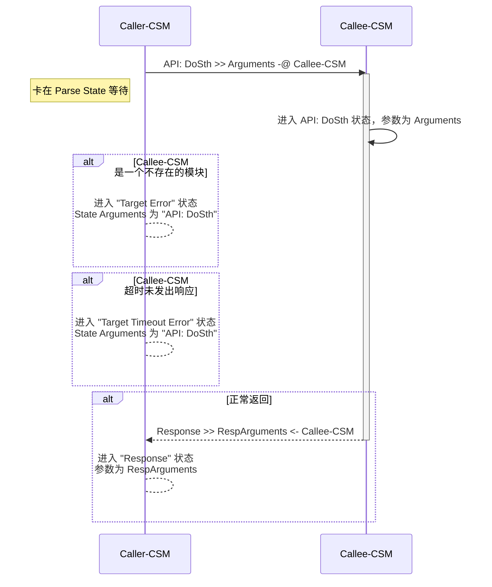
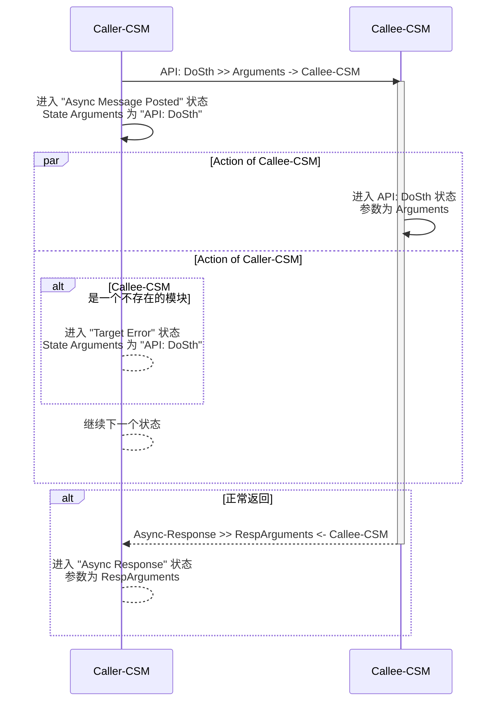
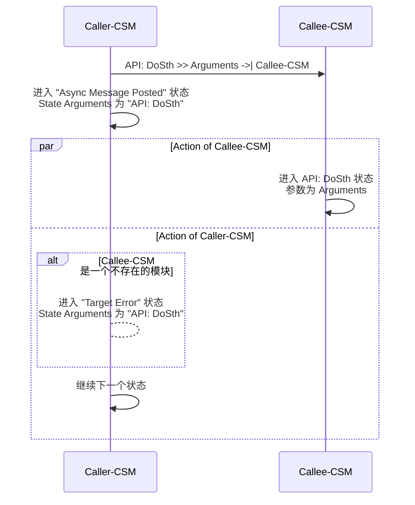

# 模块间通讯概述

CSM 支持三种通讯方式：同步调用、异步调用和状态订阅。选择哪种方式取决于你的需求。

| 通讯方式 | 符号 | 等待返回 | 适用场景 |
|---------|------|---------|----------|
| 同步调用 | `-@` | 是 | 需要立即获取结果 |
| 异步调用（有返回） | `->` | 否，后续处理 | 耗时操作但需要结果 |
| 异步调用（无返回） | `->\|` | 否 | 单向通知 |
| 状态订阅 | `<register>` | 事件驱动 | 状态变化监听 |

# 同步调用 (`-@`)

同步调用会阻塞当前模块，直到目标模块处理完成并返回结果。用 `-@` 表示。

## 超时配置

默认超时时间为 -2（使用全局设置）。可以通过 `CSM - Set TMO of Sync-Reply VI` 修改全局超时。

**特殊值**:
- `-2`: 使用全局超时（默认）
- `-1`: 永久等待
- `> 0`: 指定超时时间（毫秒）

**注意事项**:
- 根据实际处理时间设置合理的超时
- 尽量避免 -1，除非确定一定会收到响应
- 网络通讯时适当增加超时时间

## 错误处理

同步调用可能遇到三种错误：

**No Target Error**: 目标模块名为空字符串  
**Target Error**: 目标模块不存在，可用 `CSM - Check If Module Exists.vi` 检查  
**Target Timeout Error**: 超时未响应，考虑增加超时时间或改用异步调用

## 执行流程



## 使用示例

**SubModule 实现 "API: EchoArguments"** - 将参数原样返回


**MainModule 同步调用 SubModule**

按键中添加: `API: EchoArguments >> xyz -@ SubModule`


在 "Response" 状态处理响应:


运行效果（先启动 SubModule，再启动 MainModule）:


**非 CSM 代码调用**

可以用 `AdvanceAPI\CSM Send Message and Wait for Reply.vi` 在普通代码里同步调用:


# 异步调用 (`->` 或 `->|`)

异步调用发出消息后立即返回，不会阻塞。有两种形式：
- `->` 有返回值，完成后会进入 "Async Response" 状态
- `->|` 无返回值，发完就不管了

## 执行流程

**有返回的异步消息 (->)**



**无返回的异步消息 (->|)**



## 使用示例

**有返回的异步消息 (->)**

按键中添加: `API: EchoArguments >> xyz -> SubModule`


在 "Async Response" 状态处理响应:


**无返回的异步消息 (->\|)**

按键中添加: `API: EchoArguments >> xyz ->| SubModule`


有返回的消息会弹框显示结果，无返回的不会:


**非 CSM 代码调用**

用 `AdvanceAPI\CSM Post Message.vi` 发送异步消息（无返回）:


# 状态订阅

状态订阅是 CSM 最强大的特性之一，用于模块间解耦。模块不需要知道谁在监听它，只管发布状态；监听方注册感兴趣的状态就行。

## 为什么需要状态订阅

**举个例子**：音乐下载完后自动播放

传统方式的问题：
1. 下载模块需要知道播放模块的接口，耦合太紧
2. 外部要阻塞式调用下载，再手动触发播放，不够灵活

用状态订阅就简单了：
- 下载模块下载完成后发布 "下载完成" 状态（带文件路径参数）
- 播放模块注册这个状态，触发播放接口
- 想换成视频播放？只需改注册关系，代码不用动

## 发布状态

用 `CSM Broadcast Status Change.vi` 发布状态：


或者直接用字符串：
``` c
I'm timeout >> statusArguments -> <all>
```

## 订阅状态

用 `AdvanceAPI\CSM Register Status Change.vi` 订阅，`CSM Unregister Status Change.vi` 取消订阅。

支持通配符 "*" 代表所有模块。比如订阅 "*" 的 "Error Occurred" 状态，就能收到所有模块的错误通知。


## 使用示例

**SubModule 每 2 秒发布一次 "I'm timeout" 状态:**


**MainModule 通过按钮动态订阅/取消订阅:**


**订阅后的效果:**


# 消息构建 API

虽然熟悉规则后可以直接写字符串，但用 API 能减少错误。

## Build Message with Arguments++.vi

这是推荐的消息构建 API，提供多态 VI：

- **Build Message with Arguments(Auto Check).vi** - 自动检测消息类型
- **Build Synchronous Message with Arguments.vi** - 同步消息 `-@`
- **Build Asynchronous Message with Arguments.vi** - 异步消息 `->`
- **Build No-Reply Asynchronous Message with Arguments.vi** - 无返回异步 `->\|`
- **Build Interrupt Broadcast Message.vi** - 中断广播
- **Build Normal Broadcast Message.vi** - 信号广播
- **Build Register Message.vi** - 注册订阅
- **Build Unregister Message.vi** - 取消订阅

## Parse State Queue++.vi

CSM 的核心 VI，负责解析状态队列。

**主要输入**:
- **State Queue**: 状态队列（移位寄存器）
- **Response Arguments**: 响应参数
- **Name**: 模块名
- **Dequeue (1 ms)**: 检查消息队列的超时
- **Response Timeout (-2)**: 同步调用超时（-2 表示用全局设置）
- **Allowed Messages**: 消息白名单（空表示允许所有）

**主要输出**:
- **Remaining States**: 待执行状态
- **Current State**: 当前状态
- **Arguments**: 状态参数
- **Source CSM**: 消息来源模块

通过 `Allowed Messages` 可以实现消息过滤，这在责任链模式中很有用。

# 实用技巧

## 通讯方式选择

| 场景 | 推荐方式 | 理由 |
|------|---------|------|
| 获取配置信息 | 同步调用 | 立即需要结果 |
| 启动耗时任务 | 异步调用（有返回） | 不阻塞，但要结果 |
| 发送通知 | 异步调用（无返回） | 单向通知 |
| 状态变化通知 | 状态订阅 | 解耦灵活 |

## 常见模式

**请求-响应**: 同步调用处理 Response 状态  
**任务-通知**: 异步调用 + 订阅 TaskComplete 状态  
**发布-订阅**: 发送广播 + 订阅感兴趣的状态  
**责任链**: 用 Allowed Messages 过滤消息

## 性能优化

**消息队列**:
- 紧急消息用同步调用或中断广播
- 能异步就别同步
- 避免消息积压

**参数传递**:
- 小数据直接传字符串
- 大数据用 MassData Addon
- 复杂结构用 HEXSTR
- 共享数据用 CSM Attribute

## 调试技巧

**消息追踪**: 用全局日志、State Dashboard 查看消息流  
**消息未送达**: 检查目标模块是否存在，名称是否正确  
**同步调用超时**: 检查被调用模块是否运行，超时时间是否合理  
**异步响应未收到**: 确认用的是 `->` 而不是 `->\|`  
**订阅未触发**: 确认订阅关系已建立，广播是否正确发送

更多调试工具请参考 [CSM调试与开发工具](../plugins/tools) 和 [CSM全局日志系统](./global-log)。
