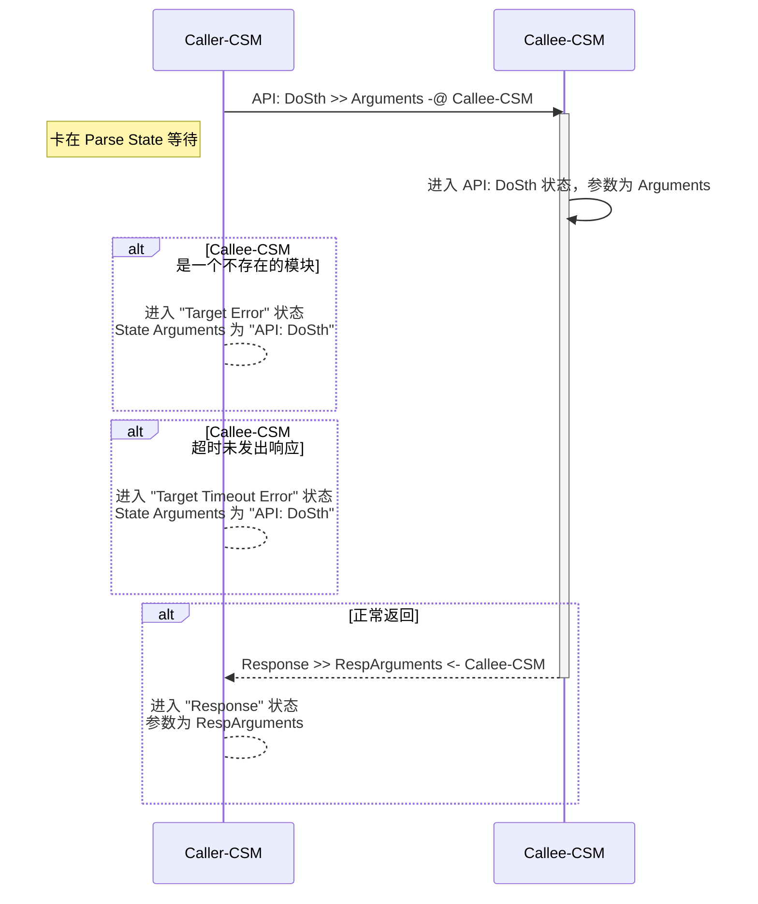
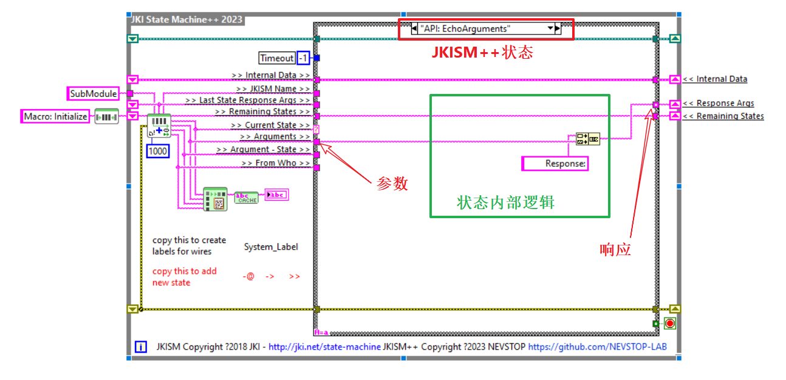
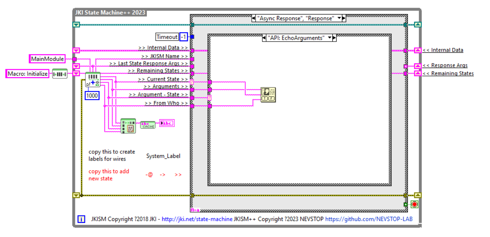
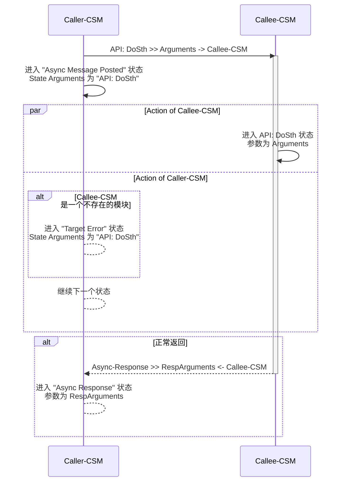
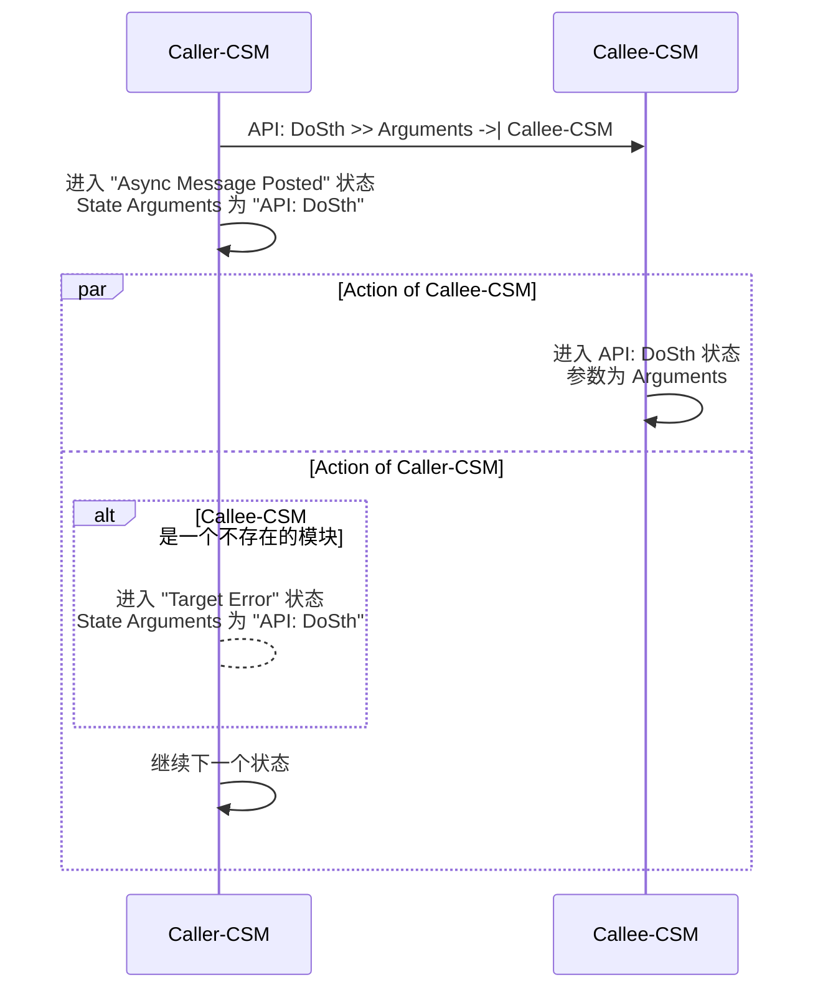
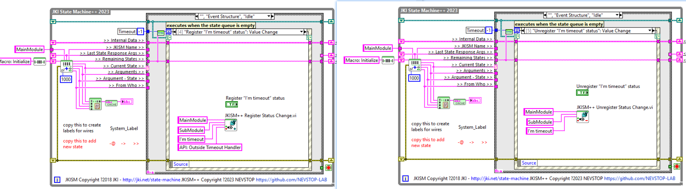
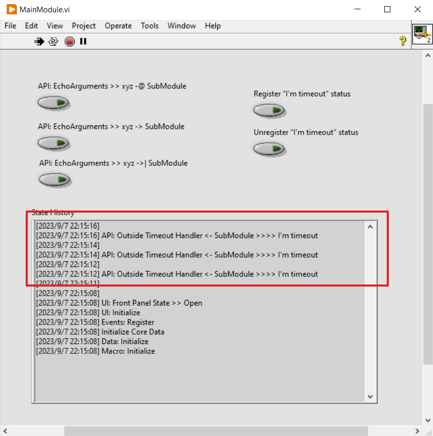

# 模块间通讯

---

CSM 支持以下通讯方式：

| 通讯方式 | 符号 | 等待返回 | 适用场景 |
|---------|------|---------|----------|
| 同步调用 | `-@` | 是 | 需要立即获取结果 |
| 异步调用（有返回） | `->` | 否，后续处理 | 耗时操作但需要结果 |
| 异步调用（无返回） | `->|` | 否 | 单向通知 |
| 信号广播 | `<status>` / `<broadcast>` | 否 | 向所有订阅者广播状态 |
| 中断广播 | `<interrupt>` | 否 | 高优先级广播 |
| 状态订阅 | `<register>` / `<unregister>` | 事件驱动 | 状态变化监听 |

## 同步调用 (-@)

同步调用会阻塞当前模块，直到目标模块处理完成并返回结果。

### 执行流程


``` mermaid
sequenceDiagram
Caller-CSM ->> Callee-CSM: API: DoSth >> Arguments -@ Callee-CSM
activate Callee-CSM
Note left of Caller-CSM: 卡在 Parse State 等待
Callee-CSM ->> Callee-CSM: 进入 API: DoSth 状态，参数为 Arguments

alt Callee-CSM 是一个不存在的模块
    Caller-CSM --> Caller-CSM: 进入 "Target Error" 状态 <br/> State Arguments 为 "API: DoSth"
end

alt Callee-CSM 超时未发出响应

    Caller-CSM --> Caller-CSM: 进入 "Target Timeout Error" 状态 <br/> State Arguments 为 "API: DoSth"
end

alt 正常返回
    Callee-CSM -->> Caller-CSM : Response >> RespArguments <- Callee-CSM
    deactivate Callee-CSM
    Caller-CSM --> Caller-CSM: 进入 "Response" 状态 <br/> 参数为 RespArguments
end

```

### 超时配置

通过 [`CSM - Set TMO of Sync-Reply.vi`](#csm---set-tmo-of-sync-replyvi) 可修改全局超时。超时参数含义：

- `-2`：使用全局超时（默认）
- `-1`：永久等待
- `> 0`：指定超时时间（毫秒）

尽量避免 `-1`，除非确定一定会收到响应。

### 错误处理

同步调用可能遇到三种错误：

- **No Target Error**：目标模块名为空字符串
- **Target Error**：目标模块不存在，可用 [`CSM - Check If Module Exists.vi`](#csm---check-if-module-existsvi) 检查
- **Target Timeout Error**：超时未响应，考虑增加超时时间或改用异步调用

#### 示例

**SubModule 实现 "API: EchoArguments"** — 将参数原样返回



**MainModule 同步调用 SubModule**

按键中添加：`API: EchoArguments >> xyz -@ SubModule`


在 "Response" 状态处理响应：


运行效果（先启动 SubModule，再启动 MainModule）：


**非 CSM 代码调用**

可以用 [`CSM - Send Message and Wait for Reply.vi`](#csm---send-message-and-wait-for-replyvi)（位于 `AdvanceAPI` 子面板）在普通代码里同步调用：


## 异步调用 (-> / ->|)

异步调用发出消息后立即返回，不会阻塞。有两种形式：

- `->` 有返回值，完成后会进入 `Async Response` 状态
- `->|` 无返回值，发完就不管了

### 执行流程（有返回）


``` mermaid
sequenceDiagram
Caller-CSM ->> Callee-CSM: API: DoSth >> Arguments -> Callee-CSM
activate Callee-CSM

Caller-CSM ->> Caller-CSM: 进入 "Async Message Posted" 状态 <br/> State Arguments 为 "API: DoSth"

Par Action of Callee-CSM
Callee-CSM ->> Callee-CSM: 进入 API: DoSth 状态 <br/> 参数为 Arguments
and Action of Caller-CSM

alt Callee-CSM 是一个不存在的模块
    Caller-CSM --> Caller-CSM: 进入 "Target Error" 状态 <br/> State Arguments 为 "API: DoSth"
end

Caller-CSM --> Caller-CSM: 继续下一个状态

End

alt 正常返回
    Callee-CSM -->> Caller-CSM : Async-Response >> RespArguments <- Callee-CSM
    deactivate Callee-CSM
    Caller-CSM --> Caller-CSM: 进入 "Async Response" 状态 <br/> 参数为 RespArguments
end

```

### 执行流程（无返回）


``` mermaid
sequenceDiagram
Caller-CSM ->> Callee-CSM: API: DoSth >> Arguments ->| Callee-CSM

Caller-CSM ->> Caller-CSM: 进入 "Async Message Posted" 状态 <br/> State Arguments 为 "API: DoSth"

Par Action of Callee-CSM
Callee-CSM ->> Callee-CSM: 进入 API: DoSth 状态 <br/> 参数为 Arguments

and Action of Caller-CSM

alt Callee-CSM 是一个不存在的模块
    Caller-CSM --> Caller-CSM: 进入 "Target Error" 状态 <br/> State Arguments 为 "API: DoSth"
end
Caller-CSM ->> Caller-CSM: 继续下一个状态

End
```

#### 示例

**有返回的异步消息 (->)**

按键中添加：`API: EchoArguments >> xyz -> SubModule`


在 "Async Response" 状态处理响应：


**无返回的异步消息 (->|)**

按键中添加：`API: EchoArguments >> xyz ->| SubModule`


有返回的消息会弹框显示结果，无返回的不会：


**非 CSM 代码调用**

用 [`CSM - Post Message.vi`](#csm---post-messagevi)（位于 `AdvanceAPI` 子面板）发送异步消息（无返回）：


## 广播(Broadcast)

广播是 CSM 的 1 对多通讯方式，订阅方注册感兴趣的广播即可收到通知。

CSM 中的广播分为三种类型：

| 广播类型 | 符号 | 优先级 | 触发方式 | 适用场景 |
| -------- | ---- | ------ | -------- | -------- |
| 信号广播 (Status) | `<status>` / `<broadcast>` | 低（与异步消息相同） | 显式调用 | 主动发送事件通知（如数据采集完成） |
| 中断广播 (Interrupt) | `<interrupt>` | 高（与同步消息相同） | 显式调用 | 紧急通知，需要被立即处理 |
| 状态广播 (State) | 无需符号 | 低（默认与信号广播相同） | 隐式，订阅后自动触发 | 订阅模块内部状态变化（执行完某状态后自动通知） |

### 信号广播(<status>)

信号广播走**低优先级队列**，行为类似异步消息，按顺序处理：

```csm
ModuleStatus >> Arguments -> <status>
// 等价写法
ModuleStatus >> Arguments -> <broadcast>
```

### 中断广播(<interrupt>)

中断广播走**高优先级队列**，会被优先处理：

```csm
UrgentEvent >> Arguments -> <interrupt>
```

也可以通过 [`CSM - Broadcast Status Change.vi`](#csm---broadcast-status-changevi) 发布状态：


### 状态广播(State)

状态广播是**隐式广播**——当 CSM 模块运行完某个状态后，如果存在针对该状态的订阅关系，就会自动触发状态广播，将该状态的 Response 作为参数传递给订阅方。

{: .note }
> 状态广播**只有在存在订阅关系时才会发送**，无需显式调用。因此在没有订阅的情况下，不会产生任何额外开销。

### 订阅与生命周期

用 [`CSM - Register Broadcast.vi`](#csm---register-broadcastvi) 订阅，[`CSM - Unregister Broadcast.vi`](#csm---unregister-broadcastvi) 取消订阅。

支持通配符 `*` 代表所有来源模块。例如订阅 `*` 的 `Error Occurred` 状态，就能收到所有模块的错误通知。

```csm
// 订阅 / 取消订阅
Status@SourceModule >> API@TargetModule -><register>
Status@SourceModule >> API@TargetModule -><unregister>

// 将订阅的广播改为普通优先级（无论发送方原来是何优先级）
Status@SourceModule >> API@TargetModule -><register as status>
// 将订阅的广播改为高优先级（无论发送方原来是何优先级）
Status@SourceModule >> API@TargetModule -><register as interrupt>
```

**订阅的生命周期**：

- 指定了目标模块名（如 `API@TargetModule`）：**外部规则**，全局生效，模块退出后不会自动删除
- 未指定目标模块名（如仅 `API`）：**内部规则**，模块退出时自动删除

## 状态订阅

状态订阅是 CSM 中最常用的解耦方式，下面通过一个完整示例展示用法。

**举个例子**：音乐下载完后自动播放

- 传统方式：下载模块需要知道播放模块的接口，耦合太紧；外部要阻塞式调用下载，再手动触发播放
- 用状态订阅：下载模块发布 "下载完成" 状态（带文件路径参数），播放模块注册这个状态；想换成视频播放？只改注册关系，代码不用动

### 发布状态

```csm
// 发布一个状态广播（带参数）
I'm timeout >> statusArguments -> <all>
```

### 订阅状态


#### 示例

**SubModule 每 2 秒发布一次 "I'm timeout" 状态：**


**MainModule 通过按钮动态订阅/取消订阅：**


**订阅后的效果：**


## 消息构建 API

熟悉规则后可以直接写字符串，但推荐使用 API 以减少拼写错误。

### Build Message with Arguments++.vi

这是推荐的消息构建 API，提供多态 VI：

- **[Build Message with Arguments(Auto Check).vi](#build-message-with-argumentsauto-checkvi)** — 自动检测消息类型
- **[Build Synchronous Message with Arguments.vi](#build-synchronous-message-with-argumentsvi)** — 同步消息 `-@`
- **[Build Asynchronous Message with Arguments.vi](#build-asynchronous-message-with-argumentsvi)** — 异步消息 `->`
- **[Build No-Reply Asynchronous Message with Arguments.vi](#build-no-reply-asynchronous-message-with-argumentsvi)** — 无返回异步 `->|`
- **[Build Interrupt Broadcast Message.vi](#build-interrupt-broadcast-messagevi)** — 中断广播
- **[Build Status Broadcast Message.vi](#build-status-broadcast-messagevi)** — 信号广播
- **[Build Register Message.vi](#build-register-messagevi)** — 注册订阅
- **[Build Unregister Message.vi](#build-unregister-messagevi)** — 取消订阅

### Parse State Queue++.vi

CSM 的核心 VI，负责解析状态队列。[查看完整 API 文档](#parse-state-queuevi)

**主要输入**：

- **State Queue**：状态队列（移位寄存器）
- **Response Arguments**：响应参数
- **Name**：模块名
- **Dequeue (1 ms)**：检查消息队列的超时
- **Response Timeout (-2)**：同步调用超时（-2 表示用全局设置）
- **Allowed Messages**：消息白名单（空表示允许所有）

**主要输出**：

- **Remaining States**：待执行状态
- **Current State**：当前状态
- **Arguments**：状态参数
- **Source CSM**：消息来源模块

通过 `Allowed Messages` 可以实现消息过滤，这在责任链模式中很有用。

## 实用技巧

### 通讯方式选择

| 场景 | 推荐方式 | 理由 |
|------|---------|------|
| 获取配置信息 | 同步调用 | 立即需要结果 |
| 启动耗时任务 | 异步调用（有返回） | 不阻塞，但要结果 |
| 发送通知 | 异步调用（无返回） | 单向通知 |
| 紧急广播 | 中断广播 | 高优先级，优先处理 |
| 状态变化通知 | 状态订阅 | 解耦灵活 |

### 混合消息场景

实际应用中经常会在一种消息执行过程中发送另一种消息。以下是常见场景的行为说明：

#### 同步调用时发送异步消息

同步消息正在等待响应时，可以同时发出异步消息。异步消息会立即发送，不被同步调用阻塞；其 `Async Message Posted` 状态会加入队列，待同步消息返回后依次处理。

```csm
API: GetData >> params -@ Database        // 同步调用，等待返回
API: UpdateProgress >> 50% ->| UI         // 等待期间同时发出异步消息
```

#### 嵌套同步调用

模块 A 同步调用 B，B 在处理时再同步调用 C，形成调用链 A → B → C → B → A。

- ⚠️ **避免循环调用**（A 调用 B，B 又调用 A）：会死锁
- ⚠️ **超时累积**：总耗时是链上所有调用的总和，需合理设置超时

```csm
// 模块 B 在处理 A 的请求时
API: ValidateUser >> userId -@ ModuleC    // 嵌套同步调用
API: CheckInventory >> itemId -@ ModuleD  // 再次嵌套
```

#### 异步消息处理时发出多个异步消息

完全非阻塞，所有异步消息立即发送；多个异步响应到达的顺序不确定，取决于各模块处理速度。

```csm
API: Task1 >> data ->| ModuleB    // 异步无返回
API: Task2 >> data -> ModuleC     // 异步有返回
API: Log >> info ->| LogModule    // 异步日志
```

### 常见问题排查

- **消息未送达**：检查目标模块是否存在，名称是否正确
- **同步调用超时**：检查被调用模块是否运行，超时时间是否合理
- **异步响应未收到**：确认用的是 `->` 而不是 `->|`
- **订阅未触发**：确认订阅关系已建立，广播是否正确发送
- **消息追踪**：用全局日志、State Dashboard 查看消息流

更多调试工具请参考 [CSM调试与开发工具](../plugins/tools) 和 [CSM全局日志系统](./global-log)。
