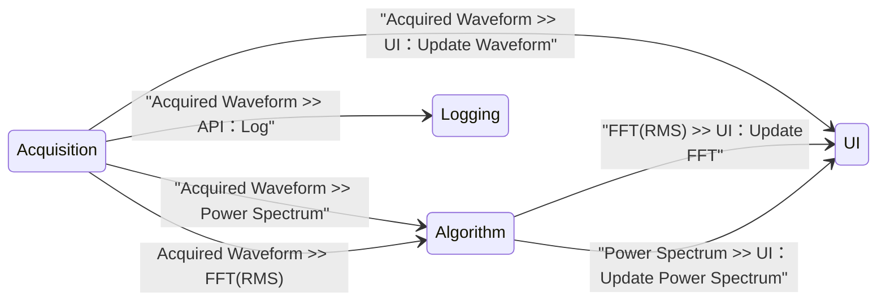

# CSM Continuous Measurement and Logging

基于 CSM（可通信状态机）框架更简单、更直观、更优雅地实现连续测量和记录应用的示例。

> 项目仓库：[https://github.com/NEVSTOP-LAB/CSM-Continuous-Meausrement-and-Logging](https://github.com/NEVSTOP-LAB/CSM-Continuous-Meausrement-and-Logging)

## 需求映射

在开始编码之前，我们首先要将应用需求分解并映射到CSM模块和接口设计。这是CSM应用开发的关键步骤。

### 应用需求分析

这个连续测量和记录应用的核心需求包括：

1. **数据采集**：持续采集波形数据
2. **数据记录**：将采集的数据保存到TDMS文件
3. **数据分析**：对采集的数据进行实时分析（FFT、功率谱等）
4. **用户界面**：显示数据和分析结果，控制采集和记录的启停
5. **配置管理**：管理采集参数和文件保存路径

### 需求到模块的映射

根据单一职责原则，我们将需求映射到独立的CSM模块：

| 需求领域 | CSM模块 | 职责 |
|---------|---------|------|
| 数据采集 | `Acquisition Module` | 按设定的采样率生成或采集波形数据 |
| 数据记录 | `Logging Module` | 将数据写入TDMS文件 |
| 数据分析 | `Algorithm Module` | 执行FFT、功率谱等分析算法 |
| 用户界面与控制 | `UI Module` | 显示数据、响应用户操作、协调其他模块 |

### 功能到API的映射

每个模块的功能需求转化为清晰的API接口：

**Acquisition Module 的 API 设计**：
- 需求：开始采集 → API: `API: Start`
- 需求：停止采集 → API: `API: Stop`
- 需求：数据就绪通知 → 状态广播: `Acquired Waveform`

**Logging Module 的 API 设计**：
- 需求：配置保存路径 → API: `API: Update Settings`
- 需求：开始记录 → API: `API: Start`
- 需求：记录数据 → API: `API: Log`
- 需求：停止记录 → API: `API: Stop`

**Algorithm Module 的 API 设计**：
- 需求：FFT(Peak)分析 → API: `API: FFT(Peak)`
- 需求：FFT(RMS)分析 → API: `API: FFT(RMS)`
- 需求：功率谱分析 → API: `API: Power Spectrum`

**UI Module 的状态设计**：
- 需求：初始化 → 宏状态: `Macro: Initialize`
- 需求：启动采集和记录 → 宏状态: `Macro: Start`
- 需求：停止采集和记录 → 宏状态: `Macro: Stop`
- 需求：更新显示 → 状态: `UI: Update Waveforms`, `UI: Update FFT`
- 需求：退出应用 → 宏状态: `Macro: Exit`

### 数据流映射

需求中的数据流通过状态订阅机制实现：

| 数据流需求 | CSM实现方式 |
|-----------|------------|
| 采集数据 → 记录到文件 | `Acquired Waveform@Acquisition >> API: Log@Logging -><register>` |
| 采集数据 → 分析 | `Acquired Waveform@Acquisition >> API: Power Spectrum@Algorithm -><register>` |
| 采集数据 → 界面显示 | `Acquired Waveform@Acquisition >> UI: Update Waveforms -><register>` |
| 分析结果 → 界面显示 | `Power Spectrum@Algorithm >> UI: Update FFT -><register>` |

这种映射方式的优势：
- **模块解耦**：数据生产者不需要知道数据消费者是谁
- **灵活配置**：可以动态注册/取消订阅，改变数据流向
- **易于扩展**：添加新的数据消费者只需注册订阅，无需修改生产者代码

### 设计总结

通过上述需求映射过程，我们：
1. 将应用需求分解为独立的功能模块
2. 为每个模块定义清晰的API接口
3. 使用状态订阅机制连接数据流
4. 实现了松耦合、高内聚的模块化架构

这种设计方法可以应用到任何CSM应用中，帮助开发者从需求出发，系统地构建CSM应用架构。

## 可复用模块

### `Logging Module` : 将1D波形数据记录到TDMS文件中

| API | 描述 | 参数 | 响应 |
| --- | --- | --- | --- |
| `API: Update Settings` | 配置API | 数据文件夹的完整路径 <br/> (类型: 普通字符串) | N/A |
| `API: Start` | 开始记录。在数据文件夹中创建基于时间的文件名的TDMS文件。 | N/A | N/A |
| `API: Log` | 将数据记录到TDMS文件中。 | 1D波形数组。 <br/> (类型: `MassData`) | N/A |
| `API: Stop` | 停止记录。 | N/A | N/A |

**示例：（假设模块名称为"Logging"）**

``` text
API: Update Settings >> c:\_data -> Logging
API: Log >> MassData-Start:89012,Size:1156 -> Logging
API: Start -> Logging
API: Stop -> Logging
```

### DAQ模块

| API | 描述 | 参数 | 响应 |
| --- | --- | --- | --- |
| `API: Start` | 开始每200毫秒生成数据。 | N/A | N/A |
| `API: Stop` | 停止数据生成。 | N/A | N/A |

| Status | 描述 | 参数 |
| --- | --- | --- |
| Acquired Waveform | 模拟生成的数据  | 1D波形数组. <br/> (类型: MassData) |

模块的前面板(Front Panel)用于参数配置。

#### `Acquisition Module`: 生成正弦/方波模拟信号数据


#### `SoundInput-DAQ`: 使用声卡采集波形数据


**示例：（假设模块名称为"Acquisition"）**

``` text
API: Start -> Acquisition
API: Stop -> Acquisition
```

### `Algorithm Module`: 波形数据分析模块

| API | 描述 | 参数 | 响应 |
| --- | --- | --- | --- |
| `API: FFT(Peak)` | FFT(peak) 分析方法 | 1D波形数组. <br/> (类型: MassData) | Cluster波形数组. <br/> (类型: MassData) |
| `API: FFT(RMS)` | FFT(RMS) 分析方法 | 1D波形数组. <br/> (类型: MassData) | Cluster波形数组. <br/> (类型: MassData) |
| `API: Power Spectrum` | Power Spectrum 分析方法 | 1D波形数组. <br/> (类型: MassData) | Cluster波形数组. <br/> (类型: MassData) |

## 连续测量和记录应用程序

"Logging Module" 和 "Acquisition Module" 是设计为完全独立工作的，彼此之间没有直接联系。为了创建完整的连续测量和记录应用，需要一个用户界面模块来协调这两个底层模块的工作。为了简化实现（并便于与Workers框架进行比较），用户界面模块同时也充当应用程序的控制器。

当需要使用真实硬件进行数据采集时，可以为您的特定硬件创建另一个具有相同 API 和状态接口的 CSM 模块，然后替换 UI 模块中的 Acquisition Module。这样可以轻松切换和集成不同的硬件模块，而无需更改 UI 模块的其余部分，因为它们遵循相同的 API 和状态接口。

### 用户界面模块

创建一个类似于 [Workers Continuous Measurement and Logging Example](https://www.vipm.io/package/sc_workers_framework_core/) 的用户界面。


使用 CSM 模板创建程序框图，将 "Logging Module" 和 "Acquisition Module" 作为子模块放置在 VI 后面板。


### 系统架构

CSM 框架通过隐形总线实现模块间的消息传递：



### 宏命令与工作流程

#### 启动过程 (Macro: Initialize)

初始化数据和用户界面(UI)，从 XML 文件加载配置并将配置发送给子模块。将 'Acquisition' 模块的 'Acquired Waveform' 状态注册到 'UI' 模块的 'UI: Update Waveforms' 状态。当 'Acquired Waveform' 状态发生时，'UI' 将自动切换到 'UI: Update Waveforms' 状态。

``` text
Data: Initialize
Initialize Core Data
Data: Load Configuration From Ini
Events: Register
UI: Initialize
UI: Front Panel State >> Open
Do: Update Settings
DO: Update Status >> Ready...
```


#### 退出过程 (Macro: Exit)

停止子模块和用户界面模块本身。

``` text
Macro: Exit -@ Acquisition
Macro: Exit -@ Logging
Macro: Exit -@ Algorithm
UI: Front Panel State >> Close
Data: Cleanup
Events: Unregister
Exits
```


#### 开始采集过程 (Macro: Start)

更新用户界面(UI)并触发子模块以启动消息进行工作。将 "Acquisition" 模块的 "Acquired Waveform" 状态注册到 "Logging" 模块的 "API: Log" 状态。当 "Acquired Waveform" 状态发生时，"Logging" 模块将自动执行 "API: Log"。

``` text
//Register Status
Acquired Waveform@Acquisition >> API: Log@Logging -><register>
Acquired Waveform@Acquisition >> API: Power Spectrum@Algorithm -><register>
Acquired Waveform@Acquisition >> UI: Update Waveforms -><register>
Power Spectrum@Algorithm >> UI: Update FFT -><register>

//Local States
DO: Update Status >> Acquiring and Logging...
UI: Update When Start

//Send Message to Other CSM Modules
API: Start ->| Logging
API: Start ->| Acquisition
```


#### 停止采集过程 (Macro: Stop)

更新用户界面(UI)并停止子模块。取消注册 "Acquisition" 模块的 "Acquired Waveform" 状态。

``` text
//Local States
DO: Update Status >> Stopping...
UI: Update When Stop

//Send Message to Other CSM Modules
API: Stop ->| Logging
API: Stop ->| Acquisition

//Unregister Status
Acquired Waveform@Acquisition >> API: Log@Logging -><unregister>
Acquired Waveform@Acquisition >> API: Power Spectrum@Algorithm -><unregister>
Acquired Waveform@Acquisition >> UI: Update Waveforms -><unregister>
Power Spectrum@Algorithm >> UI: Update FFT -><unregister>
```


## 下载

通过VIPM搜索 **CSM Continuous Measurement and Logging**，即可下载安装。

## 依赖项

- CSM Framework - NEVSTOP

## 架构优势

这个示例充分展示了CSM框架的优势：

- **模块化设计**：各模块独立开发，互不干扰
- **松耦合**：通过状态注册机制实现模块间通信，无需硬编码依赖
- **易于扩展**：可以轻松替换或添加新的模块（如不同的DAQ硬件）
- **代码复用**：底层模块可以在不同的应用中重复使用
