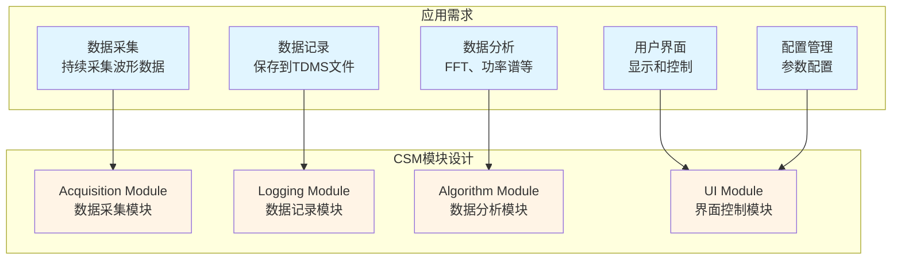
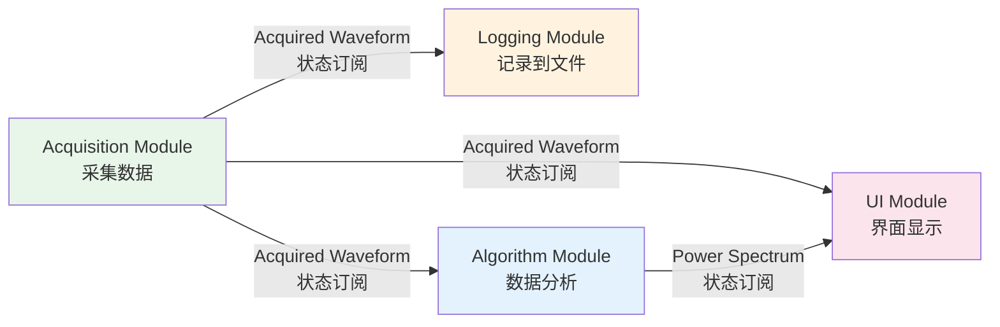
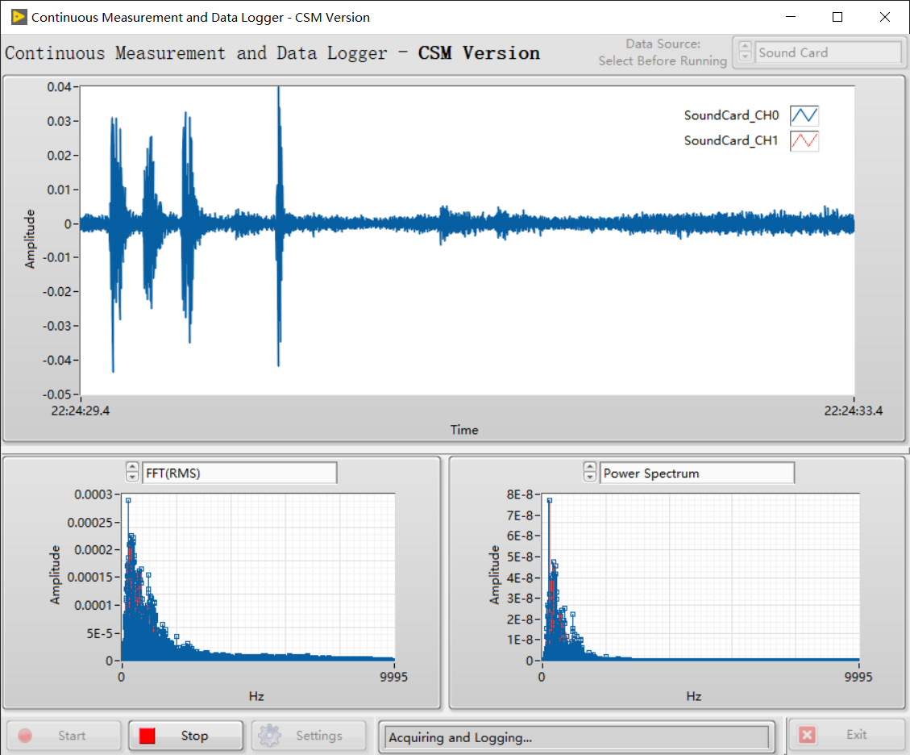
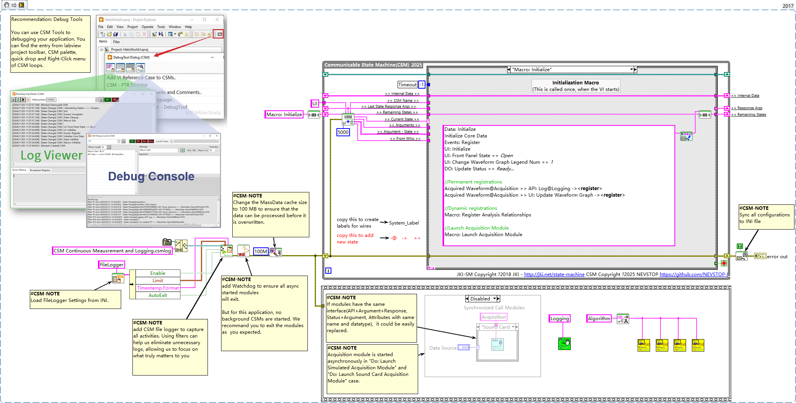
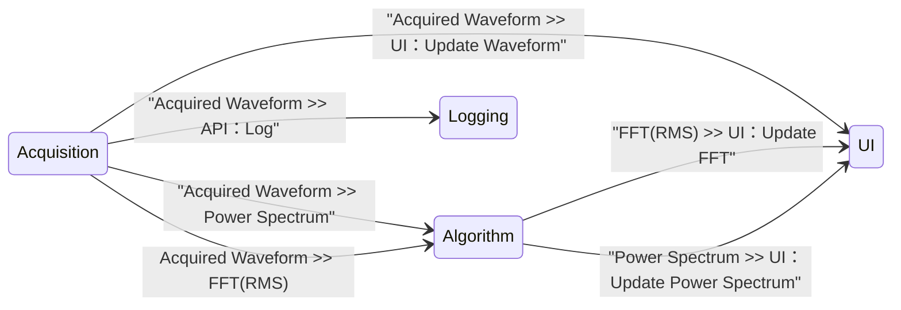

# 连续测量与记录项目

---

基于 CSM（可通信状态机）框架更简单、更直观、更优雅地实现连续测量和记录应用的示例。

> 项目仓库：[https://github.com/NEVSTOP-LAB/CSM-Continuous-Meausrement-and-Logging](https://github.com/NEVSTOP-LAB/CSM-Continuous-Meausrement-and-Logging)

## 场景描述

### 项目任务与现状

1. 需要创建一个**连续的数据采集、存储和分析系统**。
2. 分析算法暂时不明确。
3. 后期可能需要支持中控系统，需要被远程控制和数据备份。
4. 硬件仍在采购中，但是项目周期比较紧张，先要编写程序。
5. 新人同事小李与你一起完成这个项目。
6. 交付后，这个项目会部署偏远地区，可能需要长期支持。

### 初步模块化设计

根据功能职责划分，初步模块设计如下：

- **数据采集模块 (DAQ)**：负责连续采集原始数据
- **数据分析模块 (Algorithm)**：处理和分析原始数据
- **数据保存模块 (Logging)**：将原始数据和分析结果持久化
- **界面模块 (UI)**：负责显示和控制
- **TCP通讯模块（可选）**：支持远程控制
- **数据备份模块（可选）**：网络备份功能

### 系统架构师的设计考量

在进行详细设计之前，系统架构师需要思考以下问题：

**实现细节**：

- DAQ：DAQ 模块启动失败怎么办？如何保证 Logging 模块先于 DAQ 模块准备就绪？
- Algorithm：算法是否耗时？是否需要 Workers 模式并行处理？
- Logging：数据量大，队列效率是否足够？Logging 必须在 DAQ 前准备好，否则会丢数

**扩展性问题**：

- 模块是否可能会有多个实例？
- 如果要添加数据备份模块，源代码需要修改哪些？
- 如果加入 TCP 通讯模块，只与界面模块通讯是否足够？
- 如果现场出现问题，能否远程快速定位问题？

**复用性问题**：

- DAQ 模块替换？（例如硬件到位后替换模拟 DAQ）
- DAQ/Algorithm/Logging 模块能否用于其他项目？

**团队分工**：

- 模块如何定义清楚，以便于分工？
- 如何进行单模块测试？
- 如何多人并行开发？
- 如何在某个基础模块没有完成时整体调试？

{: .tip }
> CSM 框架的设计能够很好地解决上述问题：纯文本接口定义支持团队分工，调试面板支持单模块独立测试，虚拟总线设计支持插件化扩展，内置日志系统支持远程运维。

## 需求映射

在开始编码之前，我们首先要将应用需求分解并映射到CSM模块和接口设计。这是CSM应用开发的关键步骤。

### 需求分析与映射思路

这个连续测量和记录应用需要实现数据采集、记录、分析和显示的完整流程。根据CSM框架的单一职责原则，我们将功能需求拆分为独立的模块，每个模块负责一个明确的职责。


``` mermaid
graph TB
    subgraph "应用需求"
        R1[数据采集<br/>持续采集波形数据]
        R2[数据记录<br/>保存到TDMS文件]
        R3[数据分析<br/>FFT、功率谱等]
        R4[用户界面<br/>显示和控制]
        R5[配置管理<br/>参数配置]
    end
    
    subgraph "CSM模块设计"
        M1[Acquisition Module<br/>数据采集模块]
        M2[Logging Module<br/>数据记录模块]
        M3[Algorithm Module<br/>数据分析模块]
        M4[UI Module<br/>界面控制模块]
    end
    
    R1 --> M1
    R2 --> M2
    R3 --> M3
    R4 --> M4
    R5 --> M4
    
    style R1 fill:#e1f5ff
    style R2 fill:#e1f5ff
    style R3 fill:#e1f5ff
    style R4 fill:#e1f5ff
    style R5 fill:#e1f5ff
    style M1 fill:#fff4e6
    style M2 fill:#fff4e6
    style M3 fill:#fff4e6
    style M4 fill:#fff4e6
```

### 从需求到API设计

每个模块的功能需求自然转化为API接口。以Acquisition Module为例，"开始采集"和"停止采集"的需求直接映射为`API: Start`和`API: Stop`接口。当采集到数据后，通过`Acquired Waveform`状态广播通知其他模块，这种设计使得数据生产者无需关心数据的消费者是谁。

Logging Module提供数据记录能力，通过`API: Update Settings`配置保存路径，`API: Start`和`API: Stop`控制记录的开始和停止，`API: Log`接收并写入数据。Algorithm Module则提供多种分析方法的API接口，如`API: FFT(Peak)`、`API: FFT(RMS)`和`API: Power Spectrum`，每个API接收波形数据并返回分析结果。

UI Module作为协调者，实现用户交互和流程控制。通过`Macro: Initialize`完成初始化，`Macro: Start`和`Macro: Stop`控制整个应用的启停流程，并通过`UI: Update Waveforms`和`UI: Update FFT`等状态更新界面显示。

### 数据流的订阅机制

CSM框架的状态订阅机制是实现数据流的关键。下图展示了数据如何从采集模块流向记录、分析和显示模块：


``` mermaid
graph LR
    Acq[Acquisition Module<br/>采集数据]
    Log[Logging Module<br/>记录到文件]
    Alg[Algorithm Module<br/>数据分析]
    UI[UI Module<br/>界面显示]
    
    Acq -->|Acquired Waveform<br/>状态订阅| Log
    Acq -->|Acquired Waveform<br/>状态订阅| Alg
    Acq -->|Acquired Waveform<br/>状态订阅| UI
    Alg -->|Power Spectrum<br/>状态订阅| UI
    
    style Acq fill:#e8f5e9
    style Log fill:#fff3e0
    style Alg fill:#e3f2fd
    style UI fill:#fce4ec
```

当Acquisition Module采集到数据时，它发布`Acquired Waveform`状态。Logging Module订阅了这个状态并映射到`API: Log`，自动触发数据记录。Algorithm Module同样订阅该状态并映射到`API: Power Spectrum`，自动执行分析。UI Module订阅后更新波形显示。这种发布-订阅模式实现了模块间的完全解耦，数据生产者不需要知道有多少消费者，也不需要在代码中显式调用它们。

### 设计优势

这种需求映射方法带来了清晰的架构：应用需求被分解为独立的功能模块，每个模块通过明确的API接口对外提供服务，模块间通过状态订阅机制连接数据流。这样的设计实现了松耦合、高内聚的模块化架构，使得每个模块都可以独立开发、测试和复用。当需要添加新功能时，只需创建新模块并注册相应的状态订阅，无需修改现有代码。

## 可复用模块

### `Logging Module` : 将1D波形数据记录到TDMS文件中

| API | 描述 | 参数 | 响应 |
| --- | --- | --- | --- |
| `API: Update Settings` | 配置API | 数据文件夹的完整路径 <br/> (类型: 普通字符串) | N/A |
| `API: Start` | 开始记录。在数据文件夹中创建基于时间的文件名的TDMS文件。 | N/A | N/A |
| `API: Log` | 将数据记录到TDMS文件中。 | 1D波形数组。 <br/> (类型: `MassData`) | N/A |
| `API: Stop` | 停止记录。 | N/A | N/A |

**示例：（假设模块名称为"Logging"）**

``` csm
API: Update Settings >> c:\_data -> Logging
API: Log >> MassData-Start:89012,Size:1156 -> Logging
API: Start -> Logging
API: Stop -> Logging
```

### DAQ模块

| API | 描述 | 参数 | 响应 |
| --- | --- | --- | --- |
| `API: Start` | 开始每200毫秒生成数据。 | N/A | N/A |
| `API: Stop` | 停止数据生成。 | N/A | N/A |

| Status | 描述 | 参数 |
| --- | --- | --- |
| Acquired Waveform | 模拟生成的数据  | 1D波形数组. <br/> (类型: MassData) |

模块的前面板(Front Panel)用于参数配置。

#### `Acquisition Module`: 生成正弦/方波模拟信号数据


#### `SoundInput-DAQ`: 使用声卡采集波形数据


**示例：（假设模块名称为"Acquisition"）**

``` csm
API: Start -> Acquisition
API: Stop -> Acquisition
```

### `Algorithm Module`: 波形数据分析模块

| API | 描述 | 参数 | 响应 |
| --- | --- | --- | --- |
| `API: FFT(Peak)` | FFT(peak) 分析方法 | 1D波形数组. <br/> (类型: MassData) | Cluster波形数组. <br/> (类型: MassData) |
| `API: FFT(RMS)` | FFT(RMS) 分析方法 | 1D波形数组. <br/> (类型: MassData) | Cluster波形数组. <br/> (类型: MassData) |
| `API: Power Spectrum` | Power Spectrum 分析方法 | 1D波形数组. <br/> (类型: MassData) | Cluster波形数组. <br/> (类型: MassData) |

## 连续测量和记录应用程序

"Logging Module" 和 "Acquisition Module" 是设计为完全独立工作的，彼此之间没有直接联系。为了创建完整的连续测量和记录应用，需要一个用户界面模块来协调这两个底层模块的工作。为了简化实现（并便于与Workers框架进行比较），用户界面模块同时也充当应用程序的控制器。

当需要使用真实硬件进行数据采集时，可以为您的特定硬件创建另一个具有相同 API 和状态接口的 CSM 模块，然后替换 UI 模块中的 Acquisition Module。这样可以轻松切换和集成不同的硬件模块，而无需更改 UI 模块的其余部分，因为它们遵循相同的 API 和状态接口。

### 用户界面模块

创建一个类似于 [Workers Continuous Measurement and Logging Example](https://www.vipm.io/package/sc_workers_framework_core/) 的用户界面。



使用 CSM 模板创建程序框图，将 "Logging Module" 和 "Acquisition Module" 作为子模块放置在 VI 后面板。



### 系统架构

CSM 框架通过隐形总线实现模块间的消息传递：


``` mermaid
stateDiagram-v2
direction LR
Acquisition --> Algorithm : "Acquired Waveform >> Power Spectrum"
Acquisition --> Algorithm : Acquired Waveform >> FFT(RMS)
Acquisition --> Logging  : "Acquired Waveform >> API：Log"
Acquisition --> UI : "Acquired Waveform >> UI：Update Waveform"
Algorithm --> UI : "FFT(RMS) >> UI：Update FFT"
Algorithm --> UI : "Power Spectrum >> UI：Update Power Spectrum"
```

### 宏命令与工作流程

#### 启动过程 (Macro: Initialize)

初始化数据和用户界面(UI)，从 XML 文件加载配置并将配置发送给子模块。将 'Acquisition' 模块的 'Acquired Waveform' 状态注册到 'UI' 模块的 'UI: Update Waveforms' 状态。当 'Acquired Waveform' 状态发生时，'UI' 将自动切换到 'UI: Update Waveforms' 状态。

``` csm
Data: Initialize
Initialize Core Data
Data: Load Configuration From Ini
Events: Register
UI: Initialize
UI: Front Panel State >> Open
Do: Update Settings
DO: Update Status >> Ready...
```


#### 退出过程 (Macro: Exit)

停止子模块和用户界面模块本身。

``` csm
Macro: Exit -@ Acquisition
Macro: Exit -@ Logging
Macro: Exit -@ Algorithm
UI: Front Panel State >> Close
Data: Cleanup
Events: Unregister
Exits
```


#### 开始采集过程 (Macro: Start)

更新用户界面(UI)并触发子模块以启动消息进行工作。将 "Acquisition" 模块的 "Acquired Waveform" 状态注册到 "Logging" 模块的 "API: Log" 状态。当 "Acquired Waveform" 状态发生时，"Logging" 模块将自动执行 "API: Log"。

``` csm
//Register Status
Acquired Waveform@Acquisition >> API: Log@Logging -><register>
Acquired Waveform@Acquisition >> API: Power Spectrum@Algorithm -><register>
Acquired Waveform@Acquisition >> UI: Update Waveforms -><register>
Power Spectrum@Algorithm >> UI: Update FFT -><register>

//Local States
DO: Update Status >> Acquiring and Logging...
UI: Update When Start

//Send Message to Other CSM Modules
API: Start ->| Logging
API: Start ->| Acquisition
```


{: .note }
> **同步/异步消息的选择**：上面的示例使用了异步无返回消息（`->|`）启动两个模块。在生产场景中，如果需要确保 Logging 模块**准备好之后**再启动采集，应该先用**同步消息**（`-@`）启动 Logging，等待返回后再用异步消息启动 Acquisition：
>
> ```csm
> API: Start -@ Logging    // 同步启动 Logging，等待准备就绪
> Response                 // 处理返回（如有错误则中止后续步骤）
> API: Start ->| Acquisition  // Logging 准备好后再启动采集
> ```
>
> 这样可以防止采集模块发出的第一帧数据在 Logging 准备就绪前丢失。

#### 停止采集过程 (Macro: Stop)

更新用户界面(UI)并停止子模块。取消注册 "Acquisition" 模块的 "Acquired Waveform" 状态。

``` csm
//Local States
DO: Update Status >> Stopping...
UI: Update When Stop

//Send Message to Other CSM Modules
API: Stop ->| Logging
API: Stop ->| Acquisition

//Unregister Status
Acquired Waveform@Acquisition >> API: Log@Logging -><unregister>
Acquired Waveform@Acquisition >> API: Power Spectrum@Algorithm -><unregister>
Acquired Waveform@Acquisition >> UI: Update Waveforms -><unregister>
Power Spectrum@Algorithm >> UI: Update FFT -><unregister>
```


{: .note }
> **停止顺序**：在生产场景中，停止时需要先确保采集停止，再停止 Logging，防止丢掉最后一帧数据：
>
> ```csm
> API: Stop -@ Acquisition   // 同步停止采集，等待确认
> Response
> API: Stop -@ Logging       // 采集停止后，再停止 Logging
> Response
> ```

## 下载

通过VIPM搜索 **CSM Continuous Measurement and Logging**，即可下载安装。

## 依赖项

- CSM Framework - NEVSTOP

## 架构优势

这个示例充分展示了CSM框架的优势：

- **模块化设计**：各模块独立开发，互不干扰
- **松耦合**：通过状态注册机制实现模块间通信，无需硬编码依赖
- **易于扩展**：可以轻松替换或添加新的模块（如不同的DAQ硬件）
- **代码复用**：底层模块可以在不同的应用中重复使用
