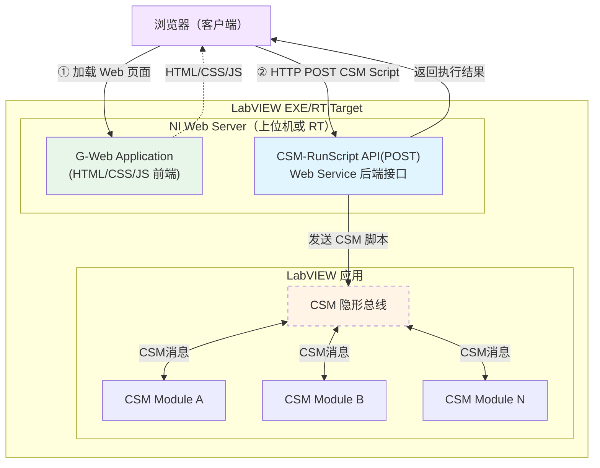
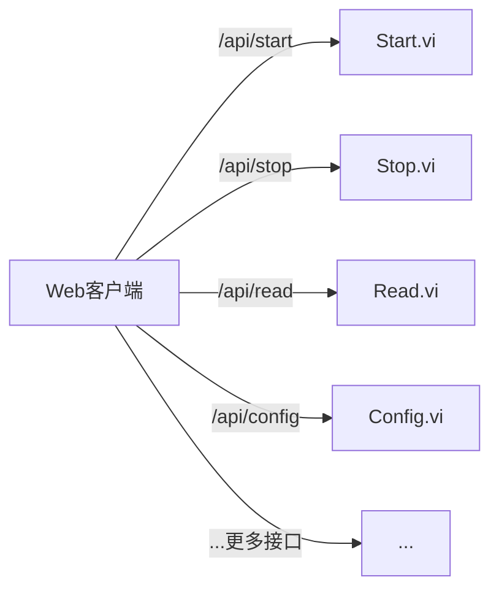
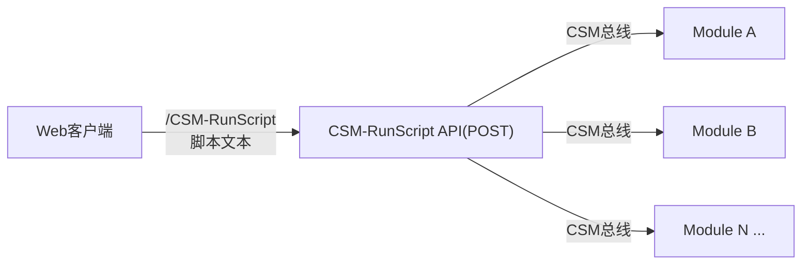
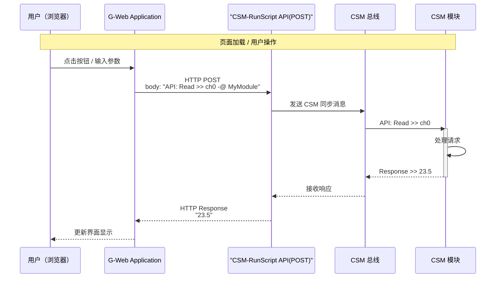

# 基于 G-Web 的应用开发

本示例展示如何借助 CSM 框架，极简地将 LabVIEW 桌面应用发布为 Web 服务，并通过 G-Web 浏览器前端对其进行远程访问和控制。核心思路：只需在 LabVIEW Web Service 中暴露**一个** `CSM-RunScript` 接口，G-Web 端即可通过该接口调用后端所有 CSM 模块的全部功能。

这个场景很适合独立运行的嵌入式RT设备，如 NI 的 cRIO/PXI 等 RT 目标，程序部署后大多数情况下不需要界面，但是又需要远程配置参数和查看运行状态，发布一个 Web 服务供局域网内访问是非常合适的方案，用户可以不安装任何的客户端软件，直接通过浏览器访问设备进行监控和控制。

> 项目仓库：[https://github.com/NEVSTOP-LAB/G-Web-Development-with-CSM](https://github.com/NEVSTOP-LAB/G-Web-Development-with-CSM)

## 背景

### LabVIEW Web Service

LabVIEW Web Service 是 NI 提供的开发机制，可将 LabVIEW VI 直接发布为 HTTP 接口，无需额外的中间件。启动后，客户端可以通过标准 HTTP 请求调用这些接口，从而在桌面程序和 Web 应用之间建立通信桥梁。

通常在LabVIEW Web Service中，每个 HTTP 接口对应一个接口VI, ——如果应用有 20 个 POST 方法，就要写 20 个 接口VI，维护成本较高。

在 CSM 应用中，由于其虚拟总线的设计，可以只定义一个`CSM-RunScript` 接口，处理所有的 CSM 脚本请求，这样极大的简化了接口层的开发和维护工作量，同时也使得前端调用更加灵活，任何新的功能都可以通过发送新的 CSM 脚本来实现，而无需修改接口代码。用户原本的 CSM 不需要为了了适配 Web Service 而做任何改动，完全不涉及网络访问的 CSM 模块代码可以被调用。
除了使用通用的 `CSM-RunScript` 单一接口外，也完全可以按照传统方式为每个功能单独编写 Web Service VI——CSM 的 API 使这种方式变得更为简单。在每个 VI 内部，只需调用 CSM 的消息发送函数，向对应模块发出同步请求并返回结果，相比不使用 CSM 的手工实现，代码更简洁、接口语义更清晰。因此，两种方式均可选择：

- **通用接口**：只写一个 `CSM-RunScript API(POST)`，任何 CSM 脚本都能通过该接口执行，快速实现 Web 化
- **语义接口**：为特定操作单独编写 Web Service VI，内部通过 CSM API 调用后端模块，适合接口语义明确、需要参数校验或类型安全的场景

### G Web Development Software（G-Web）

G Web Development Software（前称 WebVI/NXG Web Module）是 NI 推出的一种开发工具，允许工程师使用 LabVIEW G 语言编写可在浏览器中运行的 Web 前端应用。通过它，无需掌握 HTML/CSS/JavaScript，即可创建功能完整的 Web 界面，并与 LabVIEW 后端进行通信。

### LabVIEW Real-Time

LabVIEW Real-Time（RT）是 NI 提供的确定性实时操作系统（RTOS）平台，常用于工业控制、数据采集等对时序要求严格的场合。RT Target（如 cRIO、PXI）运行独立的 LabVIEW RT 应用，与主机通过网络通信。

NI Windows 与 RT 目标均内置 NI Application Web Server，均支持部署 LabVIEW Web Service。因此，CSM 应用可直接运行在 RT 目标上，并通过其上的 Web Service 对外提供 HTTP 接口，客户端可通过浏览器访问局域网内的该项目。

### CSM 的简化优势

借助 CSM 框架的**纯文本脚本驱动**特性，整个后端的所有 API 都可以通过一段 CSM 脚本文本来调用。因此，在 Web Service 侧只需提供 **一个** `CSM-RunScript` 接口，接受脚本字符串作为参数，返回执行结果即可，极大地减少了接口维护工作量。

## 系统架构



各层职责说明：

- **CSM（应用逻辑层）**：实现具体的业务逻辑，完全不涉及网络访问，可运行在 Windows 上位机或 LabVIEW RT 目标（如 cRIO）上。
- **LabVIEW Web Service（Web 后端接口层）**：将 LabVIEW VI 发布为 HTTP 接口，由 NI Web Server 托管。NI Windows 与 RT 应用程序均内置 NI Web Server，均可发布 Web Service。
- **G-Web 前端（静态文件）**：G Web Development Software 生成的 HTML/CSS/JS 静态文件，由同一 NI Web Server 托管，供浏览器下载并执行。
- **浏览器**：客户端浏览器加载 G-Web 前端页面，并通过 HTTP 调用 Web Service 与后端通信。

## 项目结构

```text
G-Web-Development-with-CSM/
├── LabVIEW Project with Web Services/   # LabVIEW 后端工程
│   ├── WebService/
│   │   ├── Methods/
│   │   │   └── CSM-RunScript.vi         # 唯一的 Web Service 接口
│   │   ├── CSM/
│   │   │   └── CSM.vi                   # CSM 应用主模块
│   │   └── Startup Main.vi              # 启动入口
│   └── Test WebService.vi               # Web Service 测试 VI
└── G-Web Application/                   # G-Web 前端工程
    └── Web Application/                 # 可部署的 Web 应用
```

## CSM-RunScript 接口

### 接口定义

`CSM-RunScript API(POST)` 是本项目中**唯一需要编写的 Web Service 方法**，其 HTTP 接口定义如下：

| 项目 | 说明 |
| --- | --- |
| 方法 | `POST` |
| URL | `http://<host>:<port>/CSMWebService/CSM-RunScript` |
| 请求体 | CSM 脚本字符串（纯文本） |
| 返回值 | 执行结果字符串（纯文本） |

### 请求示例

通过该接口，可以向后端发送任意 CSM 脚本，调用所有已注册的 CSM 模块 API：

```csm
# 同步调用某模块的 API，等待返回结果
API: Read >> channel0 -@ SomeModule

# 异步调用，不等待返回值
API: Start ->| SomeModule

# 向多个模块广播消息
API: Update Config >> {param} ->* All
```

### 为什么只需要一个接口

传统 LabVIEW Web Service 开发模式：每个功能点对应一个 VI 和一个 HTTP 接口。



基于 CSM 的简化模式：所有功能通过一个接口以脚本形式调用。



CSM 的纯文本状态队列机制使得所有调用都可以被序列化为字符串，一个接口即可覆盖全部场景。

## 实现方法

### 第一步：完成基于 CSM 框架的应用程序

在接入 Web Service 之前，先按照 CSM 框架完成应用程序的主体逻辑：

1. 参考 [CSM 基本概念]() 和 [示例程序]() 创建 CSM 应用工程
2. 将具体的业务逻辑分别封装为独立的 CSM 模块（每个模块对应一个 `.vi`）
3. 在各模块的状态处理分支中，实现 `API: <操作名>` 格式的接口状态，供外部调用
4. 调试并验证各模块的功能，确保应用在 LabVIEW 中可以正常运行

CSM 应用程序框架示意：

*📷 待补充截图：基于 CSM 框架的 LabVIEW 应用程序框图截图*

{: .note }
> CSM 模块完全不涉及网络访问，只专注于业务逻辑实现。Web Service 层在后续步骤中独立添加，对已有的 CSM 模块代码无需做任何改动。

### 第二步：编写 LabVIEW 后端代码

按以下步骤搭建 LabVIEW 工程和 Web Service 后端：

1. 用 LabVIEW 打开 `LabVIEW Project with Web Services/LabVIEW Project with Web Services.lvproj`
2. 在项目中确认 Web Service 库 `CSM WebService.lvlib` 已正确配置
3. 根据实际需求，在 `CSM/CSM.vi` 中添加或修改 CSM 应用模块

后端工程结构示意：

*📷 待补充截图：LabVIEW 后端工程项目窗口截图*

{: .note }
> 需要安装 LabVIEW Web Service 功能模块（包含在 NI Application Web Server 中）。

参考资料：
- [创建 LabVIEW Web Service（NI 文档）](https://www.ni.com/docs/en-US/bundle/labview/page/creating-web-services.html)
- [CSM-RunScript 接口说明](#csm-runscript-接口)

### 第三步：编写 G-Web 前端代码

使用 G Web Development Software 开发浏览器前端界面。构建完成后，将生成的 HTML/CSS/JS 文件放置到 NI Web Server 可识别的 Web 根发布路径下：

1. 用 G Web Development Software 打开 `G-Web Application/` 目录下的工程
2. 配置 HTTP 请求节点，将目标 URL 指向 `CSM-RunScript` 接口地址
3. 构建 Web 应用，将生成的 HTML/CSS/JS 文件发布到 NI Web Server 的 Web 根目录

G-Web 前端开发界面示意：

*📷 待补充截图：G Web Development Software 编辑器界面，展示 HTTP 节点配置*

### 第四步：调试与验证

在 LabVIEW 中运行工程，验证 Web Service 正常启动并测试前后端通信：

1. 在 LabVIEW 项目中，右键 Web Service → **Deploy**（部署）
2. 或直接运行 `Startup Main.vi` 以本地调试模式启动
3. 访问 `http://localhost:8080/CSMWebService/CSM-RunScript` 验证服务是否启动
4. 打开浏览器访问 G-Web 页面，测试与后端的通信

Web Service 启动后的界面示意：

*📷 待补充截图：Web Service 部署/运行状态界面截图*

参考资料：
- [调试与部署 LabVIEW Web Service](https://knowledge.ni.com/KnowledgeArticleDetails?id=kA03q000001DkdFCAS&l=zh-CN)

### （可选）第五步：发布与部署

开发完成后，可将应用发布为独立可执行程序进行正式部署：

- **Windows**：在 LabVIEW 的 Application Builder 中创建应用程序，在构建规范的 Web Service 页面中选择要发布的 Web Service
- **RT 控制器**：可将工程部署到 cRIO/PXI 等 RT 目标（Deploy to Target），或编译为 RT 可执行文件（`.rtexe`）并配置开机自启动

### 第六步：局域网远程访问

完成部署后，局域网内的任何设备均可通过浏览器访问该 Web 应用，实现对 LabVIEW 应用的远程监控与控制：

```
http://<设备IP地址>:<端口>/CSMWebService/
```

*📷 待补充截图：浏览器中运行的 G-Web 应用界面截图*

程序架构通讯逻辑如下：



## 依赖项

### LabVIEW 后端

- Communicable State Machine (CSM) - NEVSTOP-LAB
- LabVIEW Application Web Server（提供 Web Service 功能）

### G-Web 前端

- G Web Development Software（NI）

## 架构优势

本示例充分展示了 CSM 框架结合 G-Web 开发的核心优势：

- **极简接口**：只需一个 `CSM-RunScript` Web Service 方法，即可通过 G-Web 调用后端所有功能，无需为每个功能单独编写接口
- **无侵入集成**：现有基于 CSM 的 LabVIEW 应用，无需改动业务逻辑，只需添加 Web Service 层即可获得 Web 访问能力
- **灵活扩展**：当后端新增 CSM 模块或 API 时，前端不需要修改接口，直接发送新的 CSM 脚本即可
- **渐进式升级**：可以先使用通用 `CSM-RunScript` 快速实现 Web 化，后续按需再封装特定语义的接口
