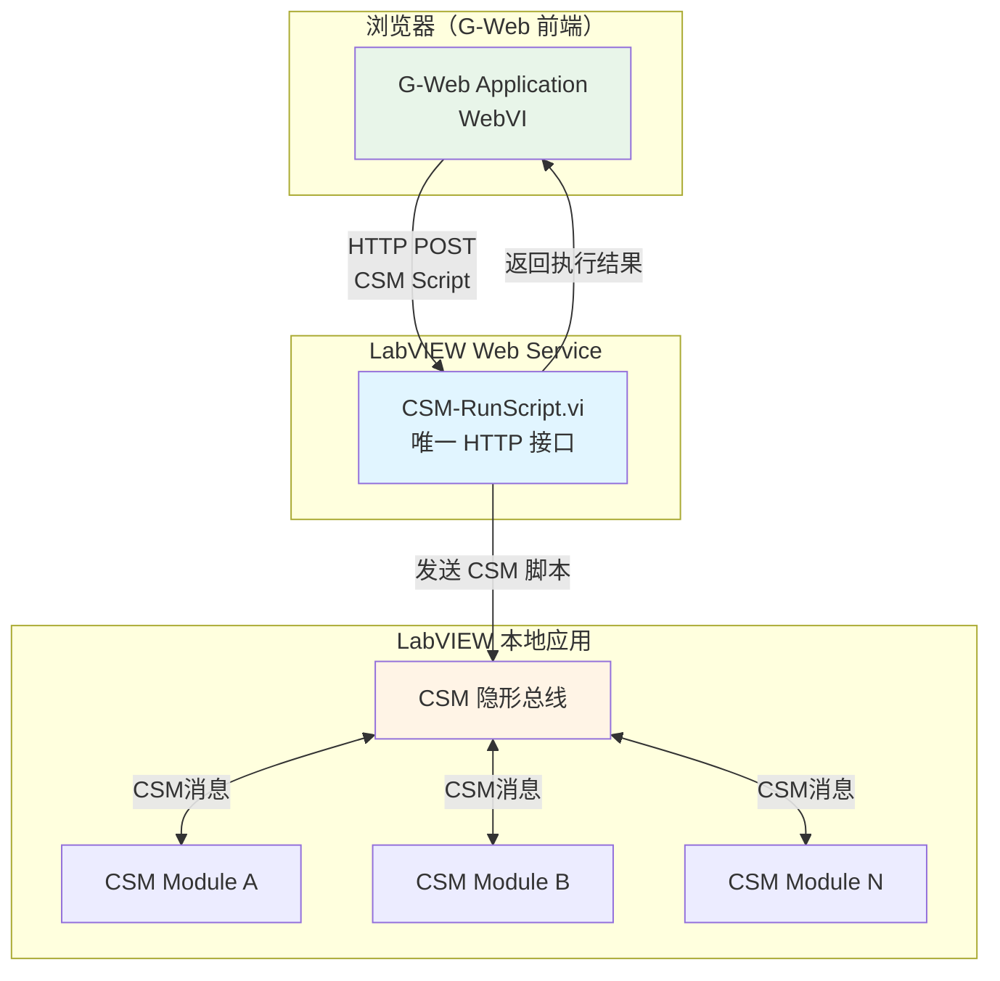
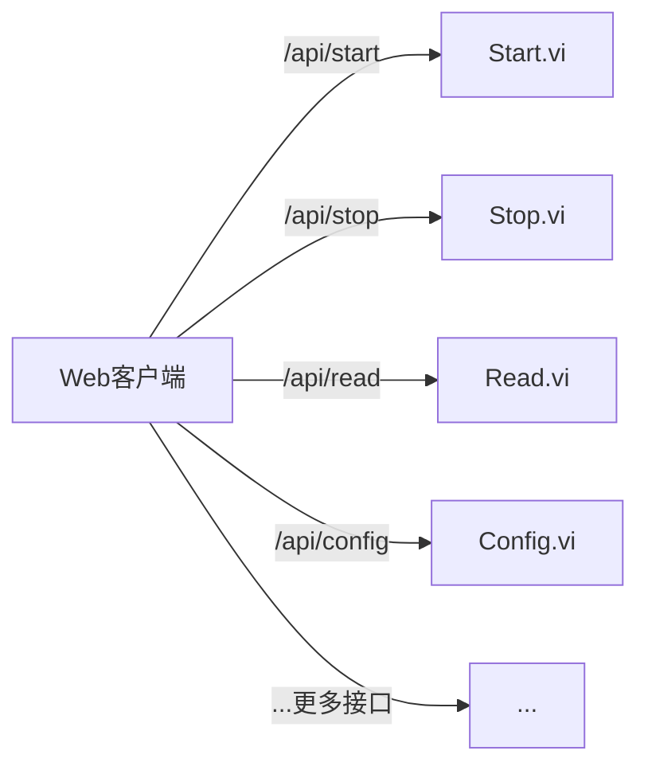
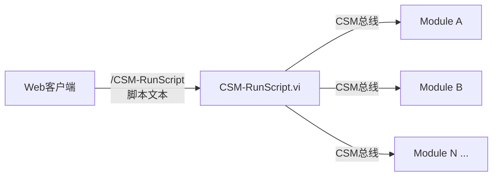
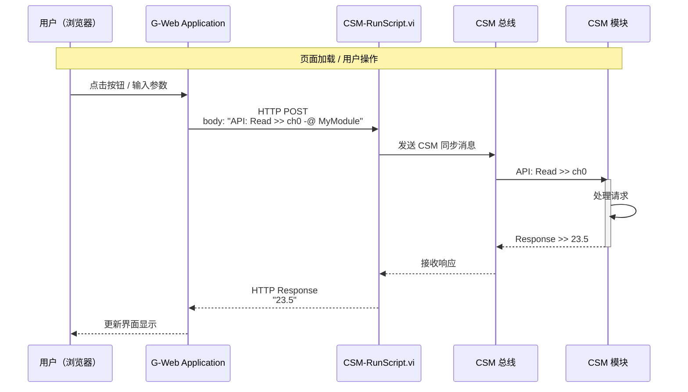

# G-Web开发应用

本示例展示如何借助 CSM 框架，极简地将 LabVIEW 桌面应用发布为 Web 服务，并通过 G-Web 浏览器前端对其进行远程访问和控制。核心思路：只需在 LabVIEW Web Service 中暴露**一个** `CSM-RunScript` 接口，G-Web 端即可通过该接口调用后端所有 CSM 模块的全部功能。

> 项目仓库：[https://github.com/NEVSTOP-LAB/G-Web-Development-with-CSM](https://github.com/NEVSTOP-LAB/G-Web-Development-with-CSM)

## 背景

### LabVIEW Web Service

LabVIEW Web Service 是 NI 提供的一种机制，可将 LabVIEW VI 直接发布为 HTTP 接口，无需额外的中间件。启动后，客户端可以通过标准 HTTP 请求调用这些接口，从而在桌面程序和 Web 应用之间建立通信桥梁。

传统方式下，每个功能都需要单独暴露为一个 HTTP 接口——如果应用有 20 个 API，就要写 20 个 Web Service 方法，维护成本较高。

### G Web Development Software（G-Web）

G Web Development Software（前称 WebVI/NXG Web Module）是 NI 推出的一种开发工具，允许工程师使用 LabVIEW G 语言编写可在浏览器中运行的 Web 前端应用。通过它，无需掌握 HTML/CSS/JavaScript，即可创建功能完整的 Web 界面，并与 LabVIEW 后端进行通信。

### CSM 的简化优势

借助 CSM 框架的**纯文本脚本驱动**特性，整个后端的所有 API 都可以通过一段 CSM 脚本文本来调用。因此，在 Web Service 侧只需提供 **一个** `CSM-RunScript` 接口，接受脚本字符串作为参数，返回执行结果即可，极大地减少了接口维护工作量。

## 系统架构



设计图（来自项目仓库）：


## 项目结构

```text
G-Web-Development-with-CSM/
├── LabVIEW Project with Web Services/   # LabVIEW 后端工程
│   ├── WebService/
│   │   ├── Methods/
│   │   │   └── CSM-RunScript.vi         # 唯一的 Web Service 接口
│   │   ├── CSM/
│   │   │   └── CSM.vi                   # CSM 应用主模块
│   │   └── Startup Main.vi              # 启动入口
│   └── Test WebService.vi               # Web Service 测试 VI
└── G-Web Application/                   # G-Web 前端工程
    └── Web Application/                 # 可部署的 Web 应用
```

## CSM-RunScript 接口

### 接口定义

`CSM-RunScript.vi` 是本项目中**唯一需要编写的 Web Service 方法**，其 HTTP 接口定义如下：

| 项目 | 说明 |
| --- | --- |
| 方法 | `POST` |
| URL | `http://<host>:<port>/CSMWebService/CSM-RunScript` |
| 请求体 | CSM 脚本字符串（纯文本） |
| 返回值 | 执行结果字符串（纯文本） |

### 请求示例

通过该接口，可以向后端发送任意 CSM 脚本，调用所有已注册的 CSM 模块 API：

```csm
# 同步调用某模块的 API，等待返回结果
API: Read >> channel0 -@ SomeModule

# 异步调用，不等待返回值
API: Start ->| SomeModule

# 向多个模块广播消息
API: Update Config >> {param} ->* All
```

### 为什么只需要一个接口

传统 Web Service 开发模式：每个功能点对应一个 VI 和一个 HTTP 接口。



基于 CSM 的简化模式：所有功能通过一个接口以脚本形式调用。



CSM 的纯文本状态队列机制使得所有调用都可以被序列化为字符串，一个接口即可覆盖全部场景。

## 使用方法

### 1. 搭建 LabVIEW 后端工程

按以下步骤配置 LabVIEW 工程：

1. 用 LabVIEW 打开 `LabVIEW Project with Web Services/LabVIEW Project with Web Serivces.lvproj`
2. 在项目中确认 Web Service 库 `CSM WebService.lvlib` 已正确配置
3. 根据实际需求，在 `CSM/CSM.vi` 中添加或修改 CSM 应用模块

后端工程结构示意：


{: .note }
> 需要安装 LabVIEW Web Service 功能模块（包含在 NI Application Web Server 中）。

### 2. 启动 Web Service

1. 在 LabVIEW 项目中，右键 Web Service → **Deploy**（部署）
2. 或直接运行 `Startup Main.vi` 以本地调试模式启动
3. 访问 `http://localhost:8080/CSMWebService/CSM-RunScript` 验证服务是否启动

Web Service 启动后的界面示意：


### 3. 配置 G-Web 前端

1. 用 G Web Development Software 打开 `G-Web Application/` 目录下的工程
2. 配置 HTTP 请求节点，将目标 URL 指向 `CSM-RunScript` 接口地址
3. 构建并发布 Web 应用

G-Web 前端开发界面示意：


### 典型调用流程



### 进阶：编写自定义接口

除了使用通用的 `CSM-RunScript` 接口外，也可以基于 CSM API 编写更具体的语义化接口（适合需要固定参数格式或安全限制的场景）：

```text
// 自定义 Web Service VI：ReadChannel.vi
// 接收 channel 参数，调用对应的 CSM 模块并返回结果
Input:  channel (String)
Output: value (String)

// 内部使用 CSM 发送同步消息
script = "API: Read >> " + channel + " -@ SomeModule"
CSM-RunScript(script) → value
```

自定义接口开发示意：


## G-Web 运行效果

运行中的 G-Web 应用界面示意：


## 依赖项

### LabVIEW 后端

- Communicable State Machine (CSM) - NEVSTOP
- LabVIEW Application Web Server（提供 Web Service 功能）

### G-Web 前端

- G Web Development Software（NI）

## 架构优势

本示例充分展示了 CSM 框架结合 G-Web 开发的核心优势：

- **极简接口**：只需一个 `CSM-RunScript` Web Service 方法，即可通过 G-Web 调用后端所有功能，无需为每个功能单独编写接口
- **无侵入集成**：现有基于 CSM 的 LabVIEW 应用，无需改动业务逻辑，只需添加 Web Service 层即可获得 Web 访问能力
- **灵活扩展**：当后端新增 CSM 模块或 API 时，前端不需要修改接口，直接发送新的 CSM 脚本即可
- **渐进式升级**：可以先使用通用 `CSM-RunScript` 快速实现 Web 化，后续按需再封装特定语义的接口
- **纯文本协议**：CSM 脚本就是人类可读的文本，便于调试、记录和回放
