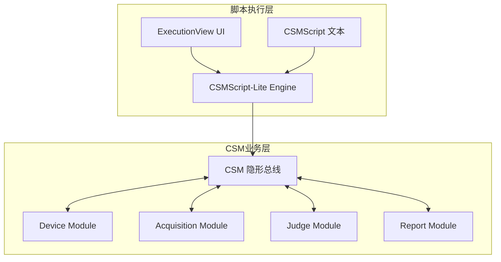

# 脚本化自动测试应用（CSMScript-Lite）

本示例演示如何使用 **CSMScript-Lite** 将 CSM 模块能力封装为可维护、可复用的自动化测试脚本流程。通过一个虚拟产线测试场景，覆盖 CSMScript-Lite 的全部核心能力与扩展指令。

> 项目仓库：[https://github.com/NEVSTOP-LAB/CSMScript-Lite](https://github.com/NEVSTOP-LAB/CSMScript-Lite)

## 场景背景

假设我们要为一台“多通道采集控制器”做出厂测试，目标是：

- 上电后自动完成设备初始化
- 读取设备 ID 并写入测试记录
- 执行多轮采集与判定
- 出错时自动跳转异常处理
- 最终执行清理并输出结论

该流程适合用脚本驱动，便于测试工程师在不改 LabVIEW 业务模块代码的前提下，快速调整测试步骤。

## 系统架构



## 功能覆盖清单（本案例全部使用）

| 功能类别 | 本案例中的体现 |
| --- | --- |
| 标准 CSM 消息执行 | 同步 `-@`、异步 `->`、异步无回复 `->|`、广播/订阅 |
| 返回值捕获 | `=> 变量名` 保存返回值并在后续步骤 `${变量}` 复用 |
| 锚点机制 | `<setup>`、`<main>`、`<error_handler>`、`<cleanup>` |
| 显式跳转 | `GOTO >> <anchor>` |
| 条件跳转 | `?? goto >> <anchor>`（前一条出错时跳转） |
| 自动错误处理 | `AUTO_ERROR_HANDLE_ENABLE`、`AUTO_ERROR_HANDLE_ANCHOR` |
| 等待指令 | `WAIT` / `Sleep`、`WAIT(s)`、`WAIT(ms)` |

## 虚拟测试脚本（完整示例）

```csm
// ====== 全局策略 ======
AUTO_ERROR_HANDLE_ENABLE >> TRUE
AUTO_ERROR_HANDLE_ANCHOR >> error_handler

<setup>
API: PowerOn -@ Device
API: SelfCheck -@ Device ?? goto >> <cleanup>
API: Read Device ID -@ Device => dut_id
API: Start Session >> DUT=${dut_id};Operator=AutoRunner -@ Report

// 订阅告警状态，交给判定模块
Alarm@Device >> API: Handle Alarm@Judge -><register>

// 混合时间写法
WAIT >> 1s 250ms

// 显式跳转到主流程
GOTO >> <main>

<main>
// 异步启动采集（不阻塞）
API: Start -> DAQ
WAIT(ms) >> 300

// 同步读取并保存结果变量
API: Read Waveform >> ch0 -@ DAQ => wave_raw
API: Evaluate >> ${wave_raw} -@ Judge => judge_result

// 带回复异步调用（由业务模块回送响应）
API: Save Temp Result >> ${judge_result} -> Report

// 无回复异步调用
API: Heartbeat >> running ->| Device

// 广播状态
Status >> RoundFinished -><status>

// 秒级等待
WAIT(s) >> 0.2

// 不合格则跳到异常处理，合格则进入收尾
API: Is Pass >> ${judge_result} -@ Judge ?? goto >> <error_handler>
GOTO >> <cleanup>

<error_handler>
API: Mark Failed >> ${dut_id} -@ Report
Interrupt >> FAIL -><interrupt>
API: Stop -@ DAQ

<cleanup>
// 取消订阅并清理
Alarm@Device >> API: Handle Alarm@Judge -><unregister>
API: Close Session -@ Report
API: PowerOff -@ Device
```

## 执行步骤

1. 在 LabVIEW 中打开 CSMScript-Lite 示例工程
2. 启动 Engine 与 ExecutionView
3. 将上述脚本粘贴到脚本编辑区并保存
4. 执行脚本，观察每一步的消息流与返回值
5. 修改脚本参数（轮次、等待时间、判定阈值）并重复执行，验证脚本驱动的可维护性

## 关键收益

- **测试流程与业务模块解耦**：调整流程不需要改业务 VI
- **错误处理一致化**：通过自动错误锚点统一收敛异常路径
- **复用效率高**：同一套模块可被多套测试脚本复用
- **便于扩展**：新增测试项只需增补脚本段落与锚点
