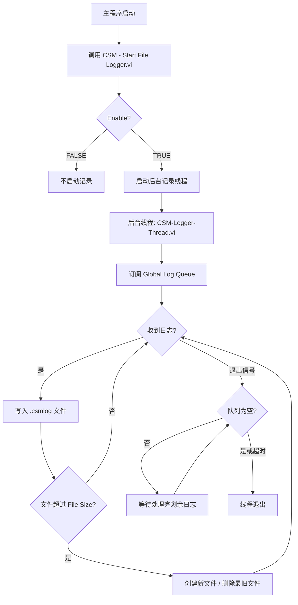
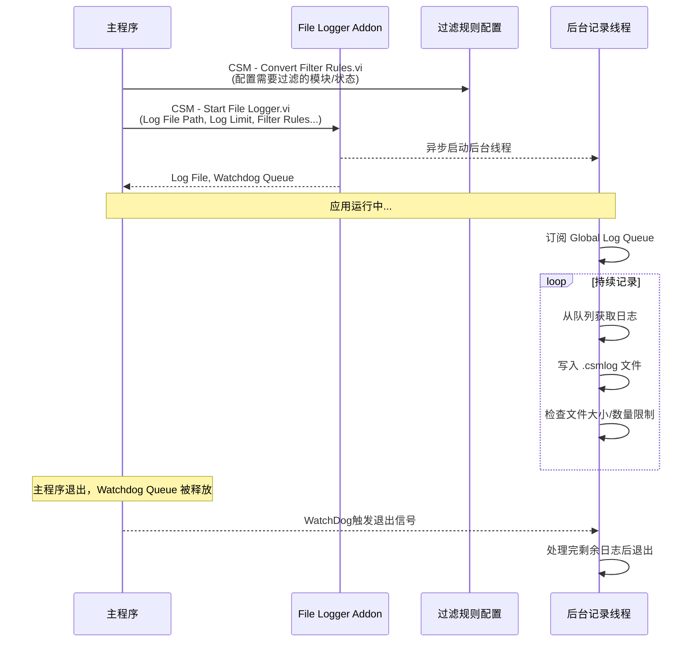

# CSM File Logger Addon

CSM File Logger Addon是CSM的**内置**插件，基于[全局日志系统]()，将应用的全部运行记录自动保存到文本文件中，方便事后分析和问题定位。

## 功能概述

File Logger通过订阅CSM全局日志队列，把应用运行过程中产生的所有日志写入`.csmlog`文件。这些文件是普通文本格式，可以用记事本等工具直接打开查看。

**可以记录的信息**：

- 模块状态变化和参数
- 模块间消息通讯（同步/异步）及返回数据
- 广播事件
- 模块创建和销毁
- 模块状态订阅关系
- 错误信息
- 用户自定义日志

**文件管理机制**：

File Logger内置了滚动文件管理，防止长期运行的应用产生过大的日志文件：

| 参数 | 默认值 | 说明 |
|------|--------|------|
| File Size | 10 MB | 单个日志文件的最大大小 |
| File Num | 2 | 最多保留的日志文件数量 |

当当前日志文件超过File Size时，会创建新文件；当文件数超过File Num时，会删除最旧的文件。

## 工作原理



**退出机制**：File Logger支持三种退出方式：

1. **WatchDog方式**（默认启用）：调用者VI退出时，其持有的Watchdog Queue资源自动释放，触发后台线程退出。也可以手动释放Watchdog Queue来主动停止记录。
2. **全部模块退出**（可选）：启用`Exit When All Module Exist?`后，所有CSM模块退出时，记录线程也自动退出（适合主程序本身不是CSM模块的场景）。

{: .note }
> **队列清空保证**：退出时后台线程会等待队列中剩余日志处理完毕（最多5秒超时），确保不丢失日志。

## 函数说明

### 函数速览

| 函数 | 说明 |
|------|------|
| [`CSM - Start File Logger.vi`](#csm-file-logger-addon) | 启动文件记录后台线程，是唯一需要主动调用的API |
| [`CSM - Convert Filter Rules.vi`](#csm-convert-filter-rulesvi) | 将过滤规则簇转换为类实例，用于配置Filter Rules参数 |
| [`CSM - Set Log Filter Rules.vi`](#csm-set-log-filter-rulesvi) | 设置全局源端过滤，减少无需记录的日志产生 |

### CSM - Start File Logger.vi 参数详解

这是唯一需要在程序中调用的API，通常在主程序初始化阶段调用一次：

**输入参数**：

| 参数 | 默认值 | 说明 |
|------|--------|------|
| Log File Path | — | 日志文件路径，建议使用绝对路径 |
| Timestamp format | `%<%Y/%m/%d %H:%M:%S%3u>T` | 时间戳格式 |
| Log Limit | File Size: 10 MB, File Num: 2 | 文件大小和数量限制 |
| Filter Rules | — | 过滤规则（用`CSM - Convert Filter Rules.vi`配置） |
| Enable? | TRUE | 设为FALSE时不启动记录，可用于生产/调试环境切换 |
| WatchDog? | TRUE | 启用WatchDog机制，调用VI退出时自动停止记录 |
| Exit When All Module Exist? | FALSE | 所有CSM模块退出时自动停止记录 |

**输出参数**：

| 参数 | 说明 |
|------|------|
| Log File | 实际使用的日志文件路径 |
| Watchdog Queue | WatchDog资源句柄，保持引用直到程序结束 |

### 调用逻辑



## 典型应用场景

以下展示 File Logger 在实际项目中的典型用法，将日志文件路径、记录限制、过滤规则等配置集中在初始化阶段，配置好后后台自动运行，无需再关注。

```labview
// 主程序初始化阶段

// 可选：过滤掉高频轮询等不关心的状态，减少磁盘写入
CSM - Convert Filter Rules.vi
  (过滤 "Idle" 状态、高频采集状态等)
→ Filter Rules

CSM - Start File Logger.vi
  Log File Path: "C:\Logs\app.csmlog"
  Log Limit: {File Size: 20MB, File Num: 5}
  Filter Rules: Filter Rules
  Enable?: TRUE          // 可通过配置文件或条件控制，FALSE 时不启动记录
  WatchDog?: TRUE        // 主程序退出时自动停止记录
→ Watchdog Queue（保持引用直到程序结束，不要手动释放）
```

**常见配置变体**：

- **生产/调试切换**：将 `Enable?` 绑定到配置项，发布时设为 FALSE 即可完全禁用，无需修改代码结构
- **源端过滤**：在调用 File Logger 前用 [`CSM - Set Log Filter Rules.vi`](#csm-set-log-filter-rulesvi) 设置全局过滤，日志在源头就不产生，对所有工具生效
- **非CSM主程序**：主程序本身不是CSM模块时，可设 `Exit When All Module Exist? = TRUE`，所有CSM模块退出后记录自动停止

**参考范例**：`Addons - Logger\CSM Application Running Log Example.vi`

## 日志文件说明

- **文件格式**：纯文本，后缀`.csmlog`，可用记事本、VS Code等工具打开
- **时间戳**：每条记录包含时间戳，格式由`Timestamp format`参数控制
- **文件命名**：多个滚动文件会自动添加序号后缀
- **内容示例**：

```text
2024/03/01 10:25:30.123 [STATE] Module1 >> Initialize
2024/03/01 10:25:30.156 [MSG] Module2 ->> API: Start >> Arguments -> Module1
2024/03/01 10:25:30.158 [STATE] Module1 >> API: Start
2024/03/01 10:25:30.210 [BROADCAST] Module1 >> Status: Ready >>
```

## 注意事项

{: .warning }
> **Watchdog Queue不要手动释放**（除非主动停止记录）：`CSM - Start File Logger.vi`输出的`Watchdog Queue`句柄必须保持有效，直到程序结束。一旦释放，后台记录线程会立即触发退出流程。

- **尽早调用**：在主程序初始化阶段调用，确保从程序启动就开始记录
- **路径选择**：建议使用绝对路径，并确保路径所在磁盘有足够空间
- **生产环境**：可以通过`Enable? = FALSE`完全禁用记录，也可以通过过滤规则减少无关日志
- **性能影响**：File Logger在独立的后台线程运行，对主程序性能影响很小；大量日志时可通过过滤规则降低写入频率

## 相关文档

- [全局日志系统]() — 了解CSM全局日志的完整功能
- [内置插件参考]() — CSM - Start File Logger.vi完整参数说明
- [全局日志API参考](#filter-rules) — 过滤规则相关API
- [调试工具]() — 基于全局日志的实时调试工具
