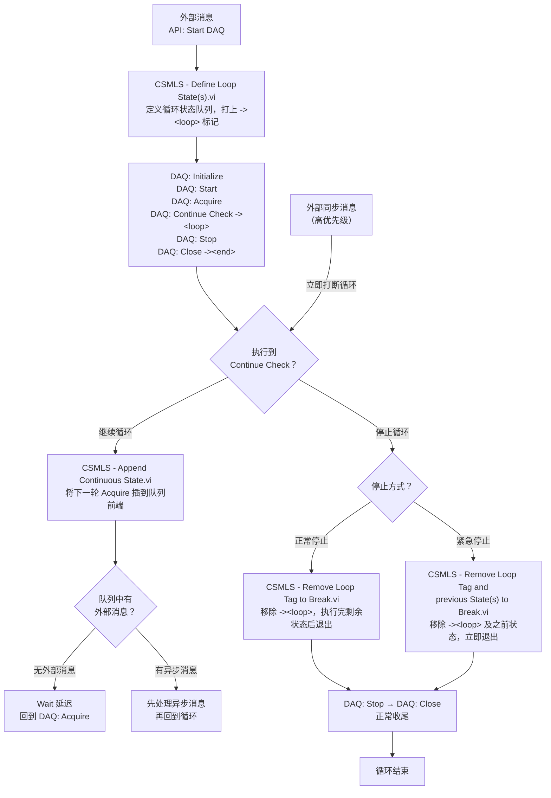

# CSM Loop Support Addon

## 概述

CSM Loop Support 是一个**内置 Addon**，为 CSM 状态机提供标准化的循环实现机制。它让你可以在状态机中实现连续循环操作，同时不阻塞状态机的运行、仍然能够响应外部消息。

## 功能说明

### 为什么需要 Loop Support？

在 CSM 状态机中实现循环有两种直观的方式，但都存在问题：

| 方案 | 做法 | 问题 |
|------|------|------|
| 在 Case 中嵌套 While 循环 | 在状态分支里直接写 While Loop | 状态机卡死在此状态，无法响应外部消息 |
| 用状态链实现循环 | 在最后一个状态中继续插入下一轮的状态 | 响应外部消息不及时，逻辑不直观 |

Loop Support 通过**特殊标记（`-><loop>` 和 `-><end>`）对状态队列进行分析和调度**，实现了以下优势：

- ✅ 循环运行时**仍可响应外部消息**，不阻塞状态机
- ✅ 同步消息（高优先级）**立即打断循环**执行
- ✅ 异步消息**插队到 `-><end>` 之后**，在下一轮循环前处理
- ✅ 无需手动嵌套 While 循环，逻辑清晰直观

### 应用范围限制

{: .warning }
> CSM 的**协作者模式（Worker）**和**责任链模式（Chain）**由多个节点组成，发送的消息无法明确指定某个节点执行，因此**不建议在这两种模式中使用 Loop Support**。

## API 函数列表

Loop Support Addon 提供以下 4 个主要 API（均在 `Addons - Loop Support` 函数选板中）：

| 函数名 | 作用 | 使用时机 |
|--------|------|----------|
| [`CSMLS - Define Loop State(s).vi`](#csmls---define-loop-statesvi) | 定义循环，用 `-><loop>` 标记循环状态 | 启动循环时（如 `API: Start DAQ`） |
| [`CSMLS - Append Continuous State.vi`](#csmls---append-continuous-statevi) | 添加下一轮循环状态，维持循环运行 | 循环检查状态中（如 `DAQ: Continue Check`） |
| [`CSMLS - Remove Loop Tag to Break.vi`](#csmls---remove-loop-tag-to-breakvi) | 移除 `-><loop>` 标记，完成当前轮后退出 | 正常停止循环（如低优先级停止） |
| [`CSMLS - Remove Loop Tag and previous State(s) to Break.vi`](#csmls---remove-loop-tag-and-previous-states-to-breakvi) | 移除标记及之前所有状态，立即退出 | 紧急停止循环（如错误处理） |

{: .note }
> 还有一个内部 VI：[`CSMLS - Add Exit State(s) with Loop Check.vi`](#csmls---add-exit-states-with-loop-checkvi)，该 VI 已集成到 `Parse State Queue++.vi` 的 `Macro: Exit` 处理中，**已从函数选板移除**，无需手动调用。

## 调用逻辑说明

### 状态队列标记机制

Loop Support 通过在状态队列中插入特殊标记来管理循环：

```text
状态队列示意：

DAQ: Initialize
DAQ: Start
DAQ: Acquire
DAQ: Continue Check  -><loop>   ← 循环检查点标记
DAQ: Stop
DAQ: Close           -><end>    ← 循环结束标记（自动添加）
```

### 整体调用流程



### 两种停止方式对比

假设当前队列中还有以下状态时触发停止：

```text
DAQ: Acquire
DAQ: Continue Check  -><loop>
DAQ: Stop
DAQ: Close
```

| 停止方式 | 效果 | 适用场景 |
|----------|------|----------|
| `Remove Loop Tag to Break` | 移除 `-><loop>` 行，依然执行 `DAQ: Acquire → Stop → Close` | 正常停止，需要完成当前工作 |
| `Remove Loop Tag and previous State(s) to Break` | 移除 `DAQ: Acquire` 和 `-><loop>` 行，直接执行 `DAQ: Stop → Close` | 紧急中止，跳过当前未完成的工作 |

### Add to Front? 参数说明

{: .warning }
> `CSMLS - Define Loop State(s).vi` 的 **Add to Front?** 参数通常应保持 **FALSE**。
>
> 原因：循环状态一旦开始，就不会立即结束。如果设为 TRUE（插入队列前端），当前状态如果是被同步消息调用的，就不会立即返回，导致同步调用超时。
>
> **只有当你希望等待循环全部完成后再返回**时，才设为 TRUE。

## 典型应用场景

### 场景一：连续数据采集（DAQ）

这是 Loop Support 最典型的应用场景。

**需求**：持续采集数据，同时允许外部随时停止采集。

```text
API: Start DAQ >> {
    CSMLS - Define Loop State(s).vi
    Loop States:
        "DAQ: Initialize
         DAQ: Start
         DAQ: Acquire
         DAQ: Continue Check
         DAQ: Stop
         DAQ: Close"
    // 注意 Add to Front? = FALSE，立即返回，后台开始循环
}

DAQ: Acquire >> {
    // 执行一次采集
    Acquire Data → 更新波形图
}

DAQ: Continue Check >> {
    // 循环检查点：有 -><loop> 标记
    CSMLS - Append Continuous State.vi
        Continuous State: "DAQ: Acquire"
    Wait 100ms  // 控制采集速率
}

API: Stop DAQ >> {
    // 外部停止命令
    CSMLS - Remove Loop Tag to Break.vi
    // 完成当前采集后，自动执行 DAQ: Stop → DAQ: Close
}

Error: High Priority >> {
    // 高优先级错误，立即中止
    CSMLS - Remove Loop Tag and previous State(s) to Break.vi
    // 跳过剩余采集，直接 DAQ: Stop → DAQ: Close
}
```

**参考示例**：`Addons - Loop Support\CSMLS - Continuous Loop in CSM Example.vi`

### 场景二：定时任务循环

**需求**：周期性地执行某个检查任务（如健康检查、状态上报）。

```text
API: Start Monitor >> {
    CSMLS - Define Loop State(s).vi
    Loop States:
        "Monitor: Check
         Monitor: Report
         Monitor: Wait"
}

Monitor: Wait >> {
    // 循环检查点（带 -><loop> 标记）
    CSMLS - Append Continuous State.vi
        Continuous State: "Monitor: Check"
    Wait 1000ms  // 每秒检查一次
}

API: Stop Monitor >> {
    CSMLS - Remove Loop Tag to Break.vi
}
```

### 场景三：文件批量处理

**需求**：逐个处理文件列表中的文件，允许中途取消。

```text
API: Process Files >> {
    CSMLS - Define Loop State(s).vi
    Loop States:
        "File: GetNext
         File: Process
         File: CheckMore
         File: Finish"
}

File: CheckMore >> {
    // 循环检查点（带 -><loop> 标记）
    If (has more files) {
        CSMLS - Append Continuous State.vi
            Continuous State: "File: GetNext"
    } Else {
        CSMLS - Remove Loop Tag to Break.vi
        // 自然结束，继续 File: Finish
    }
}

API: Cancel >> {
    CSMLS - Remove Loop Tag and previous State(s) to Break.vi
    // 立即中止，跳过剩余文件
}
```

## 与 DQMH-Style 模板的配合

在使用 CSM DQMH-Style Template 时，UI 循环和 CSM 循环是分开的。UI 按钮事件通过 [`CSM - Forward UI Operations to CSM.vi`](#csm---forward-ui-operations-to-csmvi) 转发到 CSM 主循环处理，再配合 Loop Support API 控制循环的启停。

这种组合模式可以实现：

- UI 响应流畅，不受循环采集影响
- 用户随时可以点击停止按钮中断循环
- 循环中的数据实时更新到界面

## 注意事项

1. **必须添加延迟**：在循环检查状态中，应使用 `Wait` 函数控制循环速率，避免 CPU 占用过高。

2. **退出时自动清理**：`Macro: Exit` 消息处理时，`Parse State Queue++.vi` 已自动调用 `CSMLS - Add Exit State(s) with Loop Check.vi`，会检查并清理 `-><loop>` 标记，无需手动处理。

3. **不适用 Worker/Chain 模式**：参见[应用范围限制](#应用范围限制)。

4. **同步消息优先**：在循环运行时发送的同步消息会立即打断循环执行，执行完毕后循环恢复。

## 参考资料

- API 参考：[内置插件 → CSM周期状态支持](#csm周期状态支持csm-loop-support-addon)
- 官方示例：`Addons - Loop Support\CSMLS - Continuous Loop in CSM Example.vi`
