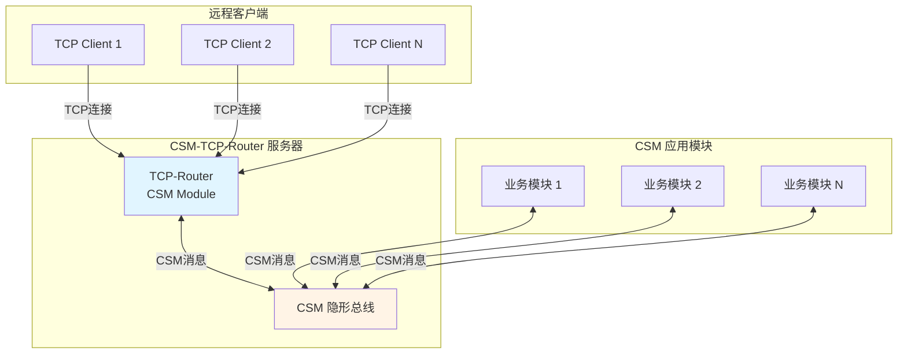

# TCP远程控制插件(TCP Router)

CSM TCP Router 是一个**扩展 Addon**，将本地 CSM 应用转变为 TCP 服务器，实现远程访问和控制。

{: .note }
> 详细的使用说明、协议定义和示例代码，请参见：[CSM-TCP-Router-App 项目仓库](https://github.com/NEVSTOP-LAB/CSM-TCP-Router-App)

## 功能概述

TCP Router 通过 CSM 隐形总线机制，以无侵入方式为 CSM 应用添加远程控制功能。远程客户端通过 TCP 连接发送 CSM 消息，与本地模块交互。

**核心特性**：

- **无侵入集成**：无需修改原有代码，即可为程序添加远程控制功能
- **多客户端支持**：基于 JKI TCP Server 库，支持多个 TCP 客户端同时连接
- **统一消息格式**：所有本地 CSM 消息都可以通过 TCP 发送，保持一致性
- **三层指令集**：支持 CSM 消息指令、Router 管理指令和客户端指令
- **完整协议支持**：支持同步/异步消息、广播订阅、状态查询等完整 CSM 功能

**应用场景**：

- 仪器远程控制和监控
- 自动化测试和脚本控制
- 分布式系统集成
- 远程调试和故障诊断
- Web 服务集成

## 系统架构

TCP Router 作为 CSM 模块运行在应用中，通过 CSM 隐形总线与其他模块通信：



## 三层指令集

TCP Router 支持三层指令集，分别处理不同层次的功能：

### 1. CSM 消息指令集

由原有 CSM 应用模块定义的 API。所有模块 API 可以直接通过 TCP 连接调用：

```
Read >> ch0 -@ AI        // 同步调用
StartMeasurement -> DAQ  // 异步调用
```

### 2. Router 指令集

由 TCP Router 提供的管理功能：

| 指令 | 功能 |
|------|------|
| `List` | 列出所有运行中的 CSM 模块 |
| `List API -@ <module>` | 列出指定模块的所有 API |
| `List State -@ <module>` | 列出指定模块的所有状态 |
| `Help -@ <module>` | 显示模块的帮助文档 |
| `Refresh lvcsm` | 刷新 CSM 缓存文件 |

### 3. Client 指令集

由标准 TCP Router Client 提供的客户端功能：

| 指令 | 功能 |
|------|------|
| `Bye` | 断开 TCP 连接 |
| `Switch <module>` | 切换默认模块 |
| `TAB` | 自动定位到输入对话框 |

## 使用方法

### 安装

通过 VIPM 搜索 **CSM TCP Router**，安装软件包及其依赖项。

### 集成到应用

在现有 CSM 应用中添加 TCP Router 模块：

```labview
// 在主程序初始化阶段
Initialize >> {
    // 异步启动 TCP Router 模块
    Run Async: TCP-Router  // 使用默认端口（通常是 6340）

    // 或指定端口和配置
    Start >> port=8080 -> TCP-Router
}
```

### 客户端连接

使用随附的 `Client.vi` 或自定义 TCP 客户端连接到服务器：
- 输入服务器 IP 地址和端口号
- 连接成功后即可发送指令

### 基本使用示例

```
// 查询系统状态
List
List API -@ AI

// 调用模块 API
Read >> ch0 -@ AI
StartMeasurement -> DataAcquisition

// 订阅广播
CSM - Register Broadcast -@ Status >> Ready >> DataAcquisition
```

## 通讯协议

TCP Router 使用固定格式的数据包进行通信（8字节包头 + 可变长度数据）。数据包类型包括：

| 类型代码 | 类型名称 | 说明 |
|---------|----------|------|
| `0x00` | info | 信息数据包 |
| `0x01` | error | 错误数据包 |
| `0x02` | cmd | 指令数据包 |
| `0x03` | resp | 同步响应数据包 |
| `0x04` | async-resp | 异步响应数据包 |
| `0x05` | status | 订阅返回数据包 |

{: .note }
> 详细的通讯协议定义，请参见项目仓库中的 [协议设计文档](https://github.com/NEVSTOP-LAB/CSM-TCP-Router-App/blob/main/.doc/Protocol.v0.(zh-cn).md)。

## 注意事项

{: .warning }
> **安全性考虑**
> - TCP Router 默认没有身份验证机制，不建议在公网环境直接暴露
> - 建议仅在可信网络（如内网、VPN）中使用
> - 如需在公网使用，应添加 SSL/TLS 加密和身份验证层

{: .important }
> **性能考虑**
> - 每个 TCP 客户端占用一个连接，大量并发连接时需注意系统资源
> - 大数据传输建议使用 MassData 等高效参数传递机制
> - 网络延迟会影响同步调用的响应时间，建议使用异步调用处理耗时操作

**最佳实践**：

- 在主程序初始化阶段启动 TCP Router
- 使用配置文件管理端口号，避免端口冲突
- 客户端应正确处理 `error` 类型数据包，并实现重连机制
- 启用 CSM 全局日志记录 TCP Router 的活动
- 客户端断开前应发送 `Bye` 指令

## 参考资料

- **项目仓库**：[CSM-TCP-Router-App](https://github.com/NEVSTOP-LAB/CSM-TCP-Router-App) — 完整的使用说明、示例代码和协议文档
- **协议文档**：[Protocol.v0.(zh-cn).md](https://github.com/NEVSTOP-LAB/CSM-TCP-Router-App/blob/main/.doc/Protocol.v0.(zh-cn).md) — 详细的通讯协议定义
- **示例应用**：[TCP服务器应用示例]() — 完整的应用示例和典型场景
- **CSM 基础**：[模块间通讯]() — 了解 CSM 消息机制
- **调试工具**：[调试工具]() — CSM Debug Console 可用于本地模拟远程命令
