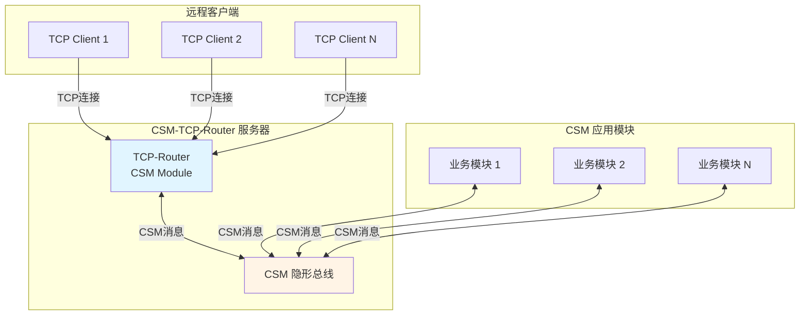
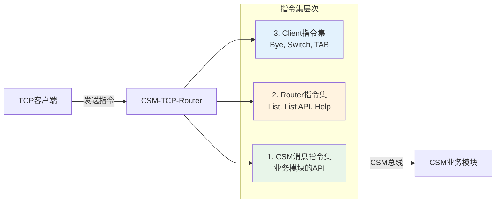
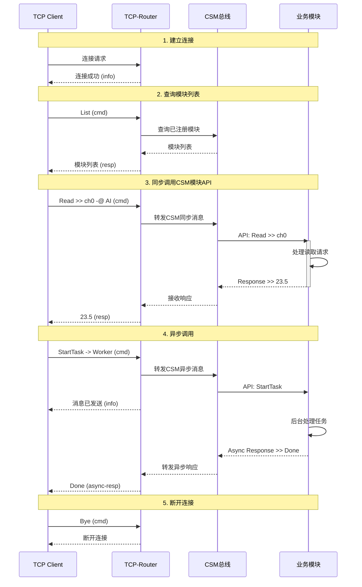

# TCP远程控制插件(TCP Router)

CSM TCP Router 是一个**扩展 Addon**，为 CSM 应用提供 TCP 远程控制能力。它作为 TCP 通讯层，将本地 CSM 应用转变为 TCP 服务器，实现远程访问和控制。

## 功能概述

TCP Router 通过 CSM 的隐形总线机制，以无侵入的方式为任何 CSM 应用添加 TCP 远程控制功能。远程客户端可以通过 TCP 连接发送 CSM 消息，与本地应用模块交互。

**核心特性**：

- **无侵入集成**：无需修改原有代码，即可为程序添加远程控制功能
- **多客户端支持**：基于 JKI TCP Server 库，支持多个 TCP 客户端同时连接
- **统一消息格式**：所有本地 CSM 消息都可以通过 TCP 发送，保持一致性
- **三层指令集**：支持 CSM 消息指令、Router 管理指令和客户端指令
- **完整协议支持**：支持同步/异步消息、广播订阅、状态查询等完整 CSM 功能

**应用场景**：

- 仪器远程控制和监控
- 自动化测试和脚本控制
- 分布式系统集成
- 远程调试和故障诊断
- Web 服务集成

## 系统架构

### 整体架构

TCP Router 作为 CSM 模块运行在应用中，通过 CSM 隐形总线与其他模块通信：



### 数据包格式

TCP Router 使用固定格式的数据包进行通信：

```
┌─────────────┬──────────┬──────────┬──────────┬──────────┬────────────────────┐
│ 数据长度    │  版本    │  FLAG1   │  FLAG2   │  TYPE    │     文本数据       │
│   (4B)      │  (1B)    │  (1B)    │  (1B)    │  (1B)    │   (可变长度)       │
├─────────────┴──────────┴──────────┴──────────┴──────────┤                    │
│                    包头 (8 bytes)                        │   数据长度范围     │
└──────────────────────────────────────────────────────────┴────────────────────┘
```

**数据包类型**：

| 类型代码 | 类型名称 | 说明 |
|---------|----------|------|
| `0x00` | info | 信息数据包（连接状态、提示信息等） |
| `0x01` | error | 错误数据包（命令执行失败、协议错误等） |
| `0x02` | cmd | 指令数据包（客户端发送的命令） |
| `0x03` | resp | 同步响应数据包（同步消息的返回值） |
| `0x04` | async-resp | 异步响应数据包（异步消息的返回值） |
| `0x05` | status | 订阅返回数据包（广播状态订阅的推送） |

{: .note }
> 详细的通讯协议定义，请参见项目仓库中的 [协议设计文档](https://github.com/NEVSTOP-LAB/CSM-TCP-Router-App/blob/main/.doc/Protocol.v0.(zh-cn).md)。

## 工作原理

### 三层指令集架构

TCP Router 支持三层指令集，分别处理不同层次的功能：



#### 1. CSM 消息指令集

由原有 CSM 应用模块定义的 API。由于 CSM 框架通过隐形总线进行消息传递，所有消息都可以通过 TCP Router 转发，无需修改原有代码。

**示例**：如果应用中有一个 AI 模块提供以下 API：
- `Channels` - 列出所有通道
- `Read >> ch0` - 读取指定通道的值
- `read all` - 读取所有通道的值

这些 API 可以直接通过 TCP 连接调用：
```
Read >> ch0 -@ AI        // 同步调用 AI 模块的 Read API
read all -> AI           // 异步调用 AI 模块的 read all API
```

#### 2. Router 指令集

由 TCP Router 自身提供的管理功能：

| 指令 | 功能 | 示例 |
|------|------|------|
| `List` | 列出所有运行中的 CSM 模块 | `List` |
| `List API` | 列出指定模块的所有 API | `List API -@ AI` |
| `List State` | 列出指定模块的所有状态 | `List State -@ AI` |
| `Help` | 显示模块的帮助文档（从 VI Documentation 读取） | `Help -@ AI` |
| `Refresh lvcsm` | 刷新 CSM 缓存文件 | `Refresh lvcsm` |

#### 3. Client 指令集

由标准 TCP Router Client 提供的客户端功能：

| 指令 | 功能 |
|------|------|
| `Bye` | 断开 TCP 连接 |
| `Switch` | 切换默认模块（便于省略 `-@` 目标模块） |
| `TAB` | 自动定位到输入对话框（客户端 UI 快捷键） |

### 典型消息流程

以下是一个完整的远程调用流程：



## 使用方法

### 安装与启动

**1. 安装**

通过 VIPM 搜索 **CSM TCP Router**，安装软件包及其依赖项：
- Communicable State Machine (CSM) - NEVSTOP
- JKI TCP Server - JKI
- Global Stop - NEVSTOP
- OpenG

**2. 集成到应用**

在现有 CSM 应用中添加 TCP Router 模块：

```labview
// 在主程序初始化阶段
Initialize >> {
    // 异步启动 TCP Router 模块
    Run Async: TCP-Router  // 使用默认端口（通常是 6340）

    // 或指定端口和配置
    Start >> port=8080 -> TCP-Router
}
```

**3. 客户端连接**

使用随附的 `Client.vi` 或自定义 TCP 客户端连接到服务器：
- 输入服务器 IP 地址和端口号
- 点击连接按钮
- 连接成功后即可发送指令

### 基本使用示例

#### 查询系统状态

```
// 列出所有模块
List

// 查看指定模块的 API
List API -@ AI

// 查看模块帮助
Help -@ AI
```

#### 调用模块 API

```
// 同步调用（等待返回结果）
Read >> ch0 -@ AI

// 异步调用（立即返回，结果通过 async-resp 推送）
StartMeasurement -> DataAcquisition

// 带多个参数的调用
Configure >> rate=1000, samples=10000 -@ DataAcquisition
```

#### 订阅广播

```
// 订阅模块状态变化
CSM - Register Broadcast -@ Status >> Ready >> DataAcquisition

// 接收到的 status 数据包会自动推送
```

## 典型应用场景

### 场景 1：仪器远程监控

为现有仪器控制程序添加远程监控功能，无需修改原有代码。

```labview
// 原有应用代码保持不变
Initialize >> {
    Run Async: InstrumentDriver
    Run Async: DataProcessor
    Run Async: DisplayModule
}

// 仅需添加一行
Initialize >> {
    // 原有模块...
    Run Async: TCP-Router  // 添加远程控制能力
}
```

远程客户端可以：
- 查询仪器状态：`GetStatus -@ InstrumentDriver`
- 启动测量：`StartMeasure >> params -@ InstrumentDriver`
- 订阅数据更新：`CSM - Register Broadcast -@ NewData >> DataProcessor`

### 场景 2：自动化测试

使用脚本语言（Python、LabVIEW、TestStand 等）远程控制应用进行自动化测试。

```python
# Python 脚本示例
import socket

def send_command(sock, cmd):
    # 按照 TCP Router 协议格式封装
    packet = build_packet(cmd)
    sock.send(packet)
    return receive_response(sock)

# 连接到 TCP Router
s = socket.socket()
s.connect(('localhost', 6340))

# 执行测试序列
send_command(s, 'Initialize -> TestModule')
result = send_command(s, 'RunTest >> test1 -@ TestModule')
assert result == 'PASS'

send_command(s, 'Bye')
```

### 场景 3：分布式系统集成

将多个 CSM 应用通过 TCP Router 连接，实现分布式协作。

```
┌──────────────┐         ┌──────────────┐         ┌──────────────┐
│  应用 A      │         │  应用 B      │         │  应用 C      │
│  TCP:6340    │ <-----> │  TCP:6341    │ <-----> │  TCP:6342    │
└──────────────┘         └──────────────┘         └──────────────┘
     ↓                        ↓                        ↓
   AI 模块                 控制模块                 采集模块
```

应用 B 可以通过 TCP 调用应用 A 和应用 C 的功能，实现跨应用协作。

## 注意事项

{: .warning }
> **安全性考虑**
> - TCP Router 默认没有身份验证机制，不建议在公网环境直接暴露
> - 建议仅在可信网络（如内网、VPN）中使用
> - 如需在公网使用，应添加 SSL/TLS 加密和身份验证层

{: .important }
> **性能考虑**
> - 每个 TCP 客户端占用一个连接，大量并发连接时需注意系统资源
> - 大数据传输建议使用 MassData 等高效参数传递机制，而非直接通过 TCP Router 传输
> - 网络延迟会影响同步调用的响应时间，建议使用异步调用处理耗时操作

{: .note }
> **兼容性说明**
> - TCP Router 基于 CSM 的隐形总线机制，要求所有被控制的模块都是 CSM 模块
> - 不支持直接调用非 CSM 封装的传统 VI
> - 客户端需要遵循 TCP Router 的数据包格式协议

**最佳实践**：

1. **尽早启动**：在主程序初始化阶段启动 TCP Router，确保所有模块就绪后即可远程访问
2. **端口管理**：避免端口冲突，建议使用配置文件管理端口号
3. **错误处理**：客户端应正确处理 `error` 类型数据包，并实现重连机制
4. **日志记录**：启用 CSM 全局日志记录 TCP Router 的活动，便于调试和审计
5. **优雅退出**：客户端断开前应发送 `Bye` 指令，避免服务器端连接超时

## 参考资料

- **示例应用**：[TCP服务器应用示例]()
- **项目仓库**：[CSM-TCP-Router-App](https://github.com/NEVSTOP-LAB/CSM-TCP-Router-App)
- **协议文档**：[Protocol.v0.(zh-cn).md](https://github.com/NEVSTOP-LAB/CSM-TCP-Router-App/blob/main/.doc/Protocol.v0.(zh-cn).md)
- **CSM 基础**：[模块间通讯]()
- **隐形总线**：[CSM基本概念]()

## 相关工具

- **CSM Debug Console**：本地调试工具，可在开发阶段模拟远程命令 - 参见[调试工具]()
- **Global Log**：记录所有 TCP Router 活动 - 参见[全局日志系统]()
