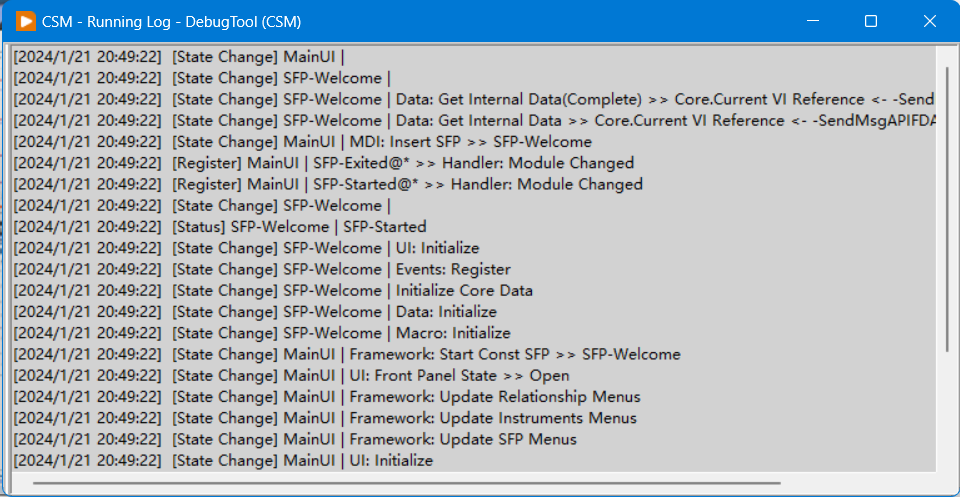
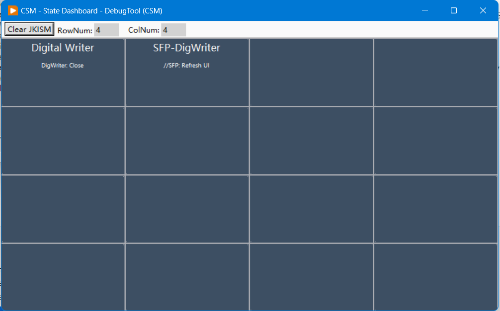
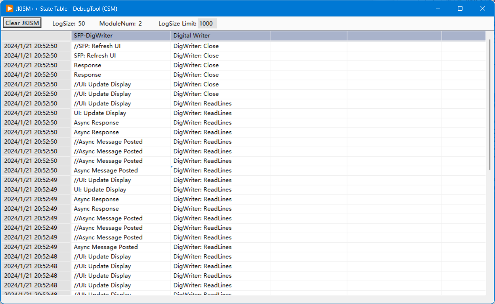

# 调试工具

CSM提供了一整套开发和调试工具，帮你更快地开发、调试和维护应用。工具分为四大类：运行时调试、开发辅助、接口管理和示例浏览。所有调试工具都基于[全局日志系统]()实现。

## 工具入口

有两个入口可以打开工具：
- **菜单**: `Tools` -> `Communicable State Machine(CSM)` -> `Open CSM Tool Launcher...`
- **函数面板**: 在CSM函数面板中选择`CSM Tools`

打开后会弹出工具选择器，选你需要的工具就行：

## 运行时调试工具

### Running Log Window（运行日志）

实时显示所有CSM事件，包括状态变化、消息通讯、广播等。

**核心功能**：实时显示、过滤搜索、导出日志、性能监控

**适合用来**：追踪消息路径、分析时序、排查问题

**小技巧**：用过滤聚焦目标模块，开启周期性日志折叠提高可读性

### State Dashboard（状态仪表板）

图形化展示所有模块的当前状态，一眼看清系统运行状况。

**核心功能**：模块列表、实时状态、状态历史、颜色标识（绿=正常、黄=等待、红=错误、蓝=外部调用）

**适合用来**：查看整体运行状态、监控多模块协同、发现卡死或异常

### Table Log Window（表格日志）

以表格形式记录状态变化，每个模块一列，每次变化一行，适合分析多模块的并行状态关系。

**核心功能**：并行状态对比、时序分析、状态同步、事件关联

**适合用来**：分析多模块时序、发现并发问题、追踪消息链

**小技巧**：横着看同一行的多个模块理解交互，竖着看一列了解单模块的状态序列

## 开发辅助工具

### Debug Console（调试控制台）

交互式测试模块API，选模块、扫API、发消息、看结果。

**主要功能**：模块选择、API扫描、消息发送（同步/异步）、结果查看、日志监控、脚本执行

**适合用来**：单元测试、快速验证、调试消息处理、自动化测试

**使用流程**：启动模块 → 选中模块 → 扫描API → 选API输参 → 发消息看结果 → 调整重测

### 批量工具

- **Add VI Reference Case**: 批量为CSM模块添加"VI Reference"分支，用于外部获取VI引用
- **Switch Language Tool**: 切换模块注释语言（中英文互换）
- **Fix JKISM Editor RCM**: 修复JKISM State Editor右键菜单在CSM中不能调用的问题
- **Create CSM Palette at Root**: 在项目根目录生成CSM函数选板
- **Remove All CSM Bookmarks**: 移除所有书签标记

> **注意**: 批量操作前先备份代码，确保VI未被占用

## 接口与示例工具

### Interface Browser（接口浏览器）

浏览项目中所有CSM模块的API，快速查找接口和参数说明。

**核心功能**：模块列表、接口展示、快速搜索、参数说明、文档链接

**适合用来**：了解可用模块、查找API、生成文档、接口评审

### Example Browser（示例浏览器）

分类浏览和打开CSM示例项目。

**示例分类**：基础（创建和调用）、高级（工作者/责任链模式）、通讯（同步/异步/订阅）、插件（Addon使用）、工具（全局日志等）

**适合用来**：学习使用方法、寻找参考代码、快速原型、验证功能

## JKISM State Editor

JKI State Machine自带的状态编辑器，CSM完全兼容。在状态字符串控件上右键选"Edit State..."就能用。

**主要功能**：状态快速输入、状态模板、历史记录、快捷键支持

**与CSM集成**：支持CSM消息格式、特殊符号（-@, ->, ->|等）、消息历史、常用消息快速切换

**小技巧**：用模板快速生成、用历史避免重复输入、设收藏夹、快捷键操作

## 自定义工具开发

基于[全局日志系统]()可以开发自己的调试工具。

**开发流程**：
1. 通过[`CSM - Global Log Queue.vi`](#csm-global-log-queuevi)或[`CSM - Global Log Event.vi`](#csm-global-log-eventvi)获取全局日志
2. 解析日志数据，实现自定义逻辑
3. 显示或保存结果

**参考模板**：
- `template/CSM - Global Log Queue Monitoring Loop.vi`
- `template/CSM - Global Log Event Monitoring Loop.vi`

## 使用注意事项

- **性能**：调试工具会增加系统开销，不用时及时关闭。生产环境建议启用源端过滤，控制日志缓存大小
- **安全**：日志可能含敏感信息，生产环境谨慎使用调试控制台
- **兼容性**：确保工具版本与CSM框架匹配，部分工具需要特定LabVIEW版本

> 📝 **工具持续完善中**，欢迎社区贡献新工具和改进！参与贡献请看[贡献指南](https://github.com/NEVSTOP-LAB/Communicable-State-Machine/blob/main/CONTRIBUTING(zh-cn).md)
