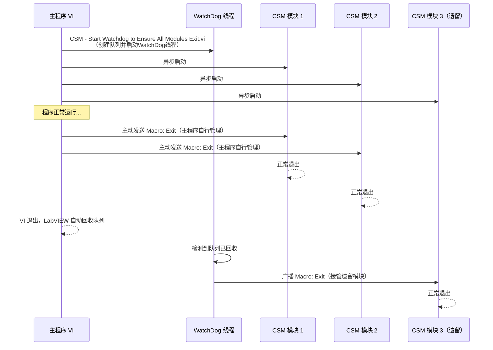
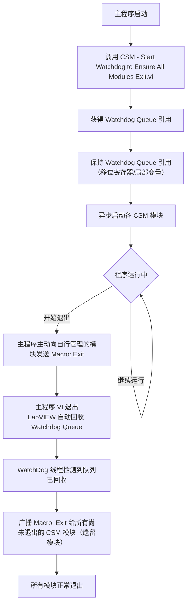

# 看门狗(WatchDog)自动退出管理

CSM WatchDog是一个**内置插件**，用于在主程序退出后，自动通知所有**异步启动**的CSM模块正常退出，避免孤儿模块残留。

{: .important }
> WatchDog 只负责管理**异步启动**的CSM模块。**同步调用**的模块必须由调用方自行管理退出：同步调用的模块若不退出，调用它的VI就无法继续执行后续代码退出，主程序VI就无法退出，WatchDog Queue也就不会被释放，退出流程也就不会被触发。

## 功能说明

### 问题背景

在CSM应用中，各功能模块通常以异步方式独立启动。主程序VI可以主动向它负责管理的模块发送 `Macro: Exit` 消息，让它们有序退出。然而，当程序结构复杂时，难免会有一些模块没有被主程序主动通知退出——WatchDog的职责就是**接管这些遗留的、尚未退出的模块**，在主程序VI退出后将它们统一清理。

这正是"WatchDog（看门狗）"名称的由来：它在后台持续监视，当主程序退出后，对所有还在运行的异步CSM模块发出退出指令，确保没有模块被遗忘。

### 实现原理

{: .note }
> **CSM WatchDog实现的原理**
>
> LabVIEW VI退出时，会自动释放所有队列、事件等句柄资源。因此，WatchDog通过创建一个专用的队列资源，由主程序VI持有该队列的引用。这个队列资源会随着创建主VI的退出而被LabVIEW自动回收，从而触发后台监控线程退出并广播 `Macro: Exit`：
> - 主程序运行时，队列存在，WatchDog保持等待；
> - 主程序VI退出前，可主动向自己管理的模块发送 `Macro: Exit`，让它们有序退出；
> - 主程序VI退出时，LabVIEW自动回收队列资源；
> - WatchDog检测到队列已回收，立即向所有**尚未退出**的CSM模块广播 `Macro: Exit`，清理遗留模块。

WatchDog与主程序的主动退出管理互为补充：主程序可以主动管理其负责的模块，WatchDog负责兜底处理未被显式退出的遗留模块。



## 函数说明

### API 一览

| 函数名 | 功能 | 调用时机 |
|--------|------|----------|
| [`CSM - Start Watchdog to Ensure All Modules Exit.vi`](#csm-start-watchdog-to-ensure-all-modules-exitvi) | 启动WatchDog监控线程，返回Watchdog Queue引用 | 主程序初始化阶段，尽早调用 |

### CSM - Start Watchdog to Ensure All Modules Exit.vi

启动CSM WatchDog后台线程，用于监控主程序是否退出。**一般在主程序启动后立即调用**。

**输出控件**：
- **Watchdog Queue**：WatchDog监控队列引用。通常保持连接（连接到移位寄存器或局部变量）直至主程序VI结束，让LabVIEW随VI退出自动回收；如果明确知道要提前触发退出流程，也可以手动释放该队列引用，同样会激活WatchDog退出机制。

### 调用逻辑



## 典型应用场景

### 典型场景：嵌入式/仪器控制应用

在仪器控制场景下，各硬件模块（DAQ、串口、GPIB等）通常以异步CSM模块运行。主程序在退出前可主动通知关键硬件模块释放资源，WatchDog则确保任何未被主动通知的模块也能正确退出，避免仪器资源被锁定。

```text
// 主控程序
Initialize >> {
    CSM - Start Watchdog to Ensure All Modules Exit.vi
    → Watchdog Queue

    // 异步启动硬件模块
    Run Async: DAQModule       // 数据采集模块
    Run Async: SerialModule    // 串口通信模块
    Run Async: DisplayModule   // 显示模块
}

// 退出时：
// 1. 主程序主动通知 DAQModule 停止采集并退出（主程序自行管理）
// 2. 主程序 VI 退出，LabVIEW 自动回收 Watchdog Queue
// 3. WatchDog 接管 SerialModule 和 DisplayModule，广播 Macro: Exit
// 4. 所有硬件模块正确释放资源后退出
```

## 注意事项

{: .warning }
> - **仅管理异步模块**：WatchDog只会向异步启动的CSM模块发送 `Macro: Exit`。同步调用的模块不在WatchDog管理范围内，需调用方自行确保其退出。
> - **尽早调用**：在主程序初始化阶段（异步启动其他模块之前）调用，确保WatchDog在所有模块启动之前就已就绪。
> - **每个主程序只需调用一次**：多次调用会启动多个WatchDog线程，造成重复发送退出命令。
> - **Watchdog Queue的释放**：通常让LabVIEW随主程序VI退出自动回收；如果需要提前触发退出流程，也可以手动释放该队列引用。
