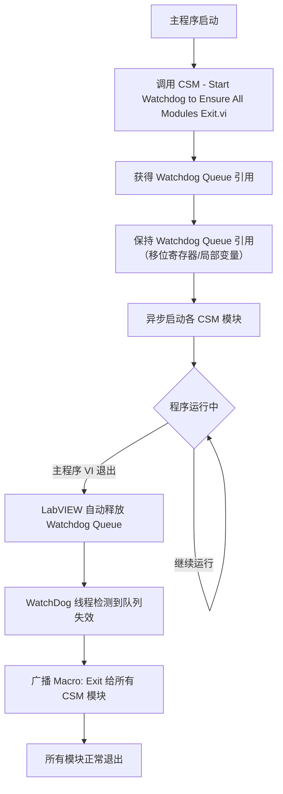

# CSM WatchDog Addon

CSM WatchDog是一个**内置插件**，用于在主程序退出后，自动通知所有异步启动的CSM模块正常退出，避免孤儿进程残留。

## 功能说明

### 问题背景

在CSM应用中，各功能模块通常以异步方式独立启动。当主程序退出时，如果没有显式通知这些模块退出，它们会继续运行，造成资源泄漏，甚至导致程序无法完全关闭。

### 实现原理

{: .note }
> **CSM WatchDog实现的原理**
>
> LabVIEW VI退出时，会自动释放所有队列、事件等句柄资源。因此，WatchDog通过创建一个专用的队列资源，由主程序VI持有该队列的引用。WatchDog线程持续监控这个队列资源的有效性：
> - 主程序运行时，队列存在，WatchDog保持等待；
> - 主程序VI退出时，LabVIEW自动释放队列资源；
> - WatchDog检测到队列已释放，立即向所有还未退出的CSM模块广播 `Macro: Exit`。

整个过程无需主程序编写任何退出逻辑，完全自动化。


## 函数说明

### API 一览

| 函数名 | 功能 | 调用时机 |
|--------|------|----------|
| [`CSM - Start Watchdog to Ensure All Modules Exit.vi`](#csm-start-watchdog-to-ensure-all-modules-exitvi) | 启动WatchDog监控线程，返回Watchdog Queue引用 | 主程序初始化阶段，尽早调用 |
| [`CSM Watchdog Thread.vi`](#csm-watchdog-threadvi) | WatchDog内部实现线程（一般不直接调用） | 由`CSM - Start Watchdog`内部启动 |

### CSM - Start Watchdog to Ensure All Modules Exit.vi

启动CSM WatchDog后台线程，用于监控主程序是否退出。**一般在主程序启动后立即调用**。

**输出控件**：
- **Watchdog Queue**：WatchDog监控队列引用。必须保持连接（通常连接到移位寄存器或局部变量），直至主程序VI结束。**不要手动释放该引用**，让LabVIEW随VI退出自动释放即可。

### CSM Watchdog Thread.vi

WatchDog监控线程的具体实现。由`CSM - Start Watchdog to Ensure All Modules Exit.vi`内部自动调用，**一般不需要手动调用**。

**输入控件**：
- **Watchdog Queue**：WatchDog监控队列资源，由启动VI传入。

### 调用逻辑



## 典型应用场景

### 场景一：标准多模块应用

这是最常见的用法——主程序启动多个功能模块，由WatchDog统一管理退出。

```text
// 主程序 VI 框架示意
Initialize >> {
    // 尽早启动 WatchDog
    CSM - Start Watchdog to Ensure All Modules Exit.vi
    → Watchdog Queue（存入移位寄存器）

    // 异步启动各功能模块
    Run Async: DataAcquisitionModule
    Run Async: DataProcessingModule
    Run Async: UIModule
}

// 程序运行...

// 主程序 VI 退出时：
// - LabVIEW 自动释放 Watchdog Queue
// - WatchDog 线程检测到，广播 Macro: Exit
// - 所有异步模块正常退出
```

{: .tip }
> **推荐做法**：将`Watchdog Queue`连接到主循环的移位寄存器，保证引用生命周期与主程序VI完全一致。

### 场景二：与 File Logger 联合使用

`CSM - Start File Logger.vi`内置了WatchDog支持（`WatchDog? (T)`参数），可以让文件记录线程也随主程序自动退出：

```text
Initialize >> {
    // 启动 WatchDog
    CSM - Start Watchdog to Ensure All Modules Exit.vi
    → Watchdog Queue

    // 启动文件日志（启用内置 WatchDog）
    CSM - Start File Logger.vi
      Log File Path: "C:\Logs\app.csmlog"
      WatchDog? (T): TRUE
}
```

这样主程序退出时，日志记录线程和所有CSM模块都会自动退出。

### 场景三：嵌入式/仪器控制应用

在仪器控制场景下，各硬件模块（DAQ、串口、GPIB等）通常以独立CSM模块运行。使用WatchDog可以避免仪器控制资源因模块未退出而被锁定。

```text
// 主控程序
Initialize >> {
    CSM - Start Watchdog to Ensure All Modules Exit.vi
    → Watchdog Queue

    Run Async: DAQModule       // 数据采集模块
    Run Async: SerialModule    // 串口通信模块
    Run Async: DisplayModule   // 显示模块
}

// 即使操作员直接关闭主程序界面
// WatchDog 也能确保所有硬件模块正确释放资源后退出
```

## 注意事项

{: .warning }
> - **不要手动释放 Watchdog Queue**：WatchDog依赖队列被自动释放来检测主程序退出。如果手动释放，会导致WatchDog提前触发，过早地向所有模块发送退出命令。
> - **尽早调用**：在主程序初始化阶段（异步启动其他模块之前）调用，确保WatchDog在所有模块启动之前就已就绪。
> - **每个主程序只需调用一次**：多次调用会启动多个WatchDog线程，造成重复发送退出命令。

## 与其他退出方式的对比

| 退出方式 | 可靠性 | 开发成本 | 适用场景 |
|----------|--------|----------|----------|
| **WatchDog Addon**（推荐） | 高，主程序意外退出也能触发 | 低，一行代码 | 所有多模块应用 |
| 手动发送 `Macro: Exit` | 中，需主动编写退出逻辑 | 中 | 需要精确控制退出顺序 |
| 等待所有模块队列超时 | 低，主程序异常时可能失效 | 高 | 不推荐 |

## 更多参考

- **API 参考**：[内置插件 - CSM WatchDog Addon](#csm-watchdog-addon)
- **示例代码**：LabVIEW中打开 `Addons - WatchDog\` 目录下的示例
- **File Logger联用**：[插件系统概述 - File Logger Addon](#file-logger-addon)
